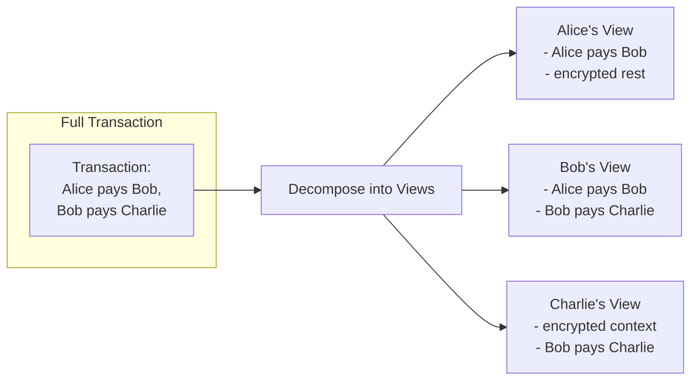

Canton's privacy model is its defining feature. This section explains how sub-transaction privacy works, what guarantees it provides, and common patterns for privacy-aware development.

## The Privacy Problem in Blockchain

On most blockchains, achieving transaction integrity requires global visibility. Every validator sees every transaction to verify no double-spends occur and all rules are followed.

This creates an inherent tension:

| Requirement | Traditional Approach | Problem |
|-------------|---------------------|---------|
| **Integrity** | Validators verify all transactions | Requires visibility |
| **Verification** | See transaction content | Reveals private data |
| **Privacy** | Hide transaction content | Undermines verification |

Traditional blockchains make a choice: integrity over privacy. Everyone sees everything.

### Why This Blocks Enterprise Adoption

For regulated industries, global visibility is a non-starter:

- **Position visibility**: Competitors can see your trading strategies
- **Front-running risk**: Observers can exploit transaction information
- **Regulatory compliance**: Data may not be shared with unauthorized parties
- **Confidential agreements**: Business terms should remain between parties

## Canton's Approach: Sub-Transaction Privacy

Canton resolves the integrity-privacy tension through **sub-transaction privacy**: decomposing transactions into views where each party sees only what they need to verify their portion.

### How It Works

When a transaction involves multiple parties, Canton doesn't send the full transaction to everyone. Instead:

1. **Decomposition**: Transaction is split into **views** based on stakeholder relationships
2. **Encryption**: Each view is encrypted to its respective recipients
3. **Distribution**: Synchronizer delivers only entitled views to each participant
4. **Validation**: Each participant validates their view independently
5. **Confirmation**: Participants confirm based on their view alone



> "Sub-transaction privacy: Participants see only those parts of a transaction they are entitled to according to the privacy model. For the other parts of a transaction they are not entitled to, the Participants see neither any transaction payload nor metadata like involved Participants or parties."

### What Each Party Sees

| Party | Sees | Doesn't See |
|-------|------|-------------|
| **Alice** | Her payment to Bob | Bob's payment to Charlie; Charlie's identity |
| **Bob** | Both payments (he's involved in both) | - |
| **Charlie** | His receipt from Bob | Alice's involvement; original source of funds |

The synchronizer sees **none of this** - only encrypted messages and confirmation results.

## Stakeholder Visibility Rules

Visibility in Canton follows two core principles:

### Principle 1: Parties See Actions They Have a Stake In

| Role | Visibility |
|------|------------|
| **Signatory** | Always sees the contract and all its events |
| **Observer** | Sees the contract by explicit declaration |
| **Controller** | Sees choices they can exercise |

### Principle 2: Parties Who See an Action See Its Consequences

If you see an action, you see the creates/archives it produces. This enables independent verification - you can confirm the action was executed correctly based on the outcomes you observe.

### Visibility Example

```haskell
template Payment
  with
    sender : Party
    receiver : Party
    amount : Decimal
  where
    signatory sender
    observer receiver
    
    choice Accept : ContractId Receipt
      controller receiver
      do
        create Receipt with payer = sender, payee = receiver, amount
```

| Party | Contract Visibility | Choice Visibility |
|-------|--------------------|--------------------|
| **sender** | ✓ (signatory) | ✓ (sees consequences) |
| **receiver** | ✓ (observer) | ✓ (controller) |
| **anyone else** | ✗ | ✗ |

## Privacy Guarantees

### What Canton Guarantees

<Check>
**Transaction content** is only visible to authorized parties (signatories, observers, controllers).
</Check>

<Check>
**Synchronizer operators** cannot read transaction data - they see only encrypted messages.
</Check>

<Check>
**No metadata leakage** about parties not entitled to see an action - other participants and parties are invisible.
</Check>

<Check>
**Validators only store** data for their hosted parties - no global state replication.
</Check>

### What Canton Does Not Guarantee

<Warning>
Canton's privacy model has limitations you should understand.
</Warning>

| Limitation | Description |
|------------|-------------|
| **Traffic analysis** | Timing, message sizes, and patterns may reveal information |
| **Validator visibility** | Your hosting validator sees all your data |
| **Transaction occurrence** | That *some* transaction happened may be observable (but not content) |
| **External data exposure** | Off-ledger integrations may expose data Canton protects |

## Privacy Patterns

### Pattern 1: Bilateral Agreement

Only the two signatories see the contract. Maximum privacy for two-party agreements.

```haskell
template BilateralContract
  with
    partyA : Party
    partyB : Party
    terms : Text
  where
    signatory partyA, partyB
    -- No observers: only signatories see this contract
```

**Use when**: Two parties need a private agreement with no third-party visibility.

**Visibility**: Only `partyA` and `partyB`.

### Pattern 2: Selective Disclosure via Observers

Add specific parties as observers when they need visibility but not control.

```haskell
template RegulatedAsset
  with
    owner : Party
    issuer : Party
    regulator : Party
    value : Decimal
  where
    signatory issuer
    observer owner, regulator

    choice Transfer : ContractId RegulatedAsset
      with
        newOwner : Party
      controller owner  -- owner can transfer unilaterally
      do
        create this with owner = newOwner
```

**Use when**: Third parties need visibility for compliance, audit, or information purposes.

**Visibility**: `issuer` (signatory), `owner` and `regulator` (observers). Note that `owner` is also the controller for `Transfer`, so they can execute that choice unilaterally.

### Pattern 3: Divulgence

When contracts are used in transactions, parties to that transaction may learn about them. This "divulgence" is automatic.

```haskell
-- Contract held by Alice
template Asset with owner : Party where
  signatory owner

-- Alice uses her Asset in a transaction with Bob
template Trade
  with
    seller : Party  -- Alice
    buyer : Party   -- Bob
    assetId : ContractId Asset
  where
    signatory seller, buyer
    
    choice Execute : ()
      controller buyer
      do
        -- Bob sees the Asset contract through divulgence
        asset <- fetch assetId
        archive assetId
        -- ... transfer logic
```

**What happens**: When `Execute` runs, Bob (as a party to the Trade) sees the Asset contract that Alice owns, even though he wasn't originally an observer.

**Use carefully**: Divulgence can inadvertently reveal information. Design transactions with awareness of what gets divulged.

## Privacy vs. Auditability

Canton enables privacy without sacrificing auditability. Common patterns:

### Auditor as Observer

```haskell
template AuditableTransaction
  with
    partyA : Party
    partyB : Party
    auditor : Party
    details : TransactionDetails
  where
    signatory partyA, partyB
    observer auditor  -- Auditor sees everything but cannot act
```

### Selective Audit Rights

```haskell
template SelectivelyAuditable
  with
    owner : Party
    data : SensitiveData
    auditor : Party
  where
    signatory owner
    
    -- Non-consuming choice: reveals data without changing state
    nonconsuming choice Audit : AuditReport
      controller auditor
      do
        -- Auditor can request audit, seeing only what's returned
        return AuditReport with 
          timestamp = now
          summary = summarize data  -- Controlled disclosure
```

### Best Practices for Auditability

| Practice | Description |
|----------|-------------|
| **Explicit auditor parties** | Add auditors as observers where audit trail is required |
| **Audit choices** | Create non-consuming choices that return audit information |
| **Separate audit contracts** | Create dedicated audit trail contracts when full visibility isn't needed |
| **Time-bounded access** | Use workflow patterns to grant temporary audit access |

## Common Privacy Mistakes

### Mistake 1: Over-Sharing via Observers

```haskell
-- BAD: Adding unnecessary observers
template OverShared
  with
    owner : Party
    counterparty : Party
    allUsers : [Party]  -- Why do all users need to see this?
  where
    signatory owner
    observer counterparty, allUsers  -- Privacy leak!
```

**Problem**: Every party in `allUsers` sees this contract, even if they don't need to.

**Fix**: Only add observers who genuinely need visibility.

### Mistake 2: Leaking via Contract Keys

<Note>
Contract keys are not currently available in Daml 3.x / Canton 3.x but are planned for a future release. This section is included for awareness when the feature becomes available.
</Note>

```haskell
-- BAD: Key reveals private information
template LeakyKey
  with
    owner : Party
    secretPartner : Party
    value : Decimal
  where
    signatory owner
    key (owner, secretPartner) : (Party, Party)  -- Key reveals relationship!
    maintainer key._1
```

**Problem**: Contract key lookups may reveal the existence of relationships.

**Fix**: Design keys to avoid encoding sensitive relationships.

### Mistake 3: Ignoring Divulgence

```haskell
-- Transaction reveals more than intended
choice RevealingChoice : ()
  controller buyer
  do
    -- Fetching this contract divulges it to all transaction stakeholders
    sensitiveAsset <- fetch sensitiveAssetId
    -- buyer now knows about sensitiveAsset, even if not originally an observer
```

**Problem**: Composing contracts in transactions can reveal information to parties who weren't original stakeholders.

**Fix**: Understand which contracts get fetched and who sees the transaction.

### Mistake 4: Timing Attacks

**Problem**: Even without seeing content, observers might infer information from:
- When transactions occur
- Transaction sizes
- Patterns of activity

**Fix**: 
- Consider batching sensitive operations
- Add noise or randomization where appropriate
- Design workflows to minimize timing information leakage

## Privacy Design Checklist

When designing Canton applications, ask:

| Question | Consideration |
|----------|--------------|
| **Who are the signatories?** | They will always see everything |
| **Who needs to observe?** | Add observers deliberately, not by default |
| **What gets divulged?** | Trace through transaction composition |
| **What do contract keys reveal?** | Keys should not encode sensitive relationships |
| **What can timing reveal?** | Consider patterns, not just content |
| **Who is my validator?** | They see all your data - choose carefully |

## Next Steps

- **[The Global Synchronizer](/docs-main/understand/global-synchronizer)** - Understand the public network infrastructure
- **[Developer Track Module 3: Daml Development](/docs-main/developer/m3-daml)** - Apply privacy patterns in code
- **[Glossary](/docs-main/understand/glossary)** - Terminology reference including privacy-related terms
