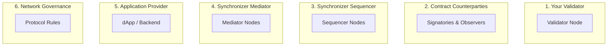

Canton's trust model differs fundamentally from traditional blockchains. Rather than "trust everyone" or "trust no one," Canton enables **selective trust**—you choose who to trust for what purpose.

## The Core Question

In any distributed system, the key question is: **Who do you need to trust, and for what?**

Canton breaks this into distinct trust domains, each with different participants and assumptions.

## Six Trust Domains

### 1. Your Validator

**What you trust them for:**
- Storing your contract data securely
- Executing Daml code correctly
- Keeping your private keys safe (for local parties)
- Not revealing your data to unauthorized parties

**Trust level:** High—they see all your data

**Mitigation options:**
- Run your own validator
- Choose a reputable validator operator
- Use external party keys (you hold the keys)

### 2. Contract Counterparties

**What you trust them for:**
- Honestly validating transactions they're stakeholders in
- Not colluding to manipulate shared contracts

**Trust level:** Medium—they only see contracts they're party to

**Mitigation options:**
- Daml authorization rules limit what parties can do
- Multi-signature requirements for critical operations
- Audit trails are cryptographically signed

### 3. Synchronizer Sequencer

**What you trust them for:**
- Delivering messages in consistent order to all validators
- Not censoring your transactions indefinitely
- Maintaining availability

**What you DON'T trust them for:**
- They cannot read your transaction content (encrypted)
- They cannot forge transactions (signatures required)
- They cannot approve invalid transactions (stakeholders validate)

**Trust level:** Low—they see only encrypted messages

**Mitigation options:**
- BFT sequencer with multiple independent operators
- Connect to multiple sequencers with threshold confirmation
- Synchronizer diversity (use multiple synchronizers)

### 4. Synchronizer Mediator

**What you trust them for:**
- Correctly aggregating confirmation votes
- Delivering accurate verdicts
- Not leaking which parties confirmed

**What you DON'T trust them for:**
- They cannot read transaction content (encrypted)
- They cannot force approval (need stakeholder confirmations)

**Trust level:** Low—they see only encrypted confirmations

**Mitigation options:**
- Multiple mediators with threshold agreement
- Mediator responses are signed and verifiable

### 5. Application Provider

**What you trust them for:**
- Submitting commands you authorize
- Correctly implementing business logic off-ledger
- Protecting your credentials/session

**Trust level:** Varies—depends on application design

**Mitigation options:**
- On-ledger authorization (Daml) vs off-ledger
- External party signing (you approve each transaction)
- Open source / audited applications

### 6. Network Governance

**What you trust them for:**
- Protocol upgrades don't break your contracts
- Network parameters are set fairly
- Dispute resolution processes

**Trust level:** Low for technical, medium for economic

**Mitigation options:**
- Transparent governance (CIPs for Canton Network)
- Exit rights (move to different synchronizer)
- Contract design anticipating upgrades

## Trust Comparison Table

| Trust Domain | Sees Your Data? | Can Block You? | Can Steal Funds? |
|--------------|-----------------|----------------|------------------|
| Your Validator | Yes | Yes | Only if you use local keys |
| Counterparties | Their contracts only | For their contracts | No (Daml rules) |
| Sequencer | No (encrypted) | Temporarily | No |
| Mediator | No (encrypted) | Temporarily | No |
| App Provider | Depends on design | Depends | Depends on design |
| Governance | No | Long-term risk | No |

## Decentralization Options

Canton supports progressive decentralization at each layer:

### Validator Level

| Configuration | Trust Model |
|---------------|-------------|
| Single validator | Full trust in operator |
| Multi-hosted party | Distributed across validators |
| External party keys | You control signing |

### Synchronizer Level

| Configuration | Trust Model |
|---------------|-------------|
| Single-operator | Trust one entity |
| BFT sequencer | Trust < 1/3 are malicious |
| Multiple synchronizers | Reduce single-point-of-failure |

### Global Synchronizer

The Global Synchronizer provides maximum decentralization:

- **Super Validators**: Multiple independent operators run sequencer/mediator nodes
- **BFT Consensus**: Tolerates Byzantine failures up to threshold
- **Governance**: Transparent CIP process for protocol changes

## Practical Trust Decisions

### For End Users

| Question | Consideration |
|----------|---------------|
| Which wallet/validator? | They hold your data—choose carefully |
| Which apps to use? | On-ledger authorization is stronger |
| External vs local keys? | External = more control, more responsibility |

### For Developers

| Question | Consideration |
|----------|---------------|
| Where to put logic? | On-ledger = trustless, off-ledger = flexible |
| Authorization design | Multi-sig for high-value operations |
| Synchronizer choice | Match trust requirements to use case |

### For Validators

| Question | Consideration |
|----------|---------------|
| Which synchronizers? | Evaluate operator reputation, decentralization |
| Security practices | You're trusted with user data |
| Key management | HSMs, KMS for production |

## Trust Model vs Traditional Blockchains

| Aspect | Traditional Blockchain | Canton |
|--------|----------------------|--------|
| Who sees transactions | Everyone | Only stakeholders |
| Who validates | All nodes | Only affected parties |
| Trust in validators | Trust the majority | Trust your validator |
| Synchronizer trust | N/A | Minimal (encrypted) |
| Governance | Protocol-level | Per-synchronizer + network |

## Key Takeaways

1. **You choose your trust**: Select validators, synchronizers, and apps that match your trust requirements
2. **Minimal synchronizer trust**: They coordinate but can't read your data
3. **Stakeholder validation**: Only parties to a contract validate it
4. **Defense in depth**: Multiple layers of trust mitigation available
5. **Progressive decentralization**: Start simple, add decentralization as needed

## Next Steps

- **[Two-Layer Consensus](/docs-main/overview/learn/two-layer-consensus)** - How consensus layers interact
- **[Architecture Overview](/docs-main/overview/learn/architecture)** - Component responsibilities
- **[Privacy Model](/overview/learn/privacy-model)** - What each party can see
