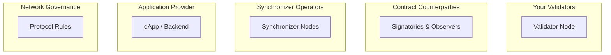

Canton's trust model differs fundamentally from traditional blockchains. Rather than "trust everyone" or "trust no one," Canton enables **selective trust**—you choose who to trust for what purpose.

## The Core Question

In any distributed system, the key question is: **Who do you need to trust, and for what?**

Canton breaks this into distinct trust domains, each with different participants and assumptions.

## Five Trust Domains

### 1. Your Validator

**What you trust them for:**
- Storing your contract data securely and making it available to you
- Giving you access to node RPCs and letting you submit transactions
- Not revealing your data to unauthorized parties
- Correctly participating in consensus on behalf of your Party
- IF using internal parties: handling your signing keys

**What you DON'T trust them for:**
- Signing your transactions (IF using external parties)

**Mitigations:**
- Run your own validator
- Choose a reputable validator operator
- Use multiple validators to co-host your Party
- Use external party keys (you hold the keys)
- Use KMS/HSM solutions to secure the validator's cryptographic keys

### 2. Contract Counterparties

**What you trust them for:**
- Honestly validating transactions they're stakeholders in so transactions can be finalized
- Not leaking your private data that is shared with them

**What you DON'T trust them for:**
- Ledger integrity and consistency. As long as your validators are honest, you counterparties cannot finalize invalid transactions involving you.

**Mitigations:**
- Daml authorization rules limit what parties can do and where their confirmations are needed
- Share privacy critical data only with trusted counterparties
- Multi-signature requirements for critical operations
- Audit trails are cryptographically signed

### 3. Synchronizer

**What you trust them for:**
- Delivering messages in consistent order to all validators
- Not censoring your transactions indefinitely
- Maintaining availability
- Correctly aggregating confirmation votes
- Delivering accurate verdicts
- For private synchronizers: Keeping transaction metadata private.

**What you DON'T trust them for:**
- Privacy: They cannot read your transaction content (encrypted)
- Authorization: They cannot forge messages/transactions (signatures required)
- Conformance: They cannot approve invalid transactions (stakeholders validate)

**Mitigations:**
- BFT synchronizer with multiple independent operators
- Run your own synchronizer

### 4. Application Provider

**What you trust them for:**
- If they submit transactions for user actions: Actually doing so and not censoring
- Correctly implementing secure smart contract logic
- Correctly implementing business logic off-ledger
- If doing web2-style login and authentication: Protecting your credentials/session

**Mitigations:**
- On-ledger authorization (Daml) vs off-ledger
- External party signing (you approve each transaction)
- Open source / audited applications
- Use your own validator to prepare and submit transactions

### 5. Network Governance

**What you trust them for:**
- Protocol upgrades don't break your applications and the corresponding contracts
- Network parameters and traffic costs are set fairly
- Dispute resolution processes

**Mitigations:**
- Transparent governance (CIPs for Canton Network)
- Exit rights (move to different synchronizer)
- Contract design anticipating upgrades

## Trust at a Glance

Your validator sees all your data and could block you . Counterparties see only contracts they're party to, and Daml rules and Canton consensus constrain what they can do. The sequencer and mediator operate on encrypted data only; they could temporarily delay messages but cannot read or forge messages. Application providers and governance bodies vary in trust depending on how they're designed and structured.

## Decentralization Options

Canton supports decentralization at each layer.

**At the validator level**, you can run a single validator with trust in the sole operator, or use multi-hosted parties with trust distributed across them.

**At the synchronizer level**, a single-operator synchronizer requires trust in one entity. A BFT sequencer distributes trust so that only 2/3 of nodes must be honest for the system to function. Connecting to multiple synchronizers further reduces single-point-of-failure risk.

**The Global Synchronizer** provides maximum decentralization: multiple independent Super Validators run sequencer and mediator nodes, BFT consensus tolerates Byzantine failures up to threshold, and a transparent CIP process governs protocol changes.

## Canton vs Traditional Blockchains

In a traditional blockchain, everyone sees every transaction and every node validates. You trust the majority to behave honestly. Canton inverts this model: only stakeholders see a transaction, only affected parties validate it, and you place trust primarily in your own validators. The synchronizer sees only encrypted data, and governance operates per-synchronizer as well as at the network level.

## Related Topics

- [Two-Layer Consensus](/overview/learn/two-layer-consensus) — how the consensus layers interact
- [Architecture Overview](/overview/learn/architecture) — component responsibilities
- [Privacy Model](/overview/learn/privacy-model) — what each party can see
