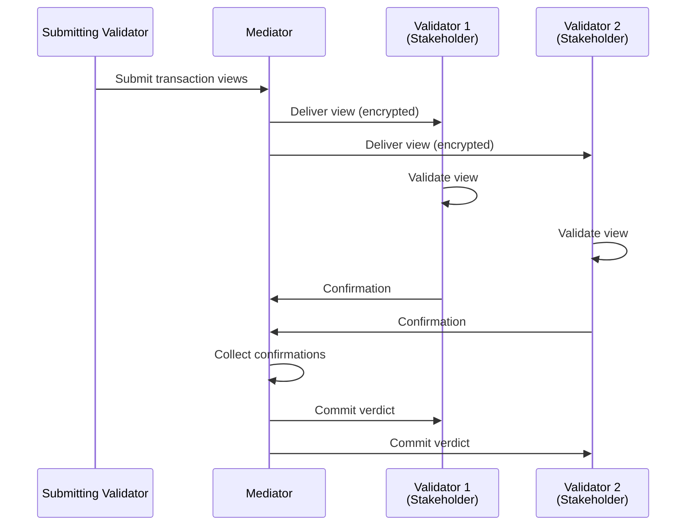
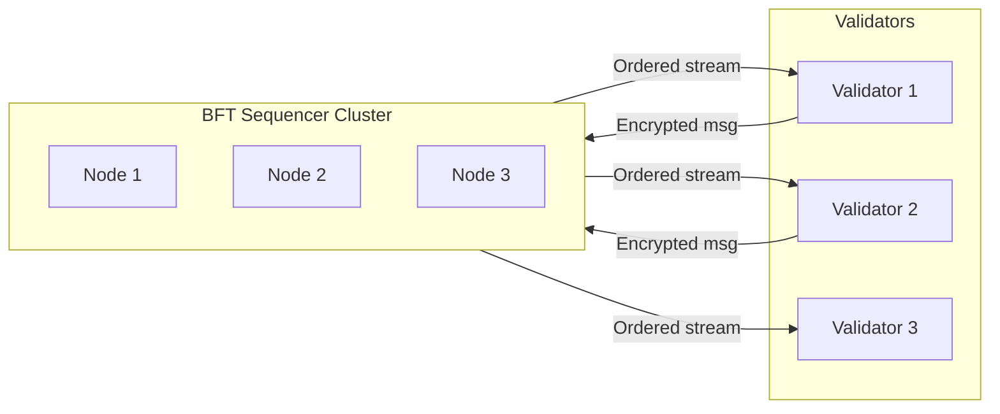
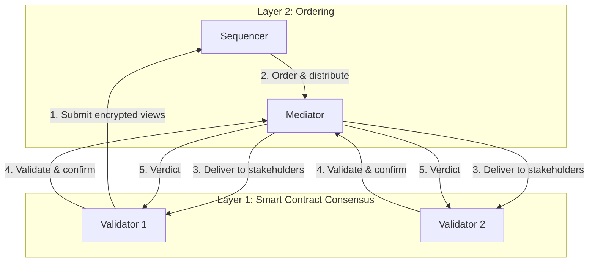

Canton uses a unique two-layer consensus architecture that separates **smart contract consensus** from **ordering consensus**. This separation is fundamental to how Canton achieves privacy while maintaining integrity.

## Why Two Layers?

Traditional blockchains combine ordering and validation into a single consensus process. Every validator sees every transaction to verify correctness and agree on order. This tight coupling creates an inherent privacy limitation.

Canton decouples these concerns:

| Layer | Purpose | Who Participates | What They See |
|-------|---------|------------------|---------------|
| **Smart Contract Consensus** | Validate transaction correctness | Only affected stakeholders | Only their portion of the transaction |
| **Ordering Consensus** | Establish global transaction order | Synchronizer nodes | Encrypted messages only |

## Layer 1: Smart Contract Consensus (Proof of Stakeholder)

Smart contract consensus in Canton follows a **Proof of Stakeholder** model. Only parties with a stake in a contract can validate transactions affecting that contract.

### How It Works

1. **Stakeholder Identification**: When a transaction affects a contract, Canton identifies all stakeholders (signatories, observers, controllers)
2. **View Distribution**: Each stakeholder receives only the transaction view they're entitled to see
3. **Independent Validation**: Each stakeholder validates their view against Daml rules
4. **Confirmation**: Stakeholders send confirmation or rejection to the mediator
5. **Verdict**: Once sufficient confirmations are received, the transaction commits

### Key Properties

- **Privacy**: Non-stakeholders never see the transaction
- **Efficiency**: Only affected parties do validation work
- **Correctness**: Daml authorization rules are enforced by stakeholders

### Trust Assumption

You trust that stakeholders will correctly validate their portion. Since stakeholders have a direct interest in the contract (they signed it or are observing it), they're incentivized to validate honestly.

## Layer 2: Ordering Consensus (BFT Sequencing)

The ordering layer establishes a **total order** for all transactions on a synchronizer. This ensures all participants see events in the same sequence, preventing double-spends and ensuring consistency.

### How It Works

The synchronizer's sequencer component:

1. Receives encrypted transaction messages from participants
2. Assigns a globally unique timestamp/sequence number
3. Distributes messages to all entitled recipients in order
4. Ensures all recipients see the same ordering

### BFT Ordering

For decentralized synchronizers (like the Global Synchronizer), ordering uses Byzantine Fault Tolerant (BFT) consensus:

- Multiple sequencer nodes run the ordering protocol
- Tolerates up to 1/3 Byzantine (malicious) nodes
- Based on ISS (Insanely Scalable State-Machine Replication) algorithm
- Provides safety and liveness guarantees

### Key Properties

- **Total Order**: All validators receive messages in identical order
- **Privacy Preserved**: Sequencers only see encrypted messages
- **Fault Tolerance**: Continues operating despite node failures

### Trust Assumption

You trust that fewer than 1/3 of sequencer nodes are malicious. For the Global Synchronizer, this is distributed across independent Super Validators.

## How the Layers Interact

The two layers work together in Canton's transaction protocol:

| Step | Layer | Action |
|------|-------|--------|
| 1 | Ordering | Validator submits encrypted transaction |
| 2 | Ordering | Sequencer orders, mediator distributes |
| 3 | Both | Messages delivered to stakeholders |
| 4 | Smart Contract | Stakeholders validate and confirm |
| 5 | Ordering | Mediator aggregates and broadcasts verdict |

## Benefits of Separation

### Privacy Without Sacrificing Integrity

- Ordering layer ensures no double-spends (integrity)
- Smart contract layer ensures only stakeholders see data (privacy)
- Neither layer alone could achieve both

### Flexible Trust Models

Different synchronizers can have different ordering trust models:
- Single-operator sequencer for private deployments
- BFT sequencer for decentralized networks
- Smart contract consensus remains the same regardless

### Scalability

- Ordering layer handles synchronization only (lightweight)
- Validation work distributed to affected participants only
- No global state replication required

## Comparison to Other Approaches

| Approach | Ordering | Validation | Privacy |
|----------|----------|------------|---------|
| **Traditional Blockchain** | All validators | All validators | None |
| **L2 Rollups** | Sequencer | Fraud/validity proofs | Limited |
| **Canton** | Synchronizer (BFT) | Affected stakeholders only | Full sub-transaction |

## Next Steps

- **[Trust Model Overview](/overview/learn/trust-model)** - Understand trust assumptions in detail
- **[Architecture Overview](/overview/learn/architecture)** - See how components fit together
- **[Privacy Model](/overview/learn/privacy-model)** - Deep dive into sub-transaction privacy
