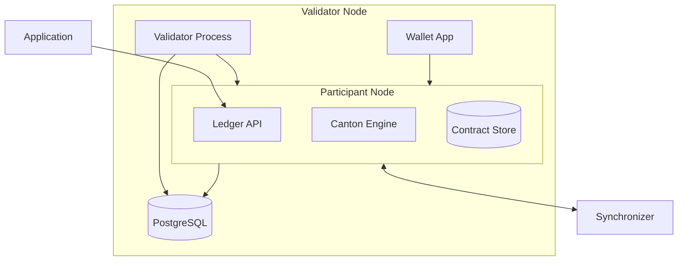

A validator is the fundamental infrastructure unit on Canton Network. It hosts parties, stores their contract data, and processes transactions on their behalf. Understanding what's inside a validator helps with deployment planning, troubleshooting, and capacity sizing.

## Components of a validator

A validator consists of two main processes and their supporting infrastructure:

### Participant node

The participant node is the core component. It:

- Hosts parties and manages their identities
- Stores contract data for hosted parties in a local database
- Exposes the Ledger API for applications to submit commands and read transactions
- Runs the Canton protocol engine that handles transaction processing, validation, and privacy
- Communicates with synchronizers to submit and receive transactions

### Validator process

The validator process handles Canton Network-specific functionality on top of the participant node:

- Manages onboarding to the Global Synchronizer
- Handles traffic purchases using Canton Coin
- Runs the wallet application for hosted parties
- Manages automatic operations like traffic top-ups and sweep configurations

### Database

Both the participant node and validator process use PostgreSQL for persistent storage. In production, this should be a managed database service (like Cloud SQL or RDS) with appropriate backup and high-availability configuration.

## How validators connect to synchronizers

Validators connect to synchronizers through the sequencer endpoint over TLS (port 443). The connection is outbound only — validators do not need to accept incoming connections from the network.

A validator can connect to multiple synchronizers simultaneously. It receives only the transactions relevant to its hosted parties, maintaining privacy even though the synchronizer coordinates across all participants.

## Ledger API

The Ledger API is the primary interface for applications to interact with the ledger. It is a gRPC API that supports:

- **Command submission** — Create contracts and exercise choices
- **Transaction stream** — Read confirmed transactions as they are committed
- **Active contract set** — Query the current set of active contracts
- **Party management** — Allocate and manage parties

Applications connect to the Ledger API either directly via gRPC or through the JSON API, which provides an HTTP/JSON layer on top.
