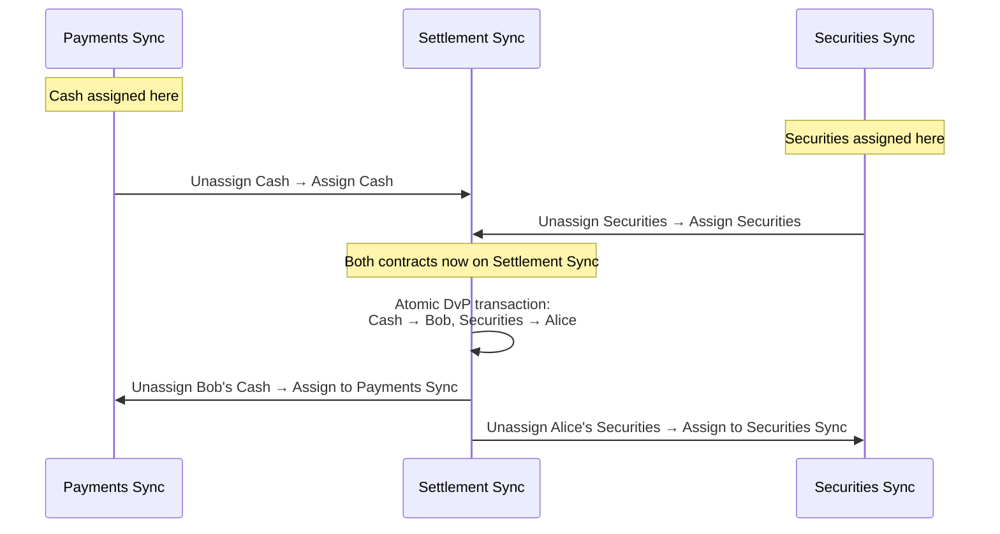

This page walks through a Delivery-versus-Payment (DvP) trade between two parties whose assets live on different synchronizers. The example shows how Canton's reassignment protocol enables atomic settlement without requiring all assets to originate on the same infrastructure.

## Setup

**Parties and roles:**
- **Alice** (buyer) -- wants to acquire securities, holds cash
- **Bob** (seller) -- wants to sell securities, will receive cash
- **PaymentBank** -- signatory on cash contracts
- **SecuritiesDepository** -- signatory on securities contracts

**Synchronizers:**
- **Payments Sync** -- operated by a payments consortium; the cash contract is assigned here
- **Securities Sync** -- operated by a capital markets infrastructure provider; the securities contract is assigned here
- **Settlement Sync** -- a common synchronizer (for example, the Global Synchronizer) where both parties and signatories are connected

**Contracts:**
- `Cash` -- signatory: PaymentBank; owner: Alice. Assigned to Payments Sync.
- `Securities` -- signatory: SecuritiesDepository; owner: Bob. Assigned to Securities Sync.

Each party's validator is connected to the synchronizers relevant to that party. Alice's validator connects to Payments Sync and Settlement Sync. Bob's validator connects to Securities Sync and Settlement Sync. PaymentBank's and SecuritiesDepository's validators connect to all three.

## Why Multiple Synchronizers?

The cash and securities contracts live on separate synchronizers for practical reasons: different settlement infrastructures are governed by different entities, may operate under different regulatory regimes, and have distinct performance or cost characteristics. A payments network and a securities settlement system are unlikely to share a single synchronizer.

A Daml transaction can only consume contracts assigned to the same synchronizer. To settle the DvP atomically -- cash to Bob, securities to Alice, in one indivisible step -- both contracts must first be reassigned to a common synchronizer.

## DvP Workflow

### Step 1: Agree on Trade Terms

Alice and Bob agree to a DvP trade (off-ledger, or via a `TradeAgreement` contract). The terms specify which cash contract and which securities contract will be exchanged.

### Step 2: Connect to Settlement Sync

All validators involved must be connected to the Settlement Sync. In practice, if Settlement Sync is the Global Synchronizer, most validators are already connected. If it is a private synchronizer, the validators for Alice, Bob, PaymentBank, and SecuritiesDepository must each have an active connection before reassignment can proceed.

### Step 3: Reassign Cash to Settlement Sync

The `Cash` contract is reassigned from Payments Sync to Settlement Sync. This is a two-phase process:

1. **Unassignment** on Payments Sync -- the contract becomes inactive on Payments Sync and enters a "pending assignment" state.
2. **Assignment** on Settlement Sync -- the contract becomes active on Settlement Sync.

After this step, the `Cash` contract can be used in transactions on Settlement Sync but no longer on Payments Sync.

### Step 4: Reassign Securities to Settlement Sync

The `Securities` contract is reassigned from Securities Sync to Settlement Sync through the same unassignment/assignment sequence.

### Step 5: Atomic Settlement

Both contracts are now assigned to Settlement Sync. A single Daml transaction exercises the swap: it archives the original `Cash` and `Securities` contracts and creates new ones -- `Cash` owned by Bob and `Securities` owned by Alice. Because both input contracts are on the same synchronizer, this transaction is atomic. Either both transfers happen or neither does.

### Step 6: Reassign Back

After settlement, the new contracts can be reassigned to their home synchronizers:
- Bob's new `Cash` contract is reassigned from Settlement Sync back to Payments Sync.
- Alice's new `Securities` contract is reassigned from Settlement Sync back to Securities Sync.

This step is optional. The contracts function on Settlement Sync, but reassigning them back keeps assets on the infrastructure best suited for their lifecycle (future transfers, corporate actions, etc.).

## Sequence Diagram

## Contract Location at Each State

| State | Cash Contract | Securities Contract |
|------|--------------|---------------------|
| Initial state | Payments Sync (owner: Alice) | Securities Sync (owner: Bob) |
| After reassign cash | Settlement Sync (owner: Alice) | Securities Sync (owner: Bob) |
| After reassign securities | Settlement Sync (owner: Alice) | Settlement Sync (owner: Bob) |
| After atomic settlement | Settlement Sync (owner: **Bob**) | Settlement Sync (owner: **Alice**) |
| After reassign back | Payments Sync (owner: Bob) | Securities Sync (owner: Alice) |

## Atomicity Boundaries

The reassignment steps (3, 4, and 6) are each **non-atomic** two-phase operations. Between the unassignment and assignment of a contract, that contract is in a "pending assignment" state and cannot be used. If the assignment fails (for example, due to a topology change), the contract remains pending until the situation is resolved.

The settlement step (5) **is atomic**. The Daml transaction either commits in full or not at all. There is no state where Alice has paid cash but not received securities, or vice versa.

This distinction is the key design property: reassignments move contracts to a common synchronizer where an atomic transaction can settle the trade. The non-atomic reassignment steps carry the risk of a contract being temporarily unusable, but they do not carry settlement risk -- no value changes hands until the atomic step executes.

## Further Reading

- [Reassignment Protocol](/docs-main/overview/reference/reassignment-protocol) -- detailed protocol mechanics for unassignment and assignment
- [Architecture Overview](/docs-main/overview/learn/architecture) -- how synchronizers, validators, and the Global Synchronizer fit together
