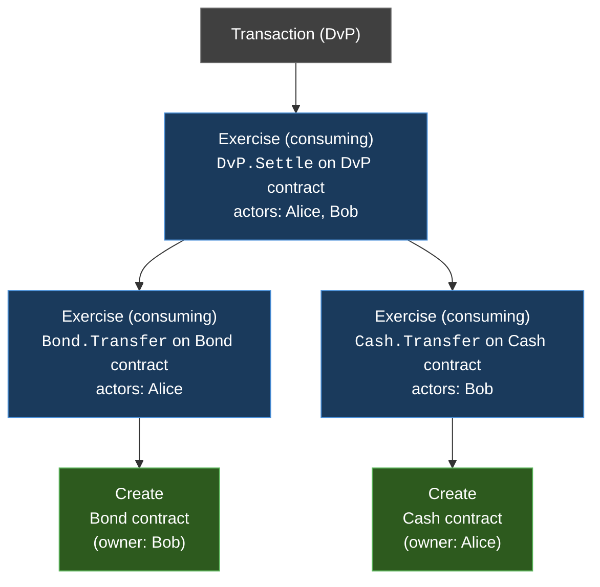

import DamlOverviewReferenceLedgerModelDetailedL30 from "/snippets/daml-docs/overview_reference_ledger-model-detailed_L30.mdx";


This page provides the formal specification of Canton's ledger model. It defines the data structures, stakeholder relationships, and validity conditions that govern all state changes on a Canton ledger. The [Learn](/docs-main/overview/learn/ledger-model) pages introduce these concepts at a high level; this reference describes them precisely.

## Extended UTXO Model

Canton uses an **extended UTXO (eUTXO)** ledger model. Ledger state consists of a set of immutable data objects called **contracts**. A contract, once created, is never modified — it can only be **archived** (consumed). Transactions consume existing contracts and produce new ones, analogous to spending and creating unspent transaction outputs in Bitcoin's UTXO model.

The "extended" qualifier reflects two differences from a plain UTXO model:

- Contracts carry structured data (typed fields defined by a template), not just a value and a locking script.
- Contracts support rich execution logic through **choices** — named actions with typed arguments, authorization rules, and computational consequences that can create or consume further contracts.

Each contract is identified by a globally unique **contract ID**. The contract ID is derived from the transaction that created it and is never reused once the contract is archived.

## Templates and Contract Instances

A **template** is a Daml type definition that specifies the schema and behavior of a contract. It declares:

- **Data fields** — the typed payload of every contract instance (the template's arguments)
- **Signatories** — the parties that must authorize creation
- **Observers** — additional parties with visibility
- **Choices** — the actions that can be performed on the contract, including their controllers, arguments, and body (the Daml code that runs when the choice is exercised)

A **contract instance** is the immutable record created on the ledger when a `Create` action executes for a given template. It binds a contract ID to a specific template ID and a specific set of argument values. The contract instance cannot be changed after creation — the only lifecycle events are creation and archival.

<DamlOverviewReferenceLedgerModelDetailedL30 />

In this example, `Iou` is the template. A contract instance of `Iou` holds concrete values for `issuer`, `owner`, and `amount`, and is referenced by a contract ID of type `ContractId Iou`.

## Stakeholder Annotations

Every contract carries three sets of parties derived from its template definition:

- **Signatories** — A non-empty set of parties that must authorize both the creation and the archival of the contract. Signatories are the primary trust anchors: their agreement is what makes a contract meaningful. A contract with signatories `{Alice, Bob}` represents a statement that both Alice and Bob attest to.

- **Observers** — A (possibly empty) set of parties that are informed about the contract's existence and lifecycle events, but whose authorization is not required for creation or archival. Observers gain visibility but not control.

- **Stakeholders** — The union of signatories and observers. A party is a stakeholder of a contract if and only if it is either a signatory or an observer. Stakeholders are the parties who have a stake in the contract and whose participant nodes store a copy of it.

The signatory set must be non-empty. Observers may overlap with signatories (any party that is both a signatory and an observer is simply a signatory — the signatory role subsumes the observer role).

Stakeholder annotations determine two things: **authorization** (who must approve state changes) and **visibility** (who learns about state changes). Both feed into the privacy model described in the [Views and Witnesses](#views-and-witnesses) section below.

## Actions and Hierarchical Structure

The basic building blocks of ledger changes are **actions**. Canton defines two primary action types.

### Create Actions

A **Create** action records the creation of a new contract. It carries:

- **Contract ID** — the unique identifier assigned to the new contract
- **Template ID** — identifies which template this contract instantiates
- **Contract arguments** — the field values for the template parameters
- **Signatories** — derived from the template definition and arguments
- **Observers** — derived from the template definition and arguments

A Create action produces one output contract (the newly created contract) and consumes no inputs.

### Exercise Actions

An **Exercise** action records the execution of a choice on an existing contract. It carries:

- **Contract ID** — the input contract being acted upon
- **Template ID** — the template of the input contract
- **Choice name** — which choice is being exercised
- **Choice arguments** — the typed arguments passed to the choice
- **Actors** — the party or parties exercising the choice (must satisfy the `controller` declaration)
- **Exercise kind** — either **consuming** or **non-consuming**
- **Consequences** — a list of child actions produced by executing the choice body

When the exercise kind is **consuming**, the input contract is archived. This is the mechanism that prevents double-spending: once consumed, a contract ID cannot be consumed again. When the exercise kind is **non-consuming**, the input contract remains active after the exercise completes.  Note that there is no action that archives a contract -- this is done via an `Exercise` action only.

### Hierarchical Action Trees

In the typical case, actions form a **tree** structure with a single **root node**.  An Exercise action's consequences are themselves a list of actions — which may include further Exercise actions and Create actions. Each of those child Exercise actions can in turn have their own consequences, producing an arbitrarily deep tree.

A more general structure involves multiple root nodes that have their own tree structure but that merge at some point.

A **top-level action** is an action that is not a consequence of any other action. A transaction consists of one or more top-level actions, making the overall structure a **forest** (a list of trees).

The following diagram shows the hierarchical action structure of a delivery-versus-payment (DvP) transaction. Alice delivers a bond to Bob, and Bob delivers cash to Alice, atomically.



In this example:

- The root action is a consuming Exercise on the DvP contract. Settling the DvP archives the DvP contract itself.
- The first consequence is a consuming Exercise on Alice's Bond contract (transferring ownership to Bob), which produces a Create of a new Bond contract owned by Bob.
- The second consequence is a consuming Exercise on Bob's Cash contract (transferring ownership to Alice), which produces a Create of a new Cash contract owned by Alice.

The hierarchical structure is the foundation of Canton's privacy model. Different parties may see different subtrees of this action tree, depending on their stake in the contracts involved.

## Transaction Structure

A **transaction** is a list of top-level actions (root nodes) together with metadata. Formally, a transaction includes:

- **Transaction ID** — a unique identifier
- **Top-level actions** — a list of action trees forming a forest
- **Ledger time** — the time at which the transaction is recorded

From the action forest, several derived sets are important:

- **Inputs** — the set of contracts consumed by consuming Exercise actions anywhere in the transaction. These contracts transition from active to archived.
- **Outputs** — the set of contracts produced by Create actions anywhere in the transaction. These contracts transition from non-existent to active.
- **Transient contracts** — contracts that appear in both the inputs and outputs of the same transaction. A transient contract is created and archived within a single transaction; it never becomes visible in the Active Contract Set between transactions.  Another name for a transient contract is an **ephemeral contract**.

### Active Contract Set (ACS)

The **Active Contract Set** at any point in the ledger's history is the set of contracts that have been created but not yet archived. After a transaction commits:

- Every contract in the transaction's outputs (minus transient contracts) is added to the ACS.
- Every contract in the transaction's inputs is removed from the ACS.

The ACS represents the current ledger state for a participant node. Each participant node maintains its own projection of the ACS, containing only contracts where its hosted parties are stakeholders.

## Views and Witnesses

Canton decomposes each transaction into **views** to enforce sub-transaction privacy. A view is a minimal unit of the transaction visible to a specific, common set of parties.

### View Generation

Each action node in the transaction tree generates a view. The view contains the action's data — contract IDs, template IDs, choice arguments, and the party annotations — encrypted so that only the view's intended recipients can read it.

Canton protocol has a performance optimization that creates a view for every action node in the transaction tree when the informee participants of a child action differ from those of its parent. When a child action's informee participants are a subset of the parent's, the child is bundled into the parent's view to reduce message overhead.

### Informees

The **informees** of a view are the parties entitled to see that action. Informee computation depends on the action type:

- **Create action**: the informees are the stakeholders of the created contract (signatories and observers).
- **Consuming Exercise action**: the informees are the union of the actors, the signatories of the input contract, and the observers of the input contract.
- **Non-consuming Exercise action**: the informees are the union of the actors and the signatories of the input contract.

A party that is an informee of a view receives the encrypted payload of that view from the sequencer and can decrypt it. A party that is *not* an informee of a view receives nothing — no payload and no metadata about the view's existence.

### Sub-Transaction Privacy in Practice

Different parties see different views of the same transaction. Consider the DvP example above:

- **Alice** sees the root Exercise (DvP.Settle), the Exercise on her Bond, and the Create of Bob's new Bond. She also sees the Create of her new Cash. She does *not* necessarily see the internal details of Bob's Cash contract if she is not a stakeholder of it (though in a DvP she would typically be an observer on the incoming cash).
- **Bob** sees the root Exercise, the Exercise on his Cash, and the Create of Alice's new Cash. He also sees the Create of his new Bond. He does not necessarily see the internal details of Alice's Bond contract if he is not a stakeholder of it (though in a DvP he would typically be an observer on the incoming bond).
- A Cash contract typically includes the issuer in the signatories. In this case, the issuer would see Alice's Cash being consumed and Bob's Cash being created. Same if the Bond contract has an issuer.
- **The synchronizer** (sequencer and mediator) sees none of the view information. It handles encrypted view payloads, recipient lists, and confirmation results.

The hierarchical structure enables this decomposition naturally. Each subtree of the action tree can be packaged as a view and encrypted to its informees. Parties who share a subtree see the same view; parties who do not share a subtree see different views — or no view at all.

### Witnesses and Disclosure

A party is a **witness** of an action if it is an informee of that action's view. Signatories (through their hosting participant nodes) are responsible for validating the portion of the transaction they can see and sending confirmation or rejection messages to the mediator, routed through the sequencer. Observer witnesses receive the view but are not required to confirm.

Beyond direct informee status, a party may also learn about a contract through **divulgence**: if a contract is fetched (read) within an action where the party is an informee, the party learns the contract's contents even if it was not an original stakeholder. Divulgence is an implicit form of disclosure that arises from transaction composition.

## Ledger Validity

A ledger — a sequence of committed transactions — is valid when every transaction satisfies four properties.

### Consistency

No contract is consumed more than once. At any point in the ledger's history, each contract is in exactly one of three states:

- **Non-existent** — not yet created
- **Active** — created but not yet consumed
- **Archived** — consumed by a prior transaction

A consuming Exercise action on a contract ID is valid only if that contract is active at the time the transaction commits. If two transactions attempt to consume the same contract, exactly one commits and the other is rejected. This is the **double-spend prevention** guarantee.

Consistency also requires **key consistency** for contracts with keys. Contract key semantics are such that there can be zero, one, or several active contracts for a given key (this is change from Canton 2.x).

### Conformance

Every Exercise action must conform to the Daml template's business logic. When a choice is exercised, the Daml interpreter evaluates the choice body given the choice arguments and the contract's data. The resulting child actions (consequences) must exactly match what the Daml code produces. A participant that validates a view re-executes the Daml code using its local state and compares the result against the submitted transaction. If they diverge, the participant rejects.

Conformance also applies to Create actions: the contract's data must satisfy any `ensure` clause (precondition) defined in the template.

### Authorization

Every action must be authorized by the required parties:

- **Create actions** require authorization from all signatories of the contract being created. Authorization can come from the parties directly exercising a choice (the actors of a parent Exercise action) or from being signatories of the parent contract.
- **Consuming Exercise actions** require authorization from the actors (which must match the choice's `controller` declaration) and — for archival — implicitly from the stakeholders through the confirmation protocol.
- **Non-consuming Exercise actions** require authorization from the actors.

Authorization is checked both at interpretation time (by the submitting participant) and at validation time (by every confirming participant that sees the relevant view). The protocol does not rely on a single point of trust for authorization checks.

### Time Bounds

Each transaction carries a **ledger time**. For the transaction to be valid, the ledger time must fall within an acceptable window relative to **record time** (the timestamp assigned by the sequencer). This bound prevents transactions from being backdated or predated beyond a configurable tolerance. The exact tolerance depends on the synchronizer's configuration and accounts for clock skew between participants.

## Relationship to Other Protocol Layers

The ledger model defines *what* constitutes a valid state transition. The Canton protocol's other layers determine *how* these transitions are proposed, validated, and committed:

- The **[smart contract consensus](/docs-main/overview/reference/smart-contract-consensus)** layer implements the confirmation protocol where participants validate views and the mediator aggregates results.
- The **[ordering consensus](/docs-main/overview/reference/ordering-consensus)** layer (sequencer) provides the total ordering that drives consistency — ensuring all participants agree on which transaction consumed a given contract first.
- The **[transaction lifecycle](/docs-main/overview/reference/transaction-lifecycle)** describes the end-to-end flow from command submission through commit.

{/* COPIED_START source="docs-website:docs/replicated/daml/3.4/overview/explanations/ledger-model/ledger-integrity.rst" hash="c93dba12" */}

<Warning title="Pre-reviewed Content - Do Not Modify">
This section was copied from existing reviewed documentation.
**Source:** `docs/replicated/daml/3.4/overview/explanations/ledger-model/ledger-integrity.rst`
Reviewers: Skip this section. Remove markers after final approval.
</Warning>

# Integrity

- Key consistency (should be transaction-internal only: consistent lookups)
- Consistency (transaction-internal and ledger-wide, contract ID and key): Discuss limitation of honest signatories/maintainers
- Move the examples to valid ledgers

This section addresses the question of who can request which changes.

To answer the next question, "who can request which changes", a precise definition is needed of which ledgers are permissible, and which are not. For example, the above paint offer ledger is intuitively permissible, while all of the following ledgers are not.

<figure>

<figcaption>Alice spending her IOU twice ("double spend"), once transferring it to `B` and once to `P`.</figcaption>
</figure>

<figure>

<figcaption>Alice changing the offer's outcome by removing the transfer of the `Iou`.</figcaption>
</figure>

<figure>

<figcaption>An obligation imposed on the painter without his consent.</figcaption>
</figure>

<figure>

<figcaption>Painter stealing Alice's IOU. Note that the ledger would be intuitively permissible if it was Alice performing the last commit.</figcaption>
</figure>

<figure>

<figcaption>Painter falsely claiming that there is no offer.</figcaption>
</figure>

<figure>

<figcaption>Painter trying to create two different paint offers with the same reference number.</figcaption>
</figure>

## Consistency

Consistency consists of two parts:

1.  Contract consistency: Contracts must be created before they are used, and they cannot be used once they are consumed.
2.  Key consistency: Keys are unique and key assertions are satisfied.

To define this precisely, notions of "before" and "after" are needed. These are given by putting all actions in a sequence. Technically, the sequence is obtained by a pre-order traversal of the ledger's actions, noting that these actions form an (ordered) forest. Intuitively, it is obtained by always picking parent actions before their proper subactions, and otherwise always picking the actions on the left before the actions on the right. The image below depicts the resulting order on the paint offer example:


In the image, an action `act` happens before action `act'` if there is a (non-empty) path from `act` to `act'`. Then, `act'` happens after `act`.

### Contract Consistency

Contract consistency ensures that contracts are used after they have been created and before they are consumed.

Definition »contract consistency«
A ledger is **consistent for a contract c** if all of the following holds for all actions `act` on \`c\`:

1.  either `act` is itself **Create c** or a **Create c** happens before `act`
2.  `act` does not happen before any **Create c** action
3.  `act` does not happen after any **Exercise** action consuming `c`.

The consistency condition rules out the double spend example. As the red path below indicates, the second exercise in the example happens after a consuming exercise on the same contract, violating the contract consistency criteria.


In addition to the consistency notions, the before-after relation on actions can also be used to define the notion of **contract state** at any point in a given transaction. The contract state is changed by creating the contract and by exercising it consumingly. At any point in a transaction, we can then define the latest state change in the obvious way. Then, given a point in a transaction, the contract state of `c` is:

1.  **active**, if the latest state change of `c` was a create;
2.  **archived**, if the latest state change of `c` was a consuming exercise;
3.  **inexistent**, if `c` never changed state.

A ledger is consistent for `c` exactly if **Exercise** and **Fetch** actions on `c` happen only when `c` is active, and **Create** actions only when `c` is inexistent. The figures below visualize the state of different contracts at all points in the example ledger.

<figure>

<figcaption>Activeness of the `PaintOffer` contract</figcaption>
</figure>

<figure>

<figcaption>Activeness of the `Iou Bank A` contract</figcaption>
</figure>

The notion of order can be defined on all the different ledger structures: actions, transactions, lists of transactions, and ledgers. Thus, the notions of consistency, inputs and outputs, and contract state can also all be defined on all these structures. The **active contract set** of a ledger is the set of all contracts that are active on the ledger. For the example above, it consists of contracts `Iou Bank P` and `PaintAgree P A`.

### Key Consistency

Contract keys introduce a key uniqueness constraint for the ledger. To capture this notion, the contract model must specify for every contract in the system whether the contract has a key and, if so, the key. Every contract can have at most one key.

Like contracts, every key has a state. An action `act` is an **action on a key** `k` if

- `act` is a **Create**, **Exercise**, or a **Fetch** action on a contract `c` with key `k`, or
- `act` is the key assertion **NoSuchKey** `k`.

Definition »key state«
The **key state** of a key on a ledger is determined by the last action `act` on the key:

- If `act` is a **Create**, non-consuming **Exercise**, or **Fetch** action on a contract `c`, then the key state is **assigned** to `c`.
- If `act` is a consuming **Exercise** action or a **NoSuchKey** assertion, then the key state is **free**.
- If there is no such action `act`, then the key state is **unknown**.

A key is **unassigned** if its key state is either **free** or **unknown**.

Key consistency ensures that there is at most one active contract for each key and that all key assertions are satisfied.

Definition »key consistency«
A ledger is **consistent for a key** `k` if for every action `act` on `k`, the key state `s` before `act` satisfies

- If `act` is a **Create** action or **NoSuchKey** assertion, then `s` is **free** or **unknown**.
- If `act` is an **Exercise** or **Fetch** action on some contract `c`, then `s` is **assigned** to `c` or **unknown**.

Key consistency rules out the problematic examples around key consistency. For example, suppose that the painter `P` has made a paint offer to `A` with reference number `P123`, but `A` has not yet accepted it. When `P` tries to create another paint offer to `David` with the same reference number `P123`, then this creation action would violate key uniqueness. The following ledger violates key uniqueness for the key `(P, P123)`.

<figure>

</figure>

Key assertions can be used in workflows to evidence the inexistence of a certain kind of contract. For example, suppose that the painter `P` is a member of the union of painters `U`. This union maintains a blacklist of potential customers that its members must not do business with. A customer `A` is considered to be on the blacklist if there is an active contract `Blacklist @U &A`. To make sure that the painter `P` does not make a paint offer if `A` is blacklisted, the painter combines its commit with a **NoSuchKey** assertion on the key `(U, A)`. The following ledger shows the transaction, where `UnionMember U P` represents `P`'s membership in the union `U`. It grants `P` the choice to perform such an assertion, which is needed for authorization.

<figure>

</figure>

Key consistency extends to actions, transactions and lists of transactions just like the other consistency notions.

### Ledger Consistency

Definition »ledger consistency«
A ledger is **consistent** if it is consistent for all contracts and for all keys.

### Internal Consistency

The above consistency requirement is too strong for actions and transactions in isolation. For example, the acceptance transaction from the paint offer example is not consistent as a ledger, because `PaintOffer A P Bank` and the `Iou Bank A` contracts are used without being created before:

However, the transaction can still be appended to a ledger that creates these contracts and yields a consistent ledger. Such transactions are said to be internally consistent, and contracts such as the `PaintOffer A P Bank P123` and `Iou Bank A` are called input contracts of the transaction. Dually, output contracts of a transaction are the contracts that a transaction creates and does not archive.

Definition »internal consistency for a contract«
A transaction is **internally consistent for a contract c** if the following holds for all of its subactions `act` on the contract `c`

1.  `act` does not happen before any **Create c** action
2.  `act` does not happen after any exercise consuming `c`.

A transaction is **internally consistent** if it is internally consistent for all contracts and consistent for all keys.

Definition »input contract«
For an internally consistent transaction, a contract `c` is an **input contract** of the transaction if the transaction contains an **Exercise** or a **Fetch** action on `c` but not a **Create c** action.

Definition »output contract«
For an internally consistent transaction, a contract `c` is an **output contract** of the transaction if the transaction contains a **Create c** action, but not a consuming **Exercise** action on `c`.

Note that the input and output contracts are undefined for transactions that are not internally consistent. The image below shows some examples of internally consistent and inconsistent transactions.

<figure>

<figcaption>The first two transactions violate the conditions of internal consistency. The first transaction creates the `Iou` after exercising it consumingly, violating both conditions. The second transaction contains a (non-consuming) exercise on the `Iou` after a consuming one, violating the second condition. The last transaction is internally consistent.</figcaption>
</figure>

Similar to input contracts, we define the input keys as the set that must be unassigned at the beginning of a transaction.

Definition »input key«
A key `k` is an **input key** to an internally consistent transaction if the first action `act` on `k` is either a **Create** action or a **NoSuchKey** assertion.

In the blacklisting example, `P`'s transaction has two input keys: `(U, A)` due to the **NoSuchKey** action and `(P, P123)` as it creates a `PaintOffer` contract.

## Conformance

The *conformance* condition constrains the actions that may occur on the ledger. This is done by considering a **contract model** `M` (or a **model** for short), which specifies the set of all possible actions. A ledger is **conformant to M** (or conforms to M) if all top-level actions on the ledger are members of `M`. Like consistency, the notion of conformance does not depend on the requesters of a commit, so it can also be applied to transactions and lists of transactions.

For example, the set of allowed actions on IOU contracts could be described as follows.


The boxes in the image are templates in the sense that the contract parameters in a box (such as obligor or owner) can be instantiated by arbitrary values of the appropriate type. To facilitate understanding, each box includes a label describing the intuitive purpose of the corresponding set of actions. As the image suggests, the transfer box imposes the constraint that the bank must remain the same both in the exercised IOU contract, and in the newly created IOU contract. However, the owner can change arbitrarily. In contrast, in the settle actions, both the bank and the owner must remain the same. Furthermore, to be conformant, the actor of a transfer action must be the same as the owner of the contract.

Of course, the constraints on the relationship between the parameters can be arbitrarily complex, and cannot conveniently be reproduced in this graphical representation. This is the role of Daml -- it provides a much more convenient way of representing contract models. The link between Daml and contract models is explained in more detail in a later section.

To see the conformance criterion in action, assume that the contract model allows only the following actions on `PaintOffer` and `PaintAgree` contracts.


The problem with the example where Alice changes the offer's outcome to avoid transferring the money now becomes apparent.


`A`'s commit is not conformant to the contract model, as the model does not contain the top-level action she is trying to commit.

## Authorization

The last criterion rules out the last two problematic examples, an obligation imposed on a painter, and the painter stealing Alice's money. The first of those is visualized below.


The reason why the example is intuitively impermissible is that the `PaintAgree` contract is supposed to express that the painter has an obligation to paint Alice's house, but he never agreed to that obligation. On paper contracts, obligations are expressed in the body of the contract, and imposed on the contract's *signatories*.

### Signatories and Maintainers

To capture these elements of real-world contracts, the **contract model** additionally specifies, for each contract in the system:

1.  A non-empty set of **signatories**, the parties bound by the contract.
2.  If the contract is associated with a key, a non-empty set of **maintainers**, the parties that make sure that at most one unconsumed contract exists for the key. The maintainers must be a subset of the signatories and depend only on the key. This dependence is captured by the function `maintainers` that takes a key and returns the key's maintainers.

In the example, the contract model specifies that

1.  An `Iou obligor owner` contract has only the `obligor` as a signatory.
2.  A `MustPay obligor owner` contract has both the `obligor` and the `owner` as signatories.
3.  A `PaintOffer houseOwner painter obligor refNo` contract has only the painter as the signatory. Its associated key consists of the painter and the reference number. The painter is the maintainer.
4.  A `PaintAgree houseOwner painter refNo` contract has both the house owner and the painter as signat The key consists of the painter and the reference number. The painter is the only maintainer.

In the graphical representation below, signatories of a contract are indicated with a dollar sign (as a mnemonic for an obligation) and use a bold font. Maintainers are marked with `@` (as a mnemonic who enforces uniqueness). Since maintainers are always signatories, parties marked with `@` are implicitly signatories. For example, annotating the paint offer acceptance action with signatories yields the image below.


### Authorization Rules

Signatories allow one to precisely state that the painter has an obligation. The imposed obligation is intuitively invalid because the painter did not agree to this obligation. In other words, the painter did not *authorize* the creation of the obligation.

In a Daml ledger, a party can **authorize** a subaction of a commit in either of the following ways:

- Every top-level action of the commit is authorized by all requesters of the commit.
- Every consequence of an exercise action `act` on a contract `c` is authorized by all signatories of `c` and all actors of `act`.

The second authorization rule encodes the offer-acceptance pattern, which is a prerequisite for contract formation in contract law. The contract `c` is effectively an offer by its signatories who act as offerers. The exercise is an acceptance of the offer by the actors who are the offerees. The consequences of the exercise can be interpreted as the contract body so the authorization rules of Daml ledgers closely model the rules for contract formation in contract law.

A commit is **well-authorized** if every subaction `act` of the commit is authorized by at least all of the **required authorizers** of `act`, where:

1.  the required authorizers of a **Create** action on a contract `c` are the signatories of `c`.
2.  the required authorizers of an **Exercise** or a **Fetch** action are its actors.
3.  the required authorizers of a **NoSuchKey** assertion are the maintainers of the key.

We lift this notion to ledgers, whereby a ledger is well-authorized exactly when all of its commits are.

### Examples

An intuition for how the authorization definitions work is most easily developed by looking at some examples. The main example, the paint offer ledger, is intuitively legitimate. It should therefore also be well-authorized according to our definitions, which it is indeed.

In the visualizations below, `Π ✓ act` denotes that the parties `Π` authorize the action `act`. The resulting authorizations are shown below.


In the first commit, the bank authorizes the creation of the IOU by requesting that commit. As the bank is the sole signatory on the IOU contract, this commit is well-authorized. Similarly, in the second commit, the painter authorizes the creation of the paint offer contract, and painter is the only signatory on that contract, making this commit also well-authorized.

The third commit is more complicated. First, Alice authorizes the exercise on the paint offer by requesting it. She is the only actor on this exercise, so this complies with the authorization requirement. Since the painter is the signatory of the paint offer, and Alice the actor of the exercise, they jointly authorize all consequences of the exercise. The first consequence is an exercise on the IOU, with Alice as the actor, so this is permissible. The second consequence is the creation of the new IOU (for P) by exercising the old IOU (for A). As the IOU was formerly signed by the bank, with Alice as the actor of the exercise, they jointly authorize this creation. This action is permissible as the bank is the sole signatory. The final consequence is creating the paint agreement with Alice and the painter as signatories. Since they both authorize the action, this is also permissible. Thus, the entire third commit is also well-authorized, and so is the ledger.

Similarly, the intuitively problematic examples are prohibited by our authorization criterion. In the first example, Alice forced the painter to paint her house. The authorizations for the example are shown below.


Alice authorizes the **Create** action on the `PaintAgree` contract by requesting it. However, the painter is also a signatory on the `PaintAgree` contract, but he did not authorize the **Create** action. Thus, this ledger is indeed not well-authorized.

In the second example, the painter steals money from Alice.


The bank authorizes the creation of the IOU by requesting this action. Similarly, the painter authorizes the exercise that transfers the IOU to him. However, the actor of this exercise is Alice, who has not authorized the exercise. Thus, this ledger is not well-authorized.

## Valid Ledgers, Obligations, Offers and Rights

Daml ledgers are designed to mimic real-world interactions between parties, which are governed by contract law. The validity conditions on the ledgers, and the information contained in contract models have several subtle links to the concepts of the contract law that are worth pointing out.

First, contracts specify implicit **on-ledger obligations**, which result from consequences of the exercises on contracts. For example, the `PaintOffer` contains an on-ledger obligation for `A` to transfer her IOU in case she accepts the offer.

Second, every contract on a Daml ledger can model a real-world offer, whose consequences (both on- and off-ledger) are specified by the **Exercise** actions on the contract allowed by the contract model.

Third, in Daml ledgers, as in the real world, one person's rights are another person's obligations. For example, `A`'s right to accept the `PaintOffer` is `P`'s obligation to paint her house in case she accepts. In Daml ledgers, a party's rights according to a contract model are the exercise actions the party can perform, based on the authorization and conformance rules.

Finally, validity conditions ensure three important properties of the Daml ledger model, that mimic the contract law.

1.  **Obligations need consent**. Daml ledgers follow the offer-acceptance pattern of the contract law, and thus ensures that all ledger contracts are formed voluntarily. For example, the following ledger is not valid.

    

2.  **Consent is needed to take away on-ledger rights**. As only **Exercise** actions consume contracts, the rights cannot be taken away from the actors; the contract model specifies exactly who the actors are, and the authorization rules require them to approve the contract consumption.

    In the examples, Alice had the right to transfer her IOUs; painter's attempt to take that right away from her, by performing a transfer himself, was not valid.

    

    Parties can still **delegate** their rights to other parties. For example, assume that Alice, instead of accepting painter's offer, decides to make him a counteroffer instead. The painter can then accept this counteroffer, with the consequences as before:

    

    Here, by creating the `CounterOffer` contract, Alice delegates her right to transfer the IOU contract to the painter. In case of delegation, prior to submission, the requester must get informed about the contracts that are part of the requested transaction, but where the requester is not a signatory. In the example above, the painter must learn about the existence of the IOU for Alice before he can request the acceptance of the `CounterOffer`. The concepts of observers and divulgence, introduced in the next section, enable such scenarios.

3.  **On-ledger obligations cannot be unilaterally escaped**. Once an obligation is recorded on a Daml ledger, it can only be removed in accordance with the contract model. For example, assuming the IOU contract model shown earlier, if the ledger records the creation of a `MustPay` contract, the bank cannot later simply record an action that consumes this contract:

    

    That is, this ledger is invalid, as the action above is not conformant to the contract model.

{/* COPIED_END */}


{/* COPIED_START source="docs-website:docs/replicated/daml/3.4/overview/explanations/ledger-model/ledger-privacy.rst" hash="b3c9457c" */}

<Warning title="Pre-reviewed Content - Do Not Modify">
This section was copied from existing reviewed documentation.
**Source:** `docs/replicated/daml/3.4/overview/explanations/ledger-model/ledger-privacy.rst`
Reviewers: Skip this section. Remove markers after final approval.
</Warning>

# Privacy

- Discuss ledger model projection with Canton projection in terms of information leakage (projection of the transaction view Merkle tree vs. as defined in here)

The ledger structure section answered the question "What does the Ledger looks like?" by introducing a hierarchical format to record the party interactions as changes. This section addresses the question "Who sees which changes and data?". That is, it explains the privacy model for Canton Ledgers.

The privacy model of Canton Ledgers is based on a **need-to-know basis**, and provides privacy **on the level of subtransactions**. Namely, a party learns only those parts of party interactions that affect contracts in which the party has a stake, and the consequences of those interactions. The hierarchical structure is key here because it yields a natural notion of sub-transaction privacy. To make the sub-transaction privacy notion precise, we introduce the concepts of *informee* and *witness*.

## Informee

A party can take different roles in Daml templates and choices; the party can be declared as `signatory`, choice `controller`, or contract or choice `observer`. For a contract, a party is a **stakeholder** if it is a signatory or contract observer of the contract.

- Every contract and choice `observer` should observe changes to the contract (creation or archival) and exercises of a choice, respectively, as the name suggests.
- A `signatory` is bound by a contract and thus has a stake in it; they should learn when the contract is created or used.
- An actor of an Exercise, which is the `controller` of the choice, has a stake in the action and should therefore see the exercise; they may not have a stake in the contract though.

These observations motivate the following definition of an **informee**, namely the set of parties that should be informed about an action. The informees for a node are the union of the sets marked with X in the following table,

| Action                     | Signatories | Contract observers | Actors | Choice observers |
|----------------------------|-------------|--------------------|--------|------------------|
| **Create**                 | X           | X                  |        |                  |
| consuming **Exercise**     | X           | X                  | X      | X                |
| non-consuming **Exercise** | X           |                    | X      | X                |
| **Fetch**                  | X           |                    | X      |                  |

Definiton: The **informees** of a node are the union of the sets marked with X.

For example, the informees of a **Create** node are the stakeholders of the created contract, that is, the signatories and observers. For consuming **Exercise** node, the informees consist of the stakeholders of the consumed contract, the action's actors and choice observers.

As a design decision, a contract observer is not informed about non-consuming **Exercise** and **Fetch** actions, unless they are explicitly among the actors or choice observers. This is because such actions do not change the state of the contract itself.

<Note>
Templates can declare `preconsuming` and `postconsuming` choices. Daml compiles such choices to a non-consuming choice whose first or last consequence exercises the `Archive` choice on the template. Accordingly, contract observers are only informees of the `Archive` subaction, but not of the main `Exercise` action itself.
</Note>

To illustrate the concept of informees, we use the running example of Alice and Bob swapping their assets. The nodes in the `AcceptAndSettle` action have the informees shown in the blue hexagons of the next figure. For example, Alice is an informee of the root node ① because she is a signatory of the input contract \#3, and Bob is an informee because he is the actor of the choice. Similarly, Bank 2 and Bob are informees of the Fetch node ③ because Bank 2 is a signatory of the input contract \#2 and Bob is the actor. Had Bob not been the actor, he would not be an informee because contract observers are not automatically informees of non-consuming Exercises and Fetches.


The informees for an action are the informees of its root node. Importantly, nodes cannot exist without their children on the Ledger, as mentioned in the ledger structure section; only actions can as they are whole trees. Accordingly, the informees of an action are entitled to see all nodes in the action, even if they are not informees of some of the individual nodes themselves. This discrepancy is formalized under this notion of witnesses in the next section.

## Witness

A single node can be part of multiple actions. For example, the diagram below extends the subaction diagram with the informees shown in the top right corner of the borderless box for each subaction. Here, the Create node ③ is part of three subactions, namely those rooted at nodes ①, ②, and ③. Accordingly, this Create node is shown to the informees of all these actions, even if they are not informees of the node itself. Those parties are called witnesses. Formally, for a given transaction `tx`, the **witnesses** of a node in `tx` are the union of the informees of all subactions of `tx` that contain the node. In particular, every informee of the node is also a witness.

The diagram shows the witnesses of a subaction in purple on its root action. For node ③, the witnesses are Alice, Bob, and Bank 1, because Bob is an informee of ① and ③; Bank 1 is an informee of ② and ③; and Alice is an informee of ① and ②.


## Projection

Informees should see the changes they are entitled to see, but this does not mean that they are entitled to see the entirety of any transaction that includes such a change. This is made precise through *projections* of a transaction, which define the view that a group of parties gets on a transaction. Intuitively, given a transaction within a commit, a group of parties sees only the subtransaction consisting of all actions on contracts whose informees include at least one of the parties. Equivalently, the group of parties sees only those nodes whose witnesses include at least one of the parties. Thus, privacy is obtained on the subtransaction level.

This section first defines projections for transactions and then for ledgers.

### Transaction projection

The next diagram gives an example for a transaction with the `AcceptAndSettle` Exercise action as the only root action, whose informees are shown in the diagrams above.


Since both Alice and Bob are informees of the root action, namely Bob exercising the `AcceptAndSettle` choice on Alice's `ProposeSimpleDvP` contract, the projection to either Alice or Bob or both consists of the whole Exercise action. As an action consists of the whole subtree underneath its root node, Alice and Bob each see all the nodes they are witnesses of. For example, Alice's projection includes the Fetch subaction, Bob's `Transfer` exercise of on \#2, and the creation of Bob's `SimpleAsset` contract \#5. Similarly, Bob's projection includes Alice's `Transfer` Exercise on \#1 and the creation of Alice's `SimpleAsset` contract \#6.

In contrast, the banks are *not* informees of the root action. In fact, Bank 1 appears as an informee only in the `Transfer` Exercise action on \#1 and its subaction, the creation of Bob's new asset \#5. Accordingly, the projection to Bank 1 consists of just this Exercise action. Bank 2 appears as an informee of two unrelated actions in the tree: the Fetch action and the `Transfer` Exercise action on \#2. The projection to Bank 2 therefore consists of a transaction with these two actions as root actions. This shows that projection can turn a single root action into a list of subactions.

<Note>
Note the privacy implications of the banks' projections. While each bank learns that a `Transfer` has occurred from Alice to Bob or vice versa, each bank does *not* learn anything about *why* the transfer occurred. In particular, Bank 2 does not learn what happens between the Fetch and the Exercise on contract \#2. In practice, this means that Bank 1 and Bank 2 do not learn what Alice and Bob is exchanging their asset for, providing privacy to Alice and Bob with respect to the banks.
</Note>

The projection to both Bank 1 and Bank 2 at the bottom shows that a projection to several parties may contain strictly more information than the projections to each of the parties together. Said differently, it is impossible to reconstruct the projection to Bank 1 and Bank 2 solely from the projection for Bank 1 and the projection for Bank 2. Here, this is because the order of the three root actions cannot be uniquely determined from the individual projections. For this reason, projection is defined for a set of parties.

Definition: projection

The **projection** of a transaction for a set `P` of parties is the subtransaction obtained by doing the following for each root action `act` of the transaciton.

1.  If `P` contains at least one of the informees of `act`, keep `act` as-is, including its consequences.
2.  Else, if `act` has consequences, replace `act` by the projection (for `P`) of its consequences, which might be empty.
3.  Else, drop `act` including its consequences.

This definition does not operate on nodes, but on actions, that is, subtrees of nodes. Accordingly, the projection of a transaction for a set of parties `P` contains a node if and only if `P` contains at least one of the witnesses of the node.

As a projection is a transaction, it is possible to project a projection further. The projection operation has the following **absorbtion** property: Projection to decreasing subsets of parties is absorbing. That is, if a set of parties `P` is a subset of `Q`, then projecting a transaction first to `Q` and then to `P` is the same as projecting it directly to `P`. Intuitively, this property expresses the fact that a group of parties jointly learns at least as much about a transaction as any subgroup of these parties learns by themselves. The converse is false, as the above example with projection to Banks 1 and 2 has shown.

Conversely, if `P` is not a subset of `Q`, then projecting a transaction first to `Q` and then to `P` will merely result in a subtransaction of the projection to `P`. For example, if we project the above projection for Bank 1 to Bob, the resulting transaction consists only of the Create action for contract \#5. This is a proper subtransaction of Bob's projection.

This difference reflects that Bank 1 learns less about the Exercise node than Bob. In particular, Bank 1 cannot infer from its projection that Bob is a witness of the Exercise node. This is a general pattern: the informees of an action may not learn about witnesses of nodes therein. This is crucial from a privacy perspective as it hides who is involved in the hidden parts of the transaction.

### Ledger projection

Finally, the **projection of a ledger** `l` for a set `P` of parties is a DAG of updates obtained as follows:

- Project the transaction of each update in `l` for `P`, but retain the update ID.
- Remove updates with empty transactions from the result.

We defer defining the edges in the projection to the causality section. Until then, we pretend that the ledger is totally ordered and projections retain the same ordering.

Notably, the projection of a ledger is not a ledger, but a DAG of updates. The requesters from the commit cannot be retained because they are typically witnesses of the actions in the projection, but not informees. Yet, the informees of the action must not know all the witnesses. For example, if Bank 1's projection did mention Bob as the requester of the last commit, then Bank 1 could infer that Bob is a witness of Alice exercising the `Transfer` choice on contract \#1.

Projecting the ledger of the complete DvP example yields the following projections for each party.


Examine each party's projection in turn:

1.  Alice sees all of the first, thrid, and forth commit as she is an informee of all root actions. In contrast, Alice does not see anything of the second commit, as she is not a stakeholder of Bob's `SimpleAsset` of 1 USD. This transaction is not present in Alice's projection at all. Yet, the output of this transaction (contract \#2) is used in the last commit of Alice's projection. Accordingly, contract \#2 is shown as an input to the left, outside of the ledger. This effect is discussed below under retroactive divulgence.
2.  Bob's projection is analogous to Alice's: He sees everything of the second, third, and forth commit, but nothing of the first commit and instead merely contract \#1 as an input.
3.  Banks 1 and 2 only see the commits in which they create their `SimpleAsset` and the `Transfer` Exercises on them. Additionally, Bank 2 sees the Fetch of the `SimpleAsset` in the last commit, as already discussed above for transaction projections.

The update IDs enable correlation across the different projections. For example, Bank 1 and Bank 2 both see the update ID `TX 3`. They can therefore infer that their projections have happened in the same atomic transaction even though their projections do not share a single node.

<Note>
A user of a Participant Node can request the Ledger projection for the user's parties via the updates tree stream.
</Note>

## Divulgence: When non-stakeholders see contracts

The guiding principle for the privacy model of Canton ledgers is that contracts should only be shown to their stakeholders. However, ledger projections can cause contracts to become visible to other parties as well. Showing contracts to non-stakeholders through ledger projections is called **divulgence**. Divulgence is a deliberate choice in the design of Canton Ledgers and comes in two forms:

- **Immediate divulgence** refers to witnesses seeing contract creations they are not an informee of. In the example of ledger projections of the DvP, Bob is a witness of the Create action for Alice's new `SimpleAsset` (contract \#6), but not an informee. Conceptually, at the instant where Bob exercises the `Transfer` choice, he also gains a temporary stake in the outcome of the `Transfer`, namely to see that the asset now belongs to Alice.

  In general, there is no point in hiding the consequences of an action. Bob could anyway compute the consequences of the actions it is an informee of, because Daml is deterministic.

- **Retroactive divulgence** refers to an input contract being shown to the non-informee witnesses of a node using this contract. For example, the Fetch on Bob's `SimpleAsset` (contract \#2) is visible to Alice and Alice's projection therefore references this contract as an input even though the Create action for \#2 is not part of Alice's projection.

  Retroactive divulgence enables Alice to validate the transactions in her projection (see `da-model-consistency` for ledger integrity). That is, Alice can check that Bob does allocate a suitable `SimpleAsset` according to what she specified in her proposal.

  Retroactive divulgence does not make Alice a witness of the Create action for Bob's `SimpleAsset` (contract \#2), because an input contract is not the same as its Create action. In the diagrams, this distinction is visualized via the dashed border for input contracts and them being placed to the left.

Via the Ledger API's update service, a user can see the immediately divulged contracts in the trees of the parties' projection as these trees contain the Create nodes. In contrast, the Ledger API currently does not offer a means for a user to look up a contract ID of a retroactive divulgence.

## Disclosure: When non-stakeholders use contracts

Divulgence from the previous section refers to parties learning about contracts they are not a stakeholder of. Disclosure is about such parties using contracts in their own transactions.

Recall from the running example that Bob uses `submitWithDisclosures` for the exercising `Settle` choice. This is because Bob (and its Participant Node) in general does not know about the `SimpleAsset` contract \#2 that Alice has allocated to the proposal. Disclosure means that Alice tells Bob via an off-ledger communication channel about this contract. In the Daml script running example, the script itself is the communication channel. In real-world contexts, Alice would offer an API for Bob to retrieve the relevant data.

It is a design decision that immediate divulgence does not entail disclosure for subsequent transactions. For example, after the DvP has been settled, Alice creates another DvP proposal for Bob to swap the two assets again:

```daml
-- Code from: ./daml/SimpleDvP.daml
-- [Include actual code example here]
```

Then, Bob's command submission must include the disclosure of Alice's `SimpleAsset` even though Bob is a witness of the creation of Alice's `SimpleAsset`. A plain `submit` without disclosure does not work.

The motivation for not using immediate divulgence implicitly for disclosure is that it leads to brittle workflows. The problem is that the non-stakeholders only learn about the creation of the contract, but not about subsequent actions on the contract like archivals. Accordingly, there is no general rule as to how long the non-stakeholder should long to keep the contract around. Keeping it for too long will waste storage; and keeping it too short may break certain applications. Instead, this rule forces the application to explicitly design for disclosure even for divulged contracts and come up with a suitable application-specific rule.

An alternative approach to disclosure is to replace the original `SimpleAsset` contract by one on which the Bob becomes a contract observer. This requires extending the contract model with a (consuming) exercise action on the `SimpleAsset` that creates a new `SimpleAsset`, with observers of Alice's choice. In addition to the increase in actions on the Ledger, the two approaches differ in in who learns about the parties that are informed about the contract:

- If Alice discloses her `SimpleAsset` to Bob via an off-ledger channel, only Alice and Bob need to know about this disclosure. So when Alice discloses the same contract to Charlie, Charlie does not need to know that Alice had already shown the contract to Bob, and Bob does not need to know that Alice is disclosing it to Charlie.
- In contrast, when Alice adds Bob as a contract observer and then subsequently adds Charlie as another observer, Bob as a contract observer is notified about the archival and the creation. Similarly, Charlie learns that Bob is an observer on the contract, too. That is, all stakeholders learn about each other. This created a privacy problem when Alice actually does not want that Bob and Charlie know of each other.

Moveover, adding parties as observers scales poorly to large numbers, because every observer learns about every other observer: A Create event with `N` observers appears in the projection of at least those `N` parties. So the size of all projections together is already quadratic in `N` as an action of size at least `N` appears in `N` different projection. If the observers are added one by one, then `N` archives and creations are needed, which means the size of all projections together is cubic in `N`.

{/* COPIED_END */}


{/* COPIED_START source="docs-website:docs/replicated/daml/3.4/overview/explanations/ledger-model/ledger-structure.rst" hash="52f080a2" */}

<Warning title="Pre-reviewed Content - Do Not Modify">
This section was copied from existing reviewed documentation.
**Source:** `docs/replicated/daml/3.4/overview/explanations/ledger-model/ledger-structure.rst`
Reviewers: Skip this section. Remove markers after final approval.
</Warning>

# Structure

This section looks at the structure of a ledger that records the interactions between the parties as ledger changes. The definitions presented here address the first question: "What do changes and ledgers look like?". The basic building blocks of the recorded interactions are actions, which get grouped into transactions, *updates*, *commits*, and the Ledger.

## Running workflow example

Most of the examples in this section look at the following Daml Script scenarios based on the templates from the running example. Two banks first each issue one asset to either Alice or Bob and then Alice proposes a DvP to Bob. Bob accepts the proposal and settles the DvP.

```daml
-- Code from: ./daml/SimpleDvP.daml
-- [Include actual code example here]
```

Acceptance and settlement can happen either in a single step via the `AcceptAndSettle` choice.

```daml
-- Code from: ./daml/SimpleDvP.daml
-- [Include actual code example here]
```

Or in two separate steps with `Accept` followed by `Settle`:

```daml
-- Code from: ./daml/SimpleDvP.daml
-- [Include actual code example here]
```

## Actions

### Hierarchical structure

One of the main features of the Ledger Model is a *hierarchical action structure*. This structure is illustrated using Bob settling the DvP by exercising the `Settle` choice in the above scenario. Alice and Bob have allocated their assets (contracts \#1 and \#2) on the ledger to a `SimpleDvp` contract (#4). These contracts appears as inputs (dashed boxes on the left) in the diagram below.


Exercising the `Settle` choice yields an Exercise action, which is the tree of nodes shown in blue. The input contracts on the left are not part of the action. The root node describes the parameters of the choice and references the `SimpleDvp` input contract \#4. It has two subtrees, which perform the asset transfers automatically as part of the `Settle` choice.

1.  The left subtree represents Alice exercising the `Transfer` choice on her `SimpleAsset` contract \#1. It consists of two nodes: The root node describes the parameters of the choice and the input contract \#1. The child node, which is a one-node subtree of its own, encodes the creation of Bob's new `SimpleAsset` contract \#5.
2.  The right subtree is analogous: The root node of the subtree describes Bob exercising the `Transfer` choice on his `SimpleAsset` contract \#2, and its child encodes the creation of Alice's new `SimpleAsset` contract \#6.

Notably, the Exercise action is the whole tree even though the root node already describes all the relevant parameters. The Ledger Model focuses on actions rather than nodes because the root node cannot exist on its own, without its children, as the choice body in the Daml model must always execute when the choice is exercised. The integrity section goes into the details of this.

Nevertheless actions are not indivisible, but hierarchical: The left and right subtrees are actions in their own right, namely the Exercise actions for Alice and Bob exercising their `Transfer` choice on their `SimpleAsset` input contracts \#1 and \#2, respectively. And each of the two subtrees contains another subtree, namely the creation of Bob's and Alice's new `SimpleAsset` contracts \#5 and \#6. Each of these subtrees is an action in its own right. This hierarchical structure induces a subaction relationship explained below and forms the basis for the privacy model.

### Definition

Overall, the settlement in the above example contains two types of actions:

1.  Creating contracts
2.  Exercising choices on contracts.

These are also the two main kinds of actions in the Ledger Model.

A **node** is one of the following:

1.  A **Create** node records the creation of the contract. It contains the following pieces of information:

    - The **contract ID** is a unique identifier of the contract. It is equivalent to the transaction output (TxO) in ledgers based on unspent transaction outputs (UTxO).
    - The **template ID** identifies the Daml code associated with the contract, and its arguments define the **contract instance**, which is the immutable data associated with the contract ID.
    - The **signatories** are the non-empty set of parties that must authorize the creation and archival of the contract.
    - The **contract observers**, or just observers for short, are the set of parties that will be informed about the contract creation and archival, in addition to the signatories.

    In Daml, the signatories and contract observers are determined by the `signatory` and `observer` clauses defined by the template.

    Create nodes are depicted as shown below. Diagrams often omit fields with empty values and observers that are also signatories.

    

2.  An **Exercise** node records the parameters of a choice that one or more parties have exercised on a contract. It contains the following pieces of information:

    - An exercise **kind**, which is either **consuming** or **non-consuming**. Once consumed, a contract cannot be used again; for example, Alice must not be able to transfer her asset twice, as this would be double spending. In contrast, contracts exercised in a non-consuming fashion can be reused, for example for expressing a delegation from one party to another.
    - The **contract ID** on which the choice is exercised. This contract is called the **input contract**.
    - The **interface ID** if this choice was exercised through a Daml interface.
    - The **template ID** that defines the smart contract code for the choice with the given **choice name**; and the **choice arguments** that are passed to the smart contract code.
    - An associated set of parties called **actors**. These are the parties who perform the action. They are specified in the `controller` clause in the Daml template.
    - An associated set of **choice observers**. These parties will be informed about the choice being exercised.
    - The **exercise result** as the Daml value returned by evaluating the choice body.

    Exercise nodes are depicted as shown below, where the consequences are indicated by arrows ordered left-to-right. Diagrams omit the kind if it is consuming, empty field values, and choice observers that are also actors.

    

3.  A **Fetch** node on a contract, which demonstrates that the contract exists and is active at the time of fetching. A Fetch behaves like a non-consuming Exercise with no consequences, and can be repeated. The fetch node contains the following pieces of information, analogous to Exercise nodes: **contract ID**, **interface ID**, **template ID**, and the **actors**, namely the parties who fetch the contract.

    Fetch nodes are depicted as shown below.

    

An **action** consists of a **root node** and a list of **consequences**, which are themselves actions. This gives rise to the tree structure of an action: The root node of an action has as children the root nodes of its consequences.

An action inherits its kind from its root node:

1.  A **Create action** has a Create node as the root. The consequences are empty.
2.  An **Exercise action** has an Exercise node as the root and the consequences are the subactions. The Exercise action is the **parent action** of its consequences.
3.  A **Fetch action** as a Fetch node as the root. The consequences are empty.

The terminology on nodes extends to actions via the root node. For example, the signatories of a Create action are the signatories of the Create node, and an Exercise action is (non)consuming if and only if its root node is. Moreover, an Exercise or a Fetch action on a contract is said to **use** the contract. Finally, a consuming Exercise is said to **consume** (or **archive**) its contract.

### Examples

An example of a Fetch action appears in the `Accept` choice on a DvP proposal contract from the template `ProposeSimpleDvP`. The choice body fetches the `SimpleAsset` that Bob allocates to the DvP, which checks that the asset contract is active and brings the contract instance into the computation, so that the choice implementation can assert that this asset meets the expectation expressed in the proposal contract. The next diagram shows this Exercise action with the Fetch action as its first consequence.


A non-consuming Exercise shows up in the combined `AcceptAndSettle` choice on the `ProposeSimpleDvP` contract: This choice is non-consuming so that the `Accept` choice exercised in the choice body can consume the proposal contract. As the next diagram shows, non-consuming Exercises yield multiple references to the same input contract \#3. The diagram also shows that fetches have the same effect: input contract \#2 is used twice.


### Subactions

This example again highlights the hierarchical structure of actions: The `AcceptAndSettle` action contains the corresponding actions for `Accept` and `Settle` as its consequences.

More generally, for an action `act`, its **proper subactions** are all actions in the consequences of `act`, together with all of their proper subactions. Additionally, `act` is a (non-proper) **subaction** of itself.

The subaction relation is visualized below for Bob's `Settle` Exercise. Each borderless box contains an action (via its tree of nodes) and the nesting of these boxes encodes the subaction relation. In detail, both the blue and purple boxes are proper subactions of Bob's `Settle` action shown in grey. The green box is a proper subaction of the blue and the grey boxes, and the yellow box is a proper subaction of the purple and the grey boxes.


## Transactions

A **transaction** is a list of actions that are executed atomically. Those actions are called the **root actions** of the transaction. That is, for a transaction <sub>tx = act</sub>`1`<sub>, …, act</sub>`n`, every <sub>act</sub>`i` is a root action. For example, if Alice and Charlie have made one DvP proposal each for Bob, then Bob may want to both accept simulataneously. To that end, Bob exercises both `Accept` choices in a single transaction with two root actions (blue and purple), as shown next. Visually, transactions are delimited by the dashed lines on both sides, to distinguish them from actions. Like for actions, the input contracts on the left are not part of the transaction.


For another example, the consequences of an Exercise action are a list of actions and therefore form a transaction In the example of the `Settle` action on Alice's and Bob's `SimpleDvP`, the consequences of the `Settle` action form the following transaction, where actions are ordered left-to-right as before. The transaction consists of two root actions (blue and purple), namely the two `Transfer` actions of the two legs of the DvP.


The hierarchical structure of actions extends to transactions and yields the notion of subtransactions. A **proper subtransaction** of a transaction is obtained by (repeatedly) replacing an action by its consequences; and a **subtransaction** of a transaction is either the transaction itself or a proper subtransaction thereof.

For example, given the transaction shown above consisting only of the two consequences of the `Settle` action, the next diagram shows all seven proper non-empty subtransactions, each with their dashed delimiters.


The privacy model uses the concept of subtransactions to define the visibility rules.

## Inputs and outputs

The Ledger Model falls into the category of [(extended) UTxO-style ledgers](https://en.wikipedia.org/wiki/Unspent_transaction_output) where the set of unspent transaction outputs (UTxOs) constitutes the current state of a ledger. Here, the **transaction outputs** are the contract IDs of the contracts created in a transaction. When a contract is consumed, its contract ID is spent and thus removed from the UTxO set. The data associated with each UTxO is immutable; modifications happen by consuming a contract ID and recreating a new contract with a different contract ID.

This Ledger Model extends the UTxO model in two aspects:

- A transaction may use a contract without consuming it, for example by exercising a non-consuming choice or fetching it. In such a case, the contract ID remains in the set of UTxOs even though it appears as an input to a transaction.
- Transactions are structured hierarchically and contract IDs created in the transaction may be consumed within the same transaction. For example, inside the `AcceptAndSettle` action, the created `SimpleDvP` in the first consequence is consumed by the second consequence. Such contracts are called **transient**.

These aspects are discussed in more detail in the remaining sections of the Ledger Model.

## Ledger

The transaction structure records the contents of a party interaction. The ledger records two more aspects of an interaction:

- An identifier to uniquely refer a particular party interaction.
- The parties who requested a particular party interaction.

Due to the privacy model, not everyone sees all parts of a party interaction. A unique identifier for a party interaction allows different parties to correlate whether they see parts of the same interactions. The notion of an **update** adds such an identifier. It consists of a single transaction and the so-called **update ID**, a string. Examples in the Ledger Model use update IDs of the form `TX i` for some number `i`, similar to the transaction view in Daml Studio. On the Ledger API, update IDs are arbitrary strings whose lexicographic order is independent from their order on the ledger.

A **commit** adds the information *who requested a party interaction*. It consists of an update and the one or more parties that requested it. Those parties are called the **requesters** of the commit. In Daml Script, the requesters correspond to the `actAs` parties given to the `submit` commands.

Definition: Ledger

A **Ledger** is a directed acyclic graph (DAG) of commits, where the update IDs are unique.

Definition: top-level action

For a commit, the root actions of its transaction are called the **top-level actions**. A top-level action of any ledger commit is also a top-level action of the ledger.

A Canton Ledger thus represents the full history of all actions taken by parties. The graph structure of the Ledger induces a **happens-before order** on the commits in the ledger. We say that commit <sub>c</sub>`1` *happens before* <sub>c</sub>`2` if and only if the ledger contains a non-empty path from <sub>c</sub>`1` to <sub>c</sub>`2`, or equivalently, the transitive closure of the graph contains an edge from <sub>c</sub>`1` to <sub>c</sub>`2`.

<Note>
The integrity conditions on a ledger require that the happens-before order respects the lifecycle of contracts. For example, the commit that creates a contract must happen before the commit that spends the contract unless they are the same. For the next few sections, we will consider only ledgers that meet these conditions.
</Note>

Visually, a ledger can be represented as a sequence growing from left to right as time progresses. Below, dashed vertical lines in purple mark the boundaries of commits, and each commit is annotated with its requester(s) and the update ID. Blue arrows link each Exercise and Fetch action to the Create action of the input contract. These arrows highlight that the ledger forms a **transaction graph** in the sense of a UTXO blockchain.

For example, the following Daml Script encodes the whole workflow of the running DvP example.

```daml
-- Code from: ./daml/SimpleDvP.daml
-- [Include actual code example here]
```

```daml
-- Code from: ./daml/SimpleDvP.daml
-- [Include actual code example here]
```

This workflow gives rise to the ledger shown below with four commits:

- In the first commit, Bank 1 requests the creation of the `SimpleAsset` of `1 EUR` issued to Alice (contract \#1).
- In the second commit, Bank 2 requests the creation of the `SimpleAsset` of `1 USD` issued to Bob (contract \#2).
- In the thrid commit, Alice requests the creation of the `SimpleDvpPoposal` (contract \#3).
- In the forth commit, Bob requests to exercise the `AcceptAndSettle` choice on the DvP proposal.


<Note>
The integrity constraints do not impose an order between independent commits. In this example, there need not be edges among the first three commits `TX 0`, `TX 1`, and `TX 2`, so they could be presented in any order.

As the Ledger is a DAG, one can always extend the order into a linear sequence via a topological sort. For the next sections, we pretend that the Ledger is totally ordered (unless otherwise specified). We discuss the more general partial orders in the causality section.
</Note>

{/* COPIED_END */}

