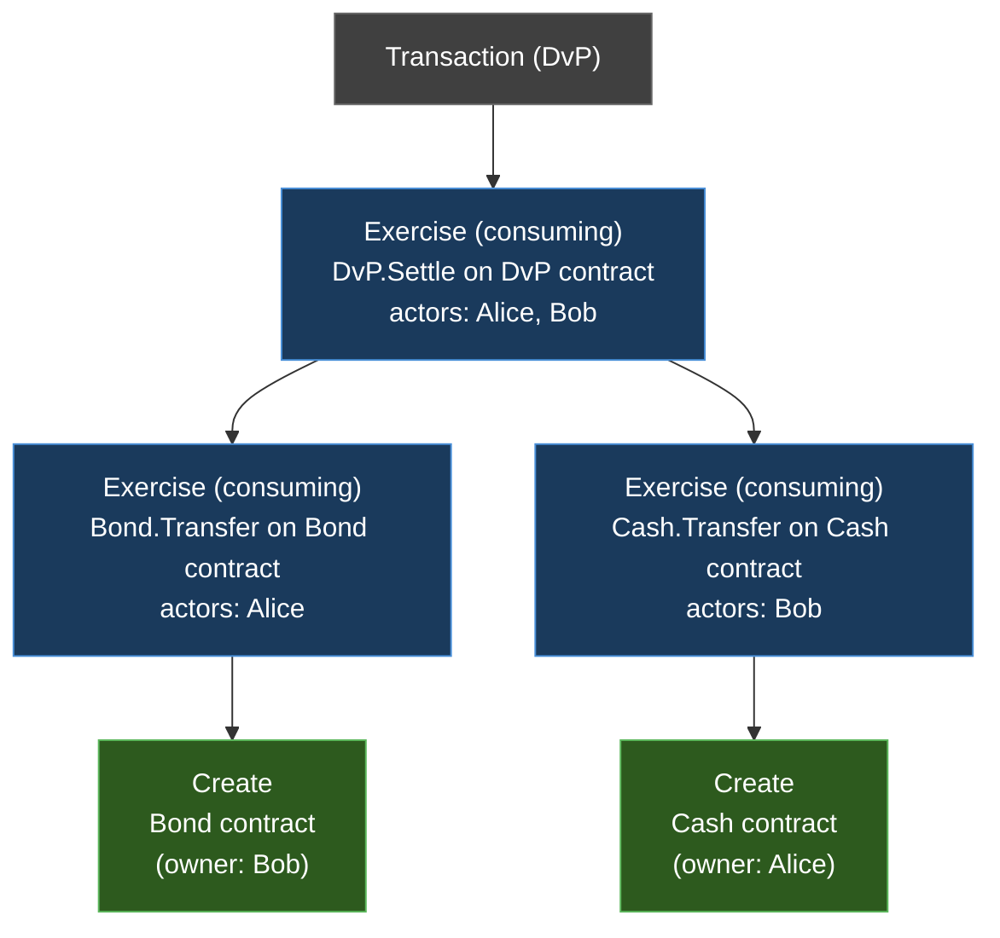

This page provides the formal specification of Canton's ledger model. It defines the data structures, stakeholder relationships, and validity conditions that govern all state changes on a Canton ledger. The [Learn](/docs-main/overview/learn/ledger-model) pages introduce these concepts at a high level; this reference describes them precisely.

## Extended UTXO Model

Canton uses an **extended UTXO (eUTXO)** ledger model. Ledger state consists of a set of immutable data objects called **contracts**. A contract, once created, is never modified — it can only be **archived** (consumed). Transactions consume existing contracts and produce new ones, analogous to spending and creating unspent transaction outputs in Bitcoin's UTXO model.

The "extended" qualifier reflects two differences from a plain UTXO model:

- Contracts carry structured data (typed fields defined by a template), not just a value and a locking script.
- Contracts support rich execution logic through **choices** — named actions with typed arguments, authorization rules, and computational consequences that can create or consume further contracts.

Each contract is identified by a globally unique **contract ID**. The contract ID is derived from the transaction that created it and is never reused once the contract is archived.

## Templates and Contract Instances

A **template** is a Daml type definition that specifies the schema and behavior of a contract. It declares:

- **Data fields** — the typed payload of every contract instance (the template's arguments)
- **Signatories** — the parties that must authorize creation
- **Observers** — additional parties with visibility
- **Choices** — the actions that can be performed on the contract, including their controllers, arguments, and body (the Daml code that runs when the choice is exercised)

A **contract instance** is the immutable record created on the ledger when a `Create` action executes for a given template. It binds a contract ID to a specific template ID and a specific set of argument values. The contract instance cannot be changed after creation — the only lifecycle events are creation and archival.

```haskell
template Iou
  with
    issuer : Party
    owner  : Party
    amount : Decimal
  where
    signatory issuer        -- must authorize creation and archival
    observer owner          -- can see the contract

    choice Transfer : ContractId Iou
      with newOwner : Party
      controller owner
      do create this with owner = newOwner
```

In this example, `Iou` is the template. A contract instance of `Iou` holds concrete values for `issuer`, `owner`, and `amount`, and is referenced by a contract ID of type `ContractId Iou`.

## Stakeholder Annotations

Every contract carries three sets of parties derived from its template definition:

- **Signatories** — A non-empty set of parties that must authorize both the creation and the archival of the contract. Signatories are the primary trust anchors: their agreement is what makes a contract meaningful. A contract with signatories `{Alice, Bob}` represents a statement that both Alice and Bob attest to.

- **Observers** — A (possibly empty) set of parties that are informed about the contract's existence and lifecycle events, but whose authorization is not required for creation or archival. Observers gain visibility but not control.

- **Stakeholders** — The union of signatories and observers. A party is a stakeholder of a contract if and only if it is either a signatory or an observer. Stakeholders are the parties who have a stake in the contract and whose participant nodes store a copy of it.

The signatory set must be non-empty. Observers may overlap with signatories (any party that is both a signatory and an observer is simply a signatory — the signatory role subsumes the observer role).

Stakeholder annotations determine two things: **authorization** (who must approve state changes) and **visibility** (who learns about state changes). Both feed into the privacy model described in the [Views and Witnesses](#views-and-witnesses) section below.

## Actions and Hierarchical Structure

The basic building blocks of ledger changes are **actions**. Canton defines two primary action types.

### Create Actions

A **Create** action records the creation of a new contract. It carries:

- **Contract ID** — the unique identifier assigned to the new contract
- **Template ID** — identifies which template this contract instantiates
- **Contract arguments** — the field values for the template parameters
- **Signatories** — derived from the template definition and arguments
- **Observers** — derived from the template definition and arguments

A Create action produces one output contract (the newly created contract) and consumes no inputs.

### Exercise Actions

An **Exercise** action records the execution of a choice on an existing contract. It carries:

- **Contract ID** — the input contract being acted upon
- **Template ID** — the template of the input contract
- **Choice name** — which choice is being exercised
- **Choice arguments** — the typed arguments passed to the choice
- **Actors** — the party or parties exercising the choice (must satisfy the `controller` declaration)
- **Exercise kind** — either **consuming** or **non-consuming**
- **Consequences** — a list of child actions produced by executing the choice body

When the exercise kind is **consuming**, the input contract is archived. This is the mechanism that prevents double-spending: once consumed, a contract ID cannot be consumed again. When the exercise kind is **non-consuming**, the input contract remains active after the exercise completes.

### Hierarchical Action Trees

Actions form a **tree** structure. An Exercise action's consequences are themselves a list of actions — which may include further Exercise actions and Create actions. Each of those child Exercise actions can in turn have their own consequences, producing an arbitrarily deep tree.

A **top-level action** is an action that is not a consequence of any other action. A transaction consists of one or more top-level actions, making the overall structure a **forest** (a list of trees).

The following diagram shows the hierarchical action structure of a delivery-versus-payment (DvP) transaction. Alice delivers a bond to Bob, and Bob delivers cash to Alice, atomically.



In this example:

- The root action is a consuming Exercise on the DvP contract. Settling the DvP archives the DvP contract itself.
- The first consequence is a consuming Exercise on Alice's Bond contract (transferring ownership to Bob), which produces a Create of a new Bond contract owned by Bob.
- The second consequence is a consuming Exercise on Bob's Cash contract (transferring ownership to Alice), which produces a Create of a new Cash contract owned by Alice.

The hierarchical structure is the foundation of Canton's privacy model. Different parties may see different subtrees of this action tree, depending on their stake in the contracts involved.

## Transaction Structure

A **transaction** is a list of top-level actions together with metadata. Formally, a transaction includes:

- **Transaction ID** — a unique identifier
- **Top-level actions** — a list of action trees forming a forest
- **Ledger time** — the time at which the transaction is recorded

From the action forest, several derived sets are important:

- **Inputs** — the set of contracts consumed by consuming Exercise actions anywhere in the transaction. These contracts transition from active to archived.
- **Outputs** — the set of contracts produced by Create actions anywhere in the transaction. These contracts transition from non-existent to active.
- **Transient contracts** — contracts that appear in both the inputs and outputs of the same transaction. A transient contract is created and archived within a single transaction; it never becomes visible in the Active Contract Set between transactions.

### Active Contract Set (ACS)

The **Active Contract Set** at any point in the ledger's history is the set of contracts that have been created but not yet archived. After a transaction commits:

- Every contract in the transaction's outputs (minus transient contracts) is added to the ACS.
- Every contract in the transaction's inputs is removed from the ACS.

The ACS represents the current ledger state. Each participant node maintains its own projection of the ACS, containing only contracts where its hosted parties are stakeholders.

## Views and Witnesses

Canton decomposes each transaction into **views** to enforce sub-transaction privacy. A view is a minimal unit of the transaction visible to a specific set of parties.

### View Generation

Each action node in the transaction tree generates a view. The view contains the action's data — contract IDs, template IDs, choice arguments, and the party annotations — encrypted so that only the view's intended recipients can read it.

Starting from Canton protocol version 7, the protocol creates a view for every action node in the transaction tree when the informee participants of a child action differ from those of its parent. When a child action's informee participants are a subset of the parent's, the child is bundled into the parent's view to reduce message overhead.

### Informees

The **informees** of a view are the parties entitled to see that action. Informee computation depends on the action type:

- **Create action**: the informees are the stakeholders of the created contract (signatories and observers).
- **Consuming Exercise action**: the informees are the union of the actors, the signatories of the input contract, and the observers of the input contract.
- **Non-consuming Exercise action**: the informees are the union of the actors and the signatories of the input contract.

A party that is an informee of a view receives the encrypted payload of that view from the sequencer and can decrypt it. A party that is *not* an informee of a view receives nothing — no payload and no metadata about the view's existence.

### Sub-Transaction Privacy in Practice

Different parties see different projections of the same transaction. Consider the DvP example above:

- **Alice** sees the root Exercise (DvP.Settle), the Exercise on her Bond, and the Create of Bob's new Bond. She also sees the Create of her new Cash. She does *not* necessarily see the internal details of Bob's Cash contract if she is not a stakeholder of it (though in a DvP she would typically be an observer on the incoming cash).
- **Bob** sees the root Exercise, the Exercise on his Cash, and the Create of Alice's new Cash. He also sees the Create of his new Bond.
- **The synchronizer** (sequencer and mediator) sees none of the plaintext. It handles encrypted view payloads, recipient lists, and confirmation results.

The hierarchical structure enables this decomposition naturally. Each subtree of the action tree can be packaged as a view and encrypted to its informees. Parties who share a subtree see the same view; parties who do not share a subtree see different views — or no view at all.

### Witnesses and Disclosure

A party is a **witness** of an action if it is an informee of that action's view. Witnesses are responsible for validating the portion of the transaction they can see and sending confirmation or rejection messages to the mediator.

Beyond direct informee status, a party may also learn about a contract through **divulgence**: if a contract is fetched (read) within an action where the party is an informee, the party learns the contract's contents even if it was not an original stakeholder. Divulgence is an implicit form of disclosure that arises from transaction composition.

## Ledger Validity

A ledger — a sequence of committed transactions — is valid when every transaction satisfies four properties.

### Consistency

No contract is consumed more than once. At any point in the ledger's history, each contract is in exactly one of three states:

- **Non-existent** — not yet created
- **Active** — created but not yet consumed
- **Archived** — consumed by a prior transaction

A consuming Exercise action on a contract ID is valid only if that contract is active at the time the transaction commits. If two transactions attempt to consume the same contract, exactly one commits and the other is rejected. This is the **double-spend prevention** guarantee.

Consistency also requires **key uniqueness** for contracts with keys: no two active contracts of the same template may share the same contract key.

### Conformance

Every Exercise action must conform to the Daml template's logic. When a choice is exercised, the Daml interpreter evaluates the choice body given the choice arguments and the contract's data. The resulting child actions (consequences) must exactly match what the Daml code produces. A participant that validates a view re-executes the Daml code and compares the result against the submitted transaction. If they diverge, the participant rejects.

Conformance also applies to Create actions: the contract's data must satisfy any `ensure` clause (precondition) defined in the template.

### Authorization

Every action must be authorized by the required parties:

- **Create actions** require authorization from all signatories of the contract being created. Authorization can come from the parties directly exercising a choice (the actors of a parent Exercise action) or from being signatories of the parent contract.
- **Consuming Exercise actions** require authorization from the actors (which must match the choice's `controller` declaration) and — for archival — implicitly from the stakeholders through the confirmation protocol.
- **Non-consuming Exercise actions** require authorization from the actors.

Authorization is checked both at interpretation time (by the submitting participant) and at validation time (by every confirming participant that sees the relevant view). The protocol does not rely on a single point of trust for authorization checks.

### Time Bounds

Each transaction carries a **ledger time**. For the transaction to be valid, the ledger time must fall within an acceptable window relative to **record time** (the timestamp assigned by the sequencer). This bound prevents transactions from being backdated or predated beyond a configurable tolerance. The exact tolerance depends on the synchronizer's configuration and accounts for clock skew between participants.

## Relationship to Other Protocol Layers

The ledger model defines *what* constitutes a valid state transition. The Canton protocol's other layers determine *how* these transitions are proposed, validated, and committed:

- The **[smart contract consensus](/docs-main/overview/reference/smart-contract-consensus)** layer implements the confirmation protocol where participants validate views and the mediator aggregates results.
- The **[ordering consensus](/docs-main/overview/reference/ordering-consensus)** layer (sequencer) provides the total ordering that drives consistency — ensuring all participants agree on which transaction consumed a given contract first.
- The **[transaction lifecycle](/docs-main/overview/reference/transaction-lifecycle)** describes the end-to-end flow from command submission through commit.
