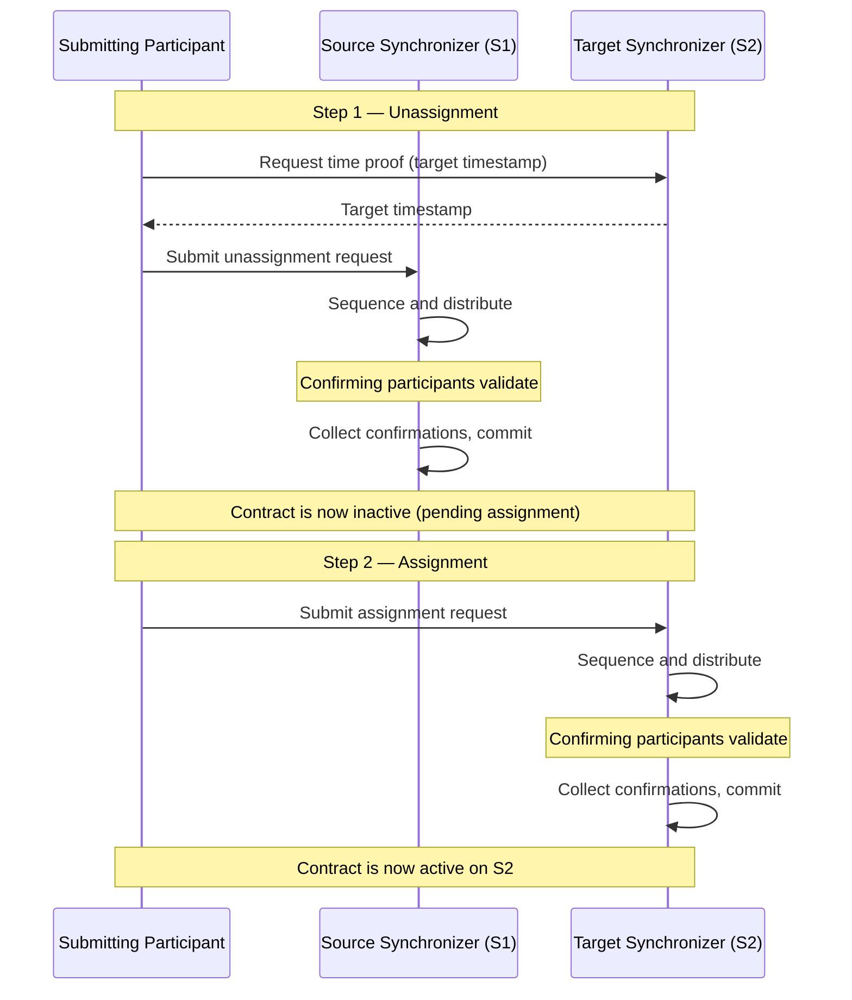

{/* COPIED_START source: multi-synchronizer.rst */}

Every Daml contract is assigned to a synchronizer. The participants hosting at least one stakeholder of the contract agree on which synchronizer to use to synchronize changes on that contract. This agreed-upon synchronizer is the contract's **assignation**.

Because a Daml transaction executes on a single synchronizer, all input contracts must share the same assignation. When they do not, one or more contracts must be **reassigned** to a common synchronizer before the transaction can proceed.

{/* COPIED_END */}

## Why reassignments exist

A participant node can connect to several synchronizers. Different synchronizers may serve different purposes: regulatory compliance, performance characteristics, cost, governance models, or application-specific restrictions. Contracts created on different synchronizers need a way to participate in the same transaction, and reassignment is that mechanism.

<Note>
Synchronizers are commodities used by stakeholders to synchronize changes on contracts. The contracts themselves are stored only on participant nodes. An assignation is an agreement between stakeholders that they can change over time through reassignments.
</Note>

## Two-step process: unassignment and assignment

{/* COPIED_START source: multi-synchronizer.rst */}

Reassigning a contract `c` from synchronizer `S1` (the **source** synchronizer) to synchronizer `S2` (the **target** synchronizer) consists of two steps:

- **Unassignment**: A stakeholder submits a command to unassign the contract from the source synchronizer. Once committed, `c` is inactive on the source and cannot be used.
- **Assignment**: A stakeholder (not necessarily the same one) submits a command to assign the contract on the target synchronizer. Once committed, `c` becomes active on the target and can be used again.

Each step goes through the same phases as the [transaction protocol](/docs-main/overview/reference/transaction-lifecycle): preparation, submission, sequencing, validation, and commit.

The reassignment is **non-atomic**. It involves two confirmation requests on two distinct synchronizers. After a successful unassignment, the contract is marked as **pending assignment** and cannot be used until the assignment completes.

{/* COPIED_END */}

## Key definitions

### Reassignment counter

{/* COPIED_START source: multi-synchronizer.rst */}

The **reassignment counter** tracks the number of times a contract has been reassigned. It is set to zero when the contract is created and increased by one with each unassignment. The unassignment event and its corresponding assignment event share the same reassignment counter value.

{/* COPIED_END */}

### Target timestamp

{/* COPIED_START source: multi-synchronizer.rst */}

When processing an unassignment request, confirming participants check that the target synchronizer meets certain requirements (for example, that required packages are vetted). These checks depend on the target synchronizer's topology, which can change over time. To ensure all involved participants perform the same validations and reach the same conclusion, the unassignment request includes a timestamp from the target synchronizer. This timestamp, called the **target timestamp**, is obtained by requesting a time proof on the target synchronizer at the time of submission.

{/* COPIED_END */}

### Reassigning participant

{/* COPIED_START source: multi-synchronizer.rst */}

Because topology can be inhomogeneous (a participant node might host a party only on some synchronizers it connects to), a participant involved in a reassignment might be an informee of only the unassignment or only the assignment. Such a participant cannot perform all validations and cannot protect against double spends. This motivates a stricter role.

A participant `P` is a **reassigning participant** for a party `S` if all of the following hold:

- `S` is a stakeholder of the contract.
- `S` is hosted by `P` on the target synchronizer at the target timestamp.
- `S` is hosted by `P` on the source synchronizer.

{/* COPIED_END */}

A reassigning participant is connected to both the source and target synchronizers and hosts a stakeholder on both. This dual connectivity allows it to validate the full reassignment and guard against double spends.

### Signatory unassigning participant

{/* COPIED_START source: multi-synchronizer.rst */}

Only signatories need to confirm a reassignment. Since signatories could archive a contract on the source synchronizer and re-create it on the target, requiring additional parties like observers to confirm would not add safety.

A participant `P` is a **signatory unassigning participant** for a party `S` if:

- `S` is a **signatory** of the contract.
- `P` is a reassigning participant for `S`.
- `S` is hosted on `P` with at least confirmation rights on the source synchronizer.

{/* COPIED_END */}

### Signatory assigning participant

{/* COPIED_START source: multi-synchronizer.rst */}

A participant `P` is a **signatory assigning participant** for a party `S` if:

- `S` is a **signatory** of the contract.
- `P` is a reassigning participant for `S`.
- `S` is hosted on `P` with at least confirmation rights on the target synchronizer.

A signatory assigning participant is informed of both the unassignment and the assignment of a contract and acts as a confirmer of the assignment request.

{/* COPIED_END */}

## Confirmation policies

{/* COPIED_START source: multi-synchronizer.rst */}

Only reassigning participants that host a signatory send confirmation responses:

- **Unassignment confirmers**: the signatory unassigning participants.
- **Assignment confirmers**: the signatory assigning participants.

The number of confirmations expected by the mediator for a given signatory equals that signatory's confirmation threshold on the relevant synchronizer (source for unassignment, target for assignment).

{/* COPIED_END */}

## Validation rules

### Unassignment validation

{/* COPIED_START source: multi-synchronizer.rst */}

During unassignment processing, confirmers verify:

- The contract is active on the source synchronizer.
- Every stakeholder is hosted on a reassigning participant.
- Each signatory `S` is hosted on sufficiently many signatory assigning participants. Specifically, if `S`'s confirmation threshold on the target synchronizer is `t`, then `S` needs at least `t` signatory assigning participants. This prevents a situation where the reassignment cannot complete due to insufficient confirmers for the assignment step.
- The package corresponding to the contract is vetted on the target synchronizer.
- If the request contains multiple contracts, all contracts in the batch have the same signatories and stakeholders.

{/* COPIED_END */}

### Assignment validation

{/* COPIED_START source: multi-synchronizer.rst */}

Assignment validation is simpler. Confirmers verify:

- The assignment corresponds to a reassignment that is not yet completed.
- The package corresponding to the contract is vetted on the target synchronizer.

{/* COPIED_END */}

Standard validations that also apply to regular Daml transactions are performed for both steps: correct view decryption, correct recipient lists, and correct root hash messages.

<Warning>
If the topology changes between unassignment and assignment, completing the reassignment may become impossible. In that case, you can either adjust the topology to allow the assignment, or use the repair service to manually fix the contract's assignation on every relevant participant node.
</Warning>

## Submission policies

{/* COPIED_START source: multi-synchronizer.rst */}

A reassignment (unassignment or assignment) of a contract `c` can be submitted by a participant `P` if `P` hosts at least one stakeholder `S` of `c` for which it is a reassigning participant. Submission permission on that synchronizer is **not** required.

{/* COPIED_END */}

This relaxed requirement has two motivations. First, a party that loses submission permission on a synchronizer after reassignment can still initiate a reassignment back, preserving the ability to exercise choices. Second, decentralized parties (which cannot submit Daml transactions) should still be able to submit reassignments for composability.

## Assignment exclusivity

{/* COPIED_START source: multi-synchronizer.rst */}

A successful unassignment yields an unassigned event containing an **assignment exclusivity** deadline. Before this deadline (measured on the target synchronizer), only the submitter of the unassignment can initiate the assignment. After the deadline, any eligible participant can submit it.

{/* COPIED_END */}

This mechanism gives the initiator a window to complete the reassignment without interference, while still allowing other participants to finish an abandoned reassignment.

## Automatic vs. explicit reassignment

You can trigger reassignments in two ways.

### Automatic (synchronizer router)

When you submit a transaction through the Ledger API, Canton's synchronizer router automatically identifies a suitable synchronizer. It reassigns all input contracts to that synchronizer, executes the transaction, and optionally reassigns output contracts afterward. Your application does not need to manage synchronizer selection or reassignment commands.

The router selects the admissible synchronizer that has the highest priority, minimizes the number of reassignments, and (as a tiebreaker) has the lowest synchronizer ID. An application can influence routing through per-synchronizer package vetting, inhomogeneous party hosting, or explicitly disclosed contracts.

### Explicit (Ledger API commands)

For fine-grained control, you can submit reassignment commands directly through the Ledger API. The unassign command specifies the contracts, source synchronizer, and target synchronizer. The assign command references the unassign ID returned by the unassignment. You can also prescribe which synchronizer to use when submitting a transaction; if that synchronizer is not suitable, submission fails.

<Note>
Automatic reassignment is convenient but can cause unexpected contention. Both unassignment and assignment lock the contract, which means reassignments compete with other workflows, including read-only transactions. If contention is a concern, design your Daml workflows with explicit reassignment in mind.
</Note>

## Ledger API data

### Unassign command fields

- **Contracts**: The contracts to reassign (all must share the same signatories and stakeholders).
- **Source synchronizer**: The current assignation.
- **Target synchronizer**: The desired assignation.

### Unassigned event fields

- **Unassign ID**: An opaque identifier that uniquely identifies the reassignment, used to submit the assignment.
- **Reassignment counter**: Number of times the contract has been reassigned.
- **Assignment exclusivity**: The deadline before which only the unassignment submitter can submit the assignment.

### Assign command fields

- **Unassign ID**: The identifier from the unassigned event.
- **Source synchronizer**: The previous assignation.
- **Target synchronizer**: The new assignation.

### Assigned event fields

- **Unassign ID**: For correlating unassigned and assigned events.
- **Reassignment counter**: Same value as in the unassigned event.
- **Created event**: The contract data, included so that participants learning about the contract for the first time (because it entered their visibility) can access its payload.

## Contracts entering and leaving visibility

{/* COPIED_START source: multi-synchronizer.rst */}

Because topology can differ across synchronizers, a participant that is an informee of the unassignment may not be an informee of the assignment (or vice versa).

When a participant is informed of the unassignment but not the assignment, the contract **leaves the visibility** of that participant: the contract becomes unusable there. When a participant is informed of the assignment but was not informed of the unassignment, the contract **enters the visibility** of that participant: the contract becomes usable there for the first time. The created event included in the assigned event allows applications on that participant to learn about the contract's payload.

A contract can enter and leave a participant's visibility multiple times during its lifecycle, if all stakeholders hosted on that participant are also hosted elsewhere.

{/* COPIED_END */}

## Updates stream ordering

When a participant connects to multiple synchronizers, the updates stream merges events from all of them. Because time cannot be compared across synchronizers, there is no global causality guarantee on the updates stream. Events from different synchronizers may appear in any order, and different participants may see different orderings.

Within a single synchronizer, ordering is consistent: a created event always appears before any unassigned or archived event for that contract, and an archived event always appears after any assigned or created event.
