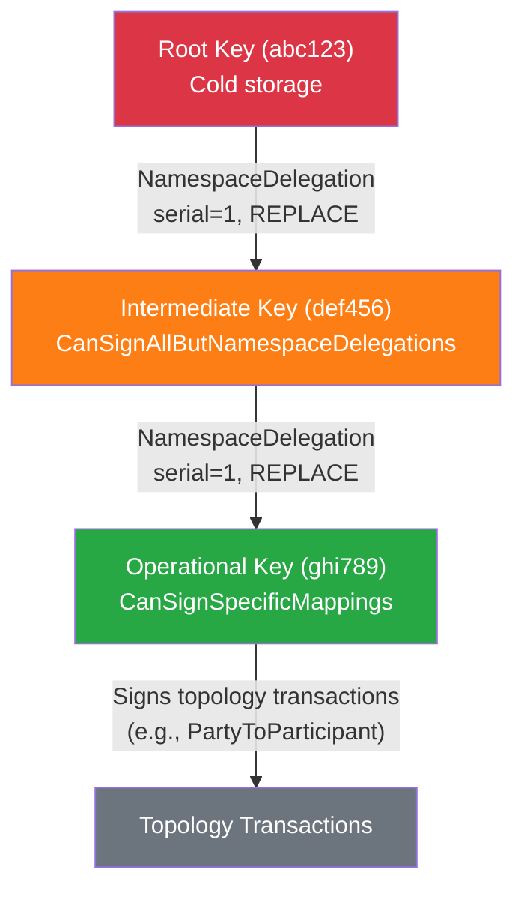

{/* Reference source: https://docs.digitalasset.com/overview/3.4/explanations/canton/topology.html */}

All participant nodes and synchronizer components must know the topology state of a synchronizer:
-  the identities present,
-  their associated keys,
-  party hosting relationships,
-  and vetted packages.

Topology state is distributed via the synchronizer so that every connected node maintains synchronized topology state through deterministic state machine replication. Each node locally validates incoming topology changes using identical rules. Because the state machine is deterministic, all nodes connected to a synchronizer compute the same topology state at any given point in time.

## Design Principles

Canton's topology system is built on four principles.

**No single trust anchor:** A globally synchronized network cannot rely on a single, globally trusted entity for establishing identities. Each namespace is independently anchored by its own root key, and no central authority controls identity issuance.

**Key-based identity:** A Canton key holder is an entity that can authorize actions and whose authorized actions can be verified. Every key holder possesses keys that are known to belong together. Cryptographic fingerprints uniquely identify key pairs, and signatures prove ownership.

**Separation of system and legal identity:** Cryptographic identity is separated from real-world legal identity. Canton enforces cryptographic proof only; legal ownership is a matter of external belief, rooted in trust anchors outside the protocol. Legal identity is relevant for interpreting shared data, not for the synchronization protocol itself.

**Asymmetric identity requirements:** Large corporations want to be known; individuals may prefer privacy. Identity on the ledger is an asymmetric problem. Whether to prioritize privacy or publicity must be weighed case by case, and the protocol does not force a uniform answer.

## Namespaces and Unique Identifiers

### Namespaces

A namespace is defined by a self-signed root certificate: a `NamespaceDelegation` where the namespace, target key, and signing key are all the same key fingerprint. For example, a root certificate for a namespace with fingerprint `abc123` takes the form:

```
NamespaceDelegation(namespace=abc123, target=abc123, signedBy=abc123)
```

The root certificate together with the corresponding private key form the trust anchor for the namespace. Whoever controls the private key controls the namespace and can authorize topology transactions within it.

### Unique Identifiers (UIDs)

A unique identifier (UID) represents an identity -- a node or a party. A UID consists of an identifier string and a namespace, formatted as `identifier::namespace`. For example:

```
jane_doe::abc123
```

Two UIDs can share the same identifier string if their namespaces differ. The namespace portion links each UID back to a cryptographic root of trust.

### Node Identity

By default, a Canton node creates a new identity on first startup by generating a key pair. The fingerprint of that key becomes both the node's namespace and the namespace portion of its UID. The node automatically creates the corresponding root certificate (a self-signed `NamespaceDelegation`) and an `OwnerToKeyMapping` declaring its signing and encryption keys.

### Party Identity

Party identifiers follow the same UID format:

```
alice::abc123
```

By default, parties are created within the namespace of the hosting participant. The participant's namespace key authorizes the party's topology transactions without additional signatures. Parties can also be created in a separate namespace to decouple ownership from hosting -- useful when the party owner and the hosting participant are distinct entities.

## Topology Transactions

Topology state is a key-value map. Each topology transaction affects exactly one key in this map and contains:

- **Mapping**: The content of the change -- what aspect of topology is being modified (e.g., `PartyToParticipant`, `OwnerToKeyMapping`, `VettedPackages`)
- **Serial**: A monotonically increasing version number for each unique key, starting at 1. Serials must increment by exactly one with no gaps or repetitions. This prevents replay attacks and enables conflict detection.
- **Change operation**: Either `REPLACE` (create or update a mapping) or `REMOVE` (delete a mapping). Removals follow the same serial rules as replacements; a removed mapping can be reactivated with a subsequent `REPLACE`.
- **Signatures**: Cryptographic signatures from all required authorizers. The signatures cover the mapping content, serial, and change operation, so tampering invalidates authorization.

A topology transaction must be *well-formed* (passing static structural checks) and *well-authorized* (passing state-dependent authorization checks based on certificate chains).

### Proposals

When a topology transaction requires signatures from multiple parties (for example, a `PartyToParticipant` mapping where the party owner and participant are in different namespaces), incompletely signed transactions are stored as proposals. Signatures from separate submitters merge automatically. A proposal has no expiration -- it remains pending until fully authorized or superseded by a competing proposal that achieves full authorization first.

### Mapping Types

The topology system defines several mapping types, each governing a different aspect of topology state.

**NamespaceDelegation** -- Delegates signing authority within a namespace to other keys. Supports three restriction levels:

- `CanSignAllMappings`: Unrestricted signing authority within the namespace
- `CanSignAllButNamespaceDelegations`: Can sign all mapping types except further namespace delegations. Suitable for operational keys while the root key remains offline.
- `CanSignSpecificMappings`: A whitelist of allowed mapping types. The most restrictive option.

**OwnerToKeyMapping** -- Declares the signing and encryption keys for a Canton node. Keys declared here are used for protocol operations (message signing, payload encryption) but cannot sign topology transactions unless they are also targets of a `NamespaceDelegation`, which is discouraged for security reasons.

**PartyToKeyMapping** -- Declares cryptographic keys for external parties, those whose keys are held outside any participant node. Enables independent key management for parties with their own namespaces.

**PartyToParticipant** -- Defines which participant nodes host a party and with what permission level. See [Party Hosting and Permissions](#party-hosting-and-permissions) below.

**VettedPackages** -- Declares which Daml packages a participant agrees to run. Vetting can be restricted to specific time windows. The vetting state determines which Daml template versions are available to interpret Ledger API commands.

**SynchronizerTrustCertificate** -- A participant's explicit signal to join a specific synchronizer. This binding is synchronizer-specific; the same certificate cannot be replayed across different synchronizers.

**SequencerSynchronizerState** -- Lists all sequencers of a synchronizer. Synchronizer owners add entries to this mapping; the sequencer itself does not authorize its own inclusion.

**MediatorSynchronizerState** -- Lists all mediators of a synchronizer. Multiple mediator groups can exist, distributing the mediator workload across groups.

## Party Hosting and Permissions

The `PartyToParticipant` mapping assigns one of three permission levels to each hosting relationship:

- **Observation**: The participant receives notifications of transactions where the party is a stakeholder, but cannot confirm or submit transactions on behalf of the party.
- **Confirmation**: The participant can confirm or reject transactions as part of the two-phase commit protocol. Subsumes Observation.
- **Submission**: The participant can submit transactions on behalf of the party. Subsumes Confirmation.

When the party owner and the hosting participant are in different namespaces, both must sign the `PartyToParticipant` mapping. If they share the same namespace, a single signature suffices.

<Note>
The distinction between Submission and Confirmation is enforced only at the participant level. A malicious participant with Confirmation permission could submit transactions for the party, because Canton's privacy model hides the identity of the submitting participant from other validators.
</Note>

## Multi-Hosting

A party can be hosted on multiple participant nodes. When multi-hosted, the confirmation policy requires a threshold number of hosting participants to confirm each transaction involving that party. This provides two benefits:

- **Resilience**: The party remains available even if some hosting participants go offline, as long as the threshold is met.
- **Decentralization**: No single participant controls the party unilaterally. Multiple participants must agree before transactions commit.

## Authorization Chains and Key Delegation

The root namespace key is the ultimate trust anchor and should be kept in cold storage. Canton supports delegation chains so that day-to-day operations do not require the root key to be online.

A delegation chain works as follows: the root key signs a `NamespaceDelegation` for an intermediate key, granting it signing authority. The intermediate key can then sign further delegations (if its restriction level permits) or sign topology transactions directly.



When validating a topology transaction's signature, nodes build a directed acyclic graph from all `NamespaceDelegation` entries and verify that a valid chain exists from the signing key back to the root certificate. The chain must be unbroken at the transaction's effective time.

### Key Revocation

A key holder revokes an intermediate certificate by broadcasting a `NamespaceDelegation` with a `REMOVE` operation targeting that certificate. Revocation leaves downstream certificates "dangling" -- they can no longer authorize new topology transactions because the chain back to the root is broken. However, transactions that were previously validated under the now-revoked chain remain valid. Validation always checks the certificate chain at the transaction's sequenced effective time, so past authorization is unaffected.

## Topology Change Propagation

### Broadcast Mechanism

Topology transactions are broadcast to all members of the synchronizer via the sequencer, addressed to the `AllMembersOfSynchronizer` group. The sequencer resolves group membership at sequencing time. Nodes reject topology transactions that arrive outside this broadcast channel, preventing ledger forks from privately submitted topology changes.

### Sequential Validation

Nodes validate topology transactions strictly sequentially, not in parallel. Sequential processing is required to maintain deterministic state across all nodes. If two nodes processed the same topology transactions in different orders, they could diverge and produce inconsistent topology snapshots.

### Future Dating

Topology changes become effective at time `t + epsilon` rather than immediately, where `t` is the sequencing timestamp and `epsilon` is the topology change delay. This delay is a configurable synchronizer parameter.

Future dating serves a specific purpose: it separates topology processing from Daml transaction processing in time. Without the delay, validating topology changes could block processing of Daml transactions, since both depend on topology snapshots. With the delay, a node can process incoming messages at time `t` using the topology snapshot from `t - epsilon`, which is already finalized and will not change.

The trade-off is straightforward. If `epsilon` is too small, topology processing may still block message processing. If `epsilon` is too large, topology changes take longer to become effective. The appropriate value depends on the synchronizer's throughput and latency characteristics.
