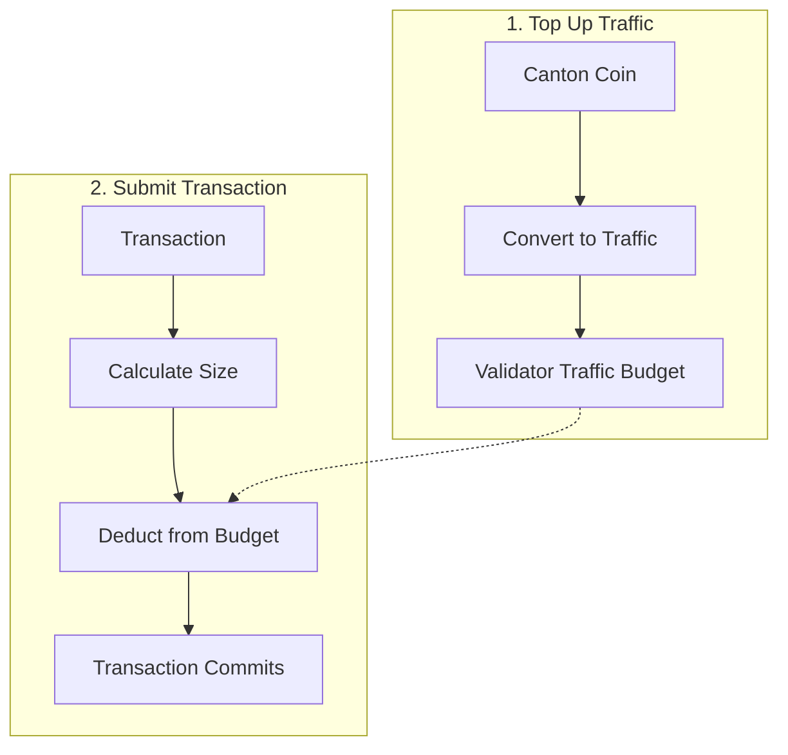

Canton Coin (CC) is the native utility token of the Global Synchronizer, providing the economic foundation for network operations.

## What is Canton Coin?

Canton Coin is the native token used to:

| Use | Description |
|-----|-------------|
| **Transaction fees (Traffic)** | Pay for network usage when submitting transactions |
| **Validator rewards** | Incentivize infrastructure operators |
| **Governance** | Super Validators stake CC to participate |

Canton Coin is implemented via [Splice](https://github.com/canton-network/splice), the open-source infrastructure for decentralized Canton synchronizers.

## Traffic: Transaction Fees

"Traffic" is Canton's term for transaction fees. To transact on the Global Synchronizer, you need traffic credits in your validator's traffic budget.

**The two-step process:**
1. **Top up**: Convert Canton Coin to traffic credits, which are added to the validator's traffic budget
2. **Consume**: When transactions are submitted, traffic credits are deducted from the budget

Traffic credits are non-transferable—once CC is converted to traffic, it can only be used to pay for transaction fees.

### How Traffic Works

Traffic costs depend on:

| Factor | Impact |
|--------|--------|
| **Transaction size** | Larger transactions cost more |
| **Computational complexity** | More complex operations cost more |
| **Network demand** | May vary with network load |

### Traffic Management

To ensure your transactions can be processed:

1. **Maintain traffic credits** in your validator's traffic budget
2. **Top up** by converting CC to traffic credits when the budget gets low
3. **Monitor usage** to plan for costs

<Note>
If your validator's traffic budget is exhausted, transactions will fail. Validators can configure auto-top-up to automatically convert CC to traffic credits when the balance falls below a threshold.
</Note>

## Obtaining Canton Coin

How you obtain CC depends on the environment:

| Environment | Method |
|-------------|--------|
| **LocalNet** | Automatically available (test CC) |
| **DevNet** | Faucet ("tapping") provides test CC |
| **TestNet** | Faucet provides test CC |
| **MainNet** | Purchase or earn through network activity |

### DevNet/TestNet Faucet

On test networks, you can "tap" for free test CC:

1. Access your wallet interface
2. Use the tap/faucet functionality
3. Receive test CC (no real value)

Test CC is rate-limited and has no economic value.

### MainNet Acquisition

On MainNet, CC has real economic value:

| Method | Description |
|--------|-------------|
| **Exchanges** | Purchase from supported exchanges |
| **Network activity** | Earn through validator operations |
| **Direct transfer** | Receive from other parties |

## Validator Rewards

Validators operating on the Global Synchronizer can earn CC through:

| Reward Type | Description |
|-------------|-------------|
| **Liveness rewards** | For maintaining node availability |
| **Transaction rewards** | Share of traffic fees |

Super Validators have additional reward mechanisms for operating synchronizer infrastructure.

## Tokenomics

The Global Synchronizer's tokenomics are designed to:

| Goal | Mechanism |
|------|-----------|
| **Sustain infrastructure** | Rewards for operators |
| **Ensure fair pricing** | Market-driven traffic costs |
| **Facilitate governance alignment** | Stake-based participation |
| **Foster network growth** | Incentives for adoption |

For detailed tokenomics, see [canton.foundation](https://canton.foundation).

## Canton Coin vs. Other Cryptocurrencies

| Aspect | Canton Coin | Other L1 Tokens |
|--------|-------------|-----------------|
| **Primary use** | Network utility | Varies |
| **Privacy** | Balances public via scan | Often public |
| **Holders visible** | Public via scan service | Public |
| **Transaction fees** | Pay for traffic | Pay for gas |

### Visibility of Holdings

CC balances and transaction history are publicly visible via the network's scan service, similar to most other cryptocurrencies. This differs from other Canton application contracts, which are private by default and visible only to entitled parties.

## Integration Considerations

### For Application Developers

| Consideration | Approach |
|---------------|----------|
| **Traffic estimation** | Estimate costs for user operations |
| **Top-up flows** | Build automatic or user-triggered top-ups |
| **Error handling** | Handle insufficient balance gracefully |
| **User communication** | Inform users about traffic costs |

### For Validators

| Consideration | Approach |
|---------------|----------|
| **Traffic budget monitoring** | Track traffic credits balance for your hosted parties |
| **Auto-top-up** | Configure automatic CC → traffic conversion when budget is low |
| **Reward management** | Handle earned CC rewards |

## Next Steps

<CardGroup cols={2}>

<Card title="Wallets for Users" icon="wallet" href="/integrations/wallets/for-users">
  Manage your Canton Coin.
</Card>

<Card title="Validator Operations" icon="server" href="/global-synchronizer/understand/introduction">
  Operate and earn rewards.
</Card>

</CardGroup>
