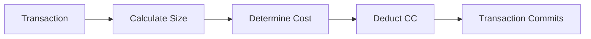

Canton Coin (CC) is the native utility token of the Global Synchronizer, providing the economic foundation for network operations.

## What is Canton Coin?

Canton Coin is the native token used to:

| Use | Description |
|-----|-------------|
| **Transaction fees (Traffic)** | Pay for network usage when submitting transactions |
| **Validator rewards** | Incentivize infrastructure operators |
| **Governance** | Super Validators stake CC to participate |

Canton Coin is implemented via [Splice](https://github.com/hyperledger-labs/splice), the open-source infrastructure for decentralized Canton synchronizers.

## Traffic: Transaction Fees

"Traffic" is Canton's term for transaction fees. When you submit transactions through the Global Synchronizer, you pay traffic costs in Canton Coin.

### How Traffic Works

Traffic costs depend on:

| Factor | Impact |
|--------|--------|
| **Transaction size** | Larger transactions cost more |
| **Computational complexity** | More complex operations cost more |
| **Network demand** | May vary with network load |

### Traffic Management

As a party transacting on the network, you need to:

1. **Maintain a CC balance** for traffic
2. **Top up** when balance gets low
3. **Monitor usage** to plan for costs

<Note>
If a party runs out of CC for traffic, their transactions will fail. Ensure adequate balance for your operational needs.
</Note>

## Obtaining Canton Coin

How you obtain CC depends on the environment:

| Environment | Method |
|-------------|--------|
| **LocalNet** | Automatically available (test CC) |
| **DevNet** | Faucet ("tapping") provides test CC |
| **TestNet** | Faucet provides test CC |
| **MainNet** | Purchase or earn through network activity |

### DevNet/TestNet Faucet

On test networks, you can "tap" for free test CC:

1. Access your wallet interface
2. Use the tap/faucet functionality
3. Receive test CC (no real value)

Test CC is rate-limited and has no economic value.

### MainNet Acquisition

On MainNet, CC has real economic value:

| Method | Description |
|--------|-------------|
| **Exchanges** | Purchase from supported exchanges |
| **Network activity** | Earn through validator operations |
| **Direct transfer** | Receive from other parties |

## Validator Rewards

Validators operating on the Global Synchronizer can earn CC through:

| Reward Type | Description |
|-------------|-------------|
| **Liveness rewards** | For maintaining node availability |
| **Transaction rewards** | Share of traffic fees |

Super Validators have additional reward mechanisms for operating synchronizer infrastructure.

## Tokenomics

The Global Synchronizer's tokenomics are designed to:

| Goal | Mechanism |
|------|-----------|
| **Sustain infrastructure** | Rewards for operators |
| **Fair pricing** | Market-driven traffic costs |
| **Governance alignment** | Stake-based participation |
| **Network growth** | Incentives for adoption |

For detailed tokenomics, see [sync.global](https://sync.global).

## Canton Coin vs. Other Cryptocurrencies

| Aspect | Canton Coin | Other L1 Tokens |
|--------|-------------|-----------------|
| **Primary use** | Network utility | Varies |
| **Privacy** | Balances private | Often public |
| **Holders visible** | Only to entitled parties | Public |
| **Transaction fees** | Pay for traffic | Pay for gas |

### Privacy of Holdings

Unlike most cryptocurrencies where balances are publicly visible:

- Your CC balance is visible only to you and entitled parties
- Transfer details are private between sender and receiver
- No public rich list or balance queries

## Integration Considerations

### For Application Developers

| Consideration | Approach |
|---------------|----------|
| **Traffic estimation** | Estimate costs for user operations |
| **Top-up flows** | Build automatic or user-triggered top-ups |
| **Error handling** | Handle insufficient balance gracefully |
| **User communication** | Inform users about traffic costs |

### For Validators

| Consideration | Approach |
|---------------|----------|
| **Balance monitoring** | Track CC balance for operations |
| **Auto-purchase** | Configure automatic traffic purchases |
| **Reward management** | Handle earned rewards |

## Next Steps

<CardGroup cols={2}>

<Card title="Wallets for Users" icon="wallet" href="/docs-main/building-blocks/wallets/for-users">
  Manage your Canton Coin.
</Card>

<Card title="Validator Operations" icon="server" href="/docs-main/global-synchronizer/understand/introduction">
  Operate and earn rewards.
</Card>

</CardGroup>
