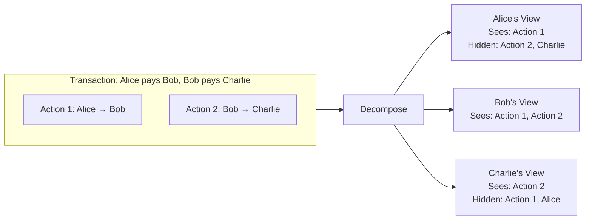
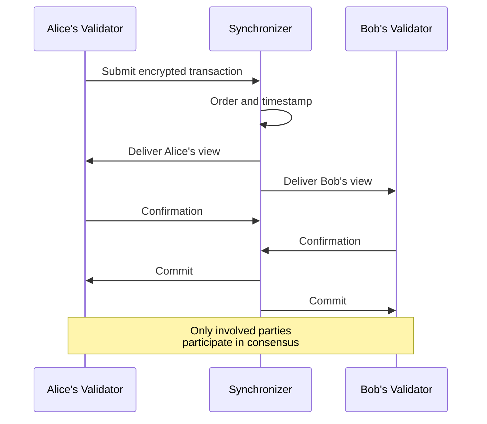
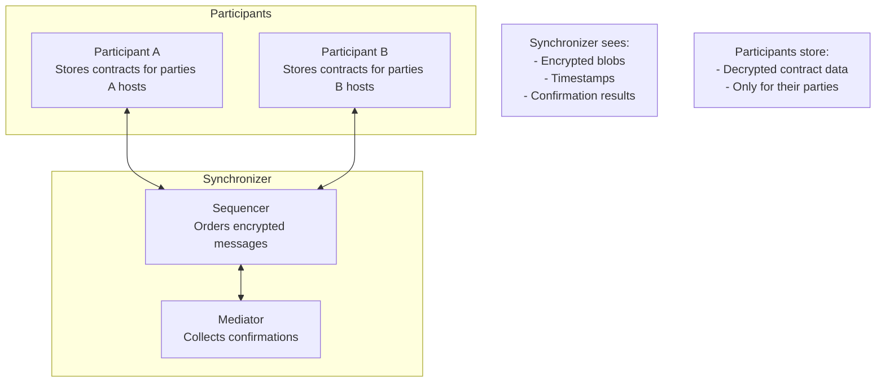
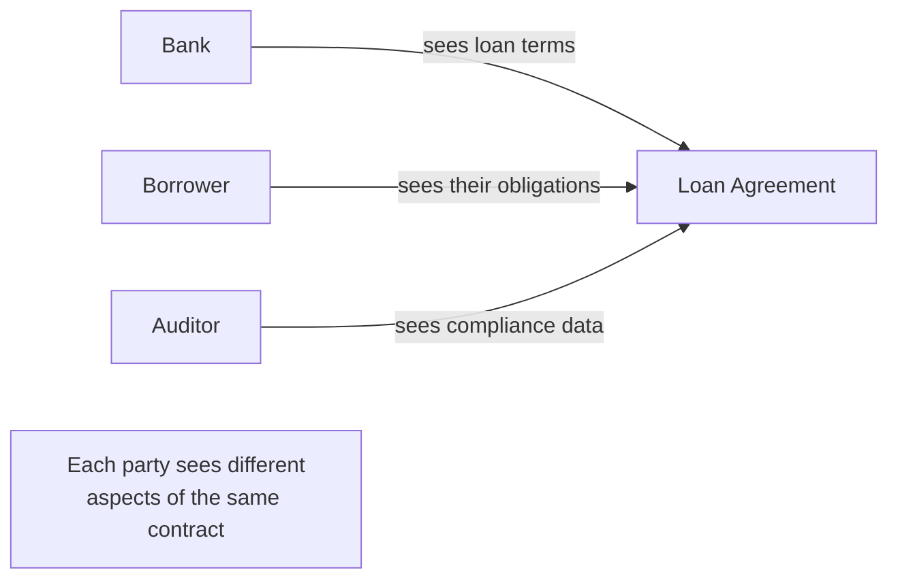

Canton resolves the privacy-integrity tradeoff through three architectural pillars that work together to provide both strong privacy guarantees and blockchain-grade integrity.

## Pillar 1: Sub-Transaction Privacy

Canton's core innovation is **sub-transaction privacy**: decomposing transactions into views where each party sees only what they're entitled to see.

### How Views Work

When a transaction involves multiple parties, Canton doesn't send the entire transaction to everyone. Instead:

1. **Decomposition**: The transaction is split into views based on stakeholder relationships
2. **Encryption**: Each view is encrypted for its specific recipients
3. **Distribution**: The synchronizer delivers only entitled views to each participant
4. **Validation**: Each participant validates their view independently
5. **Confirmation**: Participants confirm based on their view alone

### What Each Party Sees

| Party | Sees | Doesn't See |
|-------|------|-------------|
| **Alice** | Her payment to Bob | Bob's payment to Charlie; Charlie's identity |
| **Bob** | Both payments (involved in both) | Nothing hidden |
| **Charlie** | His receipt from Bob | Alice's involvement; original source |
| **Synchronizer** | Encrypted messages only | Any transaction content |

This isn't just hiding data—it's providing mathematically enforced boundaries on information flow.

## Pillar 2: Proof of Stakeholder Consensus

Traditional blockchains require all validators to verify all transactions. Canton uses a different approach: **only the stakeholders in a transaction need to confirm it**.

### Why This Works

Consider: why does a validator need to verify a transaction they're not part of?

In traditional blockchains, validators verify everything to prevent double-spends and ensure rules are followed. But if only Alice and Bob are affected by a transaction, only Alice and Bob need to verify it. As long as:

- Alice's validator confirms Alice authorized the transaction
- Bob's validator confirms Bob is receiving what he's supposed to
- Both agree the transaction is valid

Then the transaction is valid. Charlie's validator doesn't need to see it, verify it, or even know it exists.

### Integrity Without Global Visibility

This approach maintains integrity because:

- **Double-spend prevention**: Alice's validator tracks Alice's contracts; can't spend what doesn't exist
- **Authorization enforcement**: Only parties declared as controllers can exercise choices
- **Consistency**: The synchronizer ensures all parties see a consistent order
- **Atomicity**: Either all parties confirm, or the transaction is rejected

## Pillar 3: Coordination Without Visibility

The **synchronizer** (sequencer + mediator) coordinates transaction ordering and confirmation without seeing transaction content.

### What the Synchronizer Does

| Function | Description |
|----------|-------------|
| **Ordering** | Assigns timestamps and total order to transactions |
| **Distribution** | Routes encrypted views to entitled participants |
| **Mediation** | Collects confirmations and declares outcomes |
| **Consistency** | Ensures all participants see the same ordering |

### What the Synchronizer Cannot Do

| Limitation | Guarantee |
|------------|-----------|
| **Read content** | Only sees encrypted messages |
| **Identify parties** | Doesn't know which parties are involved |
| **Modify transactions** | Can only pass through or reject |
| **Store state** | No persistent transaction data |

### The Trust Model

The synchronizer's limited capability is a feature, not a limitation:

- **You don't need to trust the synchronizer** with your data—it can't read it
- **You do trust the synchronizer** for ordering and availability
- **The synchronizer can't cheat** because it can't see what it's coordinating

This separation of concerns means:
- Privacy is enforced cryptographically, not by policy
- Synchronizer operators cannot extract transaction intelligence
- Adding more synchronizer operators doesn't expand data exposure

## How the Pillars Work Together

The three pillars are interdependent:

| Pillar | Enables |
|--------|---------|
| **Sub-transaction privacy** | Views that can be validated independently |
| **Proof of stakeholder** | Consensus without global visibility |
| **Coordination without visibility** | Ordering without data exposure |

Together, they create a system where:

1. Each party receives only their view
2. Each party validates only their view
3. The coordinator never sees any views
4. The transaction commits atomically if all stakeholders confirm

## Real-World Impact

This architecture enables use cases impossible on traditional blockchains:

### Confidential Multi-Party Workflows

Multiple organizations can share a workflow where each sees only their part:

### Privacy-Preserving Settlement

Trading parties settle without observers seeing prices:

- Buyer sees: asset received, payment made
- Seller sees: asset transferred, payment received
- Market: cannot see price or parties

### Regulatory Compliance

Meet data protection requirements while maintaining shared truth:

- Data stays with entitled parties
- Audit trails exist for those with audit rights
- Cross-border data flows are minimized

## Next Steps

<CardGroup cols={2}>

<Card title="Use Cases" icon="building" href="/docs-main/overview/understand/use-cases">
  See concrete examples of Canton in action.
</Card>

<Card title="Core Concepts" icon="book" href="/docs-main/overview/understand/core-concepts">
  Learn about parties, validators, and synchronizers.
</Card>

<Card title="Architecture Deep Dive" icon="diagram-project" href="/docs-main/overview/learn/architecture">
  Understand how components work together technically.
</Card>

<Card title="Privacy Model" icon="lock" href="/docs-main/overview/learn/privacy-model">
  Explore the privacy guarantees in detail.
</Card>

</CardGroup>
