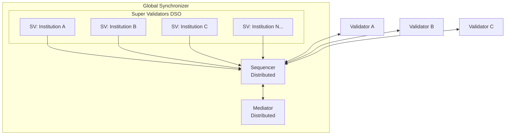
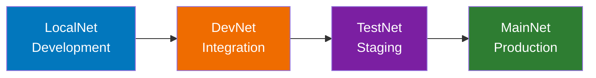

The Global Synchronizer is the public infrastructure backbone of Canton Network, a decentralized synchronizer operated by Super Validators.

## What It Is

The Global Synchronizer is:
- A **synchronizer instance** (BFT configuration of several sequencer + mediator nodes) operated by multiple independent parties
- **Decentralized**: No single entity controls it
- **The default coordination layer** for Canton Network applications
- Governed by the **Global Synchronizer Foundation** (under Linux Foundation)

Things to note:
- The Global Synchronizer is **not** a separate blockchain from Canton Network
- Validators store their own state; the Global Synchronizer is **not** a separate storage layer
- Private synchronizers can also exist; the Global Synchronizer is **not required** for all Canton applications

## Canton Coin (CC)

Canton Coin is the native utility token of the Global Synchronizer, used for:

| Use | Description |
|-----|-------------|
| **Transaction fees (Traffic)** | Pay for network usage when submitting transactions |
| **Infrastructure rewards** | Incentivize synchronizer operators for providing infrastructure |
| **Governance participation** | Super Validators stake CC to participate in governance |

Canton Coin is implemented via **Splice**, a set of reference applications that provide the economic and governance infrastructure for decentralized synchronizers.

### Traffic (Transaction Fees)

"Traffic" is Canton's term for transaction fees. When you submit transactions through the Global Synchronizer, you pay traffic costs in Canton Coin.

Traffic costs largely depend on:
- Transaction size
- Computational complexity
- Current network demand

### Obtaining Canton Coin

| Environment | Method |
|-------------|--------|
| **LocalNet** | Local test CC with no real value |
| **DevNet** | Faucet ("tapping") provides test CC |
| **TestNet** | Faucet provides test CC |
| **MainNet** | Purchase from exchanges or earn through network activity |

## Network Environments

Canton Network operates across four environments, each serving a different purpose in the development lifecycle.

| Environment | Purpose | How to Access | CC Type |
|-------------|---------|---------------|---------|
| **LocalNet** | Local development | Run locally on your machine | Test (no value) |
| **DevNet** | Integration testing | VPN credentials + SV sponsorship | Test (faucet) |
| **TestNet** | Staging/validation | Application process | Test (faucet) |
| **MainNet** | Production | Full onboarding | Real value |

### LocalNet

<Note>
LocalNet simulates a Global Synchronizer that runs entirely on your machine - no external network required.
</Note>

- **Purpose**: Development and initial testing
- **Access**: Anyone with Daml SDK installed
- **Limitations**: Single-machine; doesn't test real network behavior

**When to use**: Writing and testing Daml contracts; initial application development; learning Canton.

### DevNet

- **Purpose**: Integration testing with real network infrastructure
- **Access**: Requires VPN credentials and Super Validator sponsorship
- **CC**: Test tokens available via faucet ("tapping")

**When to use**: Testing multi-validator workflows; validating network integration; pre-production testing.

**Access process**:
1. Contact a Super Validator sponsor
2. Receive VPN credentials
3. Configure your validator to connect
4. Tap for test CC

### TestNet

- **Purpose**: Staging environment; final validation before production
- **Access**: Application process through Canton Network
- **CC**: Test tokens; no real value

**When to use**: Final integration testing; performance validation; user acceptance testing; practice CN and application upgrades.

### MainNet

- **Purpose**: Production environment
- **Access**: Complete onboarding process
- **CC**: Real economic value once approved as a featured application

**When to use**: Production deployments; real transactions; live applications.

<Note>
DevNet, TestNet, and MainNet all run on infrastructure operated by the same Super Validators. The difference is in access requirements and whether Canton Coin has real economic value.
</Note>

### Environment Progression

Moving through environments requires:
- **LocalNet → DevNet**: VPN access, SV sponsorship
- **DevNet → TestNet**: Application approval, operational readiness
- **TestNet → MainNet**: Full onboarding, production readiness review

## Super Validators

Super Validators (SVs) are the entities that operate the Global Synchronizer infrastructure.

### Responsibilities

| Responsibility | Description |
|----------------|-------------|
| **Infrastructure operation** | Run sequencer and mediator nodes |
| **Governance participation** | Vote on network parameters and upgrades |
| **Validator sponsorship** | Sponsor new validators joining the network |
| **Rewards distribution** | Receive and distribute validator rewards |

### The Decentralized Synchronizer Operator (DSO)

A group of Super Validators operating nodes together form the DSO. The DSO collectively:
- Operates the synchronizer infrastructure
- Makes governance decisions
- Manages the Splice applications
- Onboards new participants

Super Validators include major financial institutions and technology providers. The current list is maintained by the Global Synchronizer Foundation.

## Becoming a Validator

To participate as a validator on the Global Synchronizer:

### Options

| Approach | Description | Effort | Control |
|----------|-------------|--------|---------|
| **Node-as-a-Service** | Use a provider to host your validator | Least | Medium |
| **Self-hosted** | Run your own validator infrastructure | Most | Full |

### Requirements

1. **Obtain sponsorship**: A Super Validator must sponsor your onboarding
2. **Deploy infrastructure**: Set up validator node(s) with required specifications
3. **Connect to synchronizer**: Configure network connectivity
4. **Manage upgrades**: The network upgrades frequently; validators must keep pace

### Sponsorship Process

1. Contact a Super Validator (list available at [canton.foundation](https://canton.foundation))
2. Describe your use case and organization
3. Complete any required agreements
4. Receive sponsorship and access credentials

<Note>
For application developers, the simpler path is often using an existing validator (node-as-a-service) rather than self-hosting. This provides network access without operational overhead.
</Note>

## Governance

### Global Synchronizer Foundation

The **Global Synchronizer Foundation (GSF)** is an independent, non-profit body under the Linux Foundation that governs the Global Synchronizer.

**Responsibilities**:
- Set network policies and parameters
- Coordinate upgrades and maintenance
- Oversee Super Validator participation
- Manage the Splice codebase governance
- Review and commission featured applications

### Decision-Making

Governance decisions follow a structured process:
1. **Proposal**: Any SV can propose changes
2. **Discussion**: SVs discuss implications and modifications
3. **Voting**: SVs vote according to governance rules
4. **Implementation**: Approved changes are implemented

### What Gets Governed

| Area | Examples |
|------|----------|
| **Protocol parameters** | Transaction limits, timing windows |
| **Economic parameters** | Fee structures, reward distributions |
| **Membership** | SV admission, validator requirements |
| **Upgrades** | Protocol versions, upgrade schedules |

## Splice Applications

**Splice** is the open-source project (under Hyperledger Labs) providing infrastructure for operating, funding, and governing decentralized Canton synchronizers.

### Components

| Component | Purpose |
|-----------|---------|
| **Canton Coin** | Native token implementation |
| **Validator App** | Validator node management |
| **Wallet** | User wallet for CC |
| **Scan** | Network explorer |
| **Governance** | Voting and proposal management |

### Token Standard

Splice includes a token standard ([CIP-0056](https://github.com/global-synchronizer-foundation/cips/blob/main/cip-0056/cip-0056.md)) for creating tokens on Canton Network. This provides:
- Standard interfaces for token operations
- Interoperability between applications
- Consistent wallet integration

## Upgrade Considerations

The Global Synchronizer and validators currently have frequent upgrades with the rate expected to slow in the next year. As a validator or application developer, expect:

| Frequency | Type | Impact |
|-----------|------|--------|
| **Weekly-Monthly** | Minor updates | Minimal; usually backward compatible |
| **Quarterly** | Feature releases | May require application updates |
| **As needed** | Security patches | Critical; rapid deployment required |

### Staying Current

- **Monitor announcements**: Subscribe to Canton Network communications
- **Test on DevNet/TestNet**: Validate compatibility before MainNet upgrades
- **Plan maintenance windows**: Schedule time for updates
- **Maintain rollback capability**: Have procedures for reverting if needed
- **Join community channels**: [#gsf-global-synchronizer-appdev](https://daholdings.slack.com/archives/C08FQRCRFUN), [#gsf-outreach](https://daholdings.slack.com/archives/C08PT9P8ERM), [#validator-operations](https://daholdings.slack.com/archives/C08AP9QR7K4)

## Next Steps

- **[Glossary](/overview/understand/glossary)** - Terminology reference
- **[Validator Operations](/global-synchronizer/understand/introduction)** - Deploy your own validator
- **[Deployment Progression](/appdev/modules/m5-deployment-progression)** - Deploy applications across environments

{/* COPIED_START source="docs-website:docs/replicated/canton/3.4/overview/explanations/canton/synchronizers.rst" hash="ff3b68a4" */}

<Warning title="Pre-reviewed Content - Do Not Modify">
This section was copied from existing reviewed documentation.
**Source:** `docs-website:docs/replicated/canton/3.4/overview/explanations/canton/synchronizers.rst`
Reviewers: Skip this section. Remove markers after final approval.
</Warning>

# Synchronizers

A deep look into the synchronizer architecture; functional requirements have already been established in protocols.rst

## The Sequencer

{/* TODO: https://github.com/DACH-NY/canton/issues/25653 See also https://github.com/DACH-NY/canton/blob/main/docs/src/sphinx/arch/canton/sequencing.rst */}

- Members; envelopes and recipients including projection (confidential delivery)
- Ordering guarantees
  - Ordering as a separate protocol layer (see below)
- Traffic management
- Traffic credits managed by the sequencers and topped up by sequencer operators
- Source of time
  - Ledger time, submission time (rename to preparation time???), skews

## The Mediator

\<[https://github.com/DACH-NY/canton/issues/25653](https://github.com/DACH-NY/canton/issues/25653)\>

Mediator = Two-phase commit coordinator

- Obtain list of expected quorums (currently it's a tree)
  - Deduplicate requests within bounded periods

### The Ordering Layer

\<[https://github.com/DACH-NY/canton/issues/25653](https://github.com/DACH-NY/canton/issues/25653)\> \* API spec

- Overview of integrations with links
  - CometBFT
  - DA BFT (once we have docs on this)
  - DB sequencer (once we have this ready)
- No mention of Fabric / Besu

\<[https://github.com/DACH-NY/canton/issues/25653](https://github.com/DACH-NY/canton/issues/25653)\> \* Remove all implementation details (in particular internal architecture)

- If suitable, move them to the "subnet" chapter.

{/* COPIED_END */}

