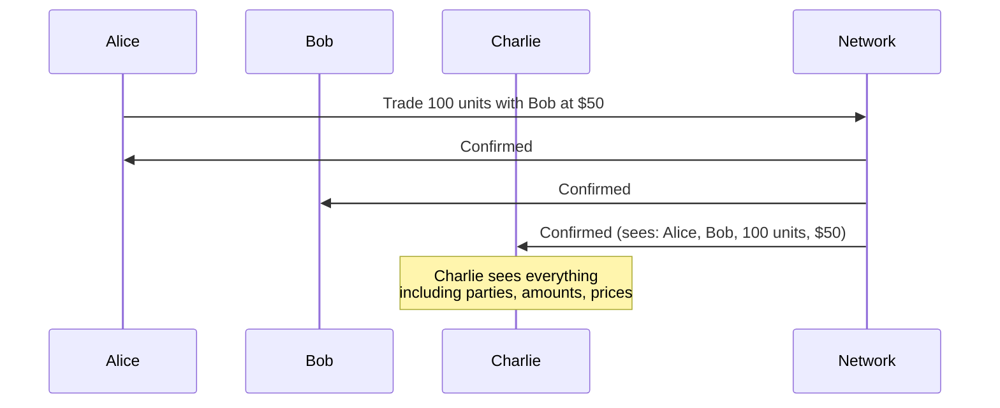

Blockchain technology promises shared truth between parties who don't fully trust each other. But traditional blockchains achieve this trust through total public visibility—everyone sees everything. For many real-world applications, this is a dealbreaker.

## The Public Visibility Problem

Consider what happens on Ethereum when Alice trades with Bob:

1. Alice submits a transaction
2. The transaction enters the mempool (visible to everyone)
3. Miners/validators include it in a block
4. Every node in the network stores the transaction
5. Anyone can query the transaction details forever

This means:
- Charlie can see that Alice traded with Bob
- Charlie can see the price, the asset, and the amounts
- Charlie can analyze Alice's trading patterns over time
- If Charlie is a competitor, he now has valuable intelligence

## Why Privacy Matters

The public transparency problem isn't theoretical. It blocks real adoption:

### Front-Running Risk

When transactions are visible before and during execution, observers can exploit that information. In traditional finance, this is illegal. On public blockchains, it's structural.

### Competitive Intelligence

Every transaction reveals information:
- **Trading strategies**: Pattern analysis exposes your approach
- **Business relationships**: Who you transact with reveals partners
- **Position sizes**: Competitors learn your exposure
- **Pricing information**: Counterparties see your other deals

### Regulatory Barriers

Many industries have legal requirements around data:
- **Financial regulations**: Client data must be protected
- **Data sovereignty**: Information may not leave certain jurisdictions
- **Confidentiality obligations**: Contractual privacy requirements

### Business Reality

No enterprise will put sensitive business logic and transactions on a system where competitors can read it. Period.

## Imperfect Mitigating Solutions

The industry has tried several approaches to add privacy to public blockchains:

### Private Channels

Systems like Hyperledger Fabric create separate channels for subsets of participants.

**Problems:**
- Fragmentation: No shared state across channels
- Complexity: Managing channel membership
- Limited interoperability: Cross-channel transactions are difficult

### Zero-Knowledge Proofs

ZK-rollups and ZK-based systems prove transaction validity without revealing content.

**Problems:**
- Computational overhead: Proof generation is expensive
- Complexity: ZK circuits are difficult to develop and audit
- Limited expressiveness: Not all business logic fits ZK constraints
- Trusted setup requirements: Some systems require trust assumptions

### Layer 2 Solutions

Moving transactions off the main chain and settling on-chain periodically.

**Problems:**
- Data availability: L2 operators typically see all transactions
- Trust assumptions: Users must trust L2 operators
- Settlement delays: Finality requires waiting for L1 confirmation
- Bridge risks: Moving assets between layers introduces attack surface

### Encryption at Rest

Encrypting data stored on-chain.

**Problems:**
- Key management: Who holds decryption keys?
- Metadata exposure: Transaction patterns still visible
- Future vulnerability: Encrypted data today may be decrypted tomorrow
- Computation limits: Can't compute on encrypted data easily

## The Fundamental Tension

These approaches all treat privacy as something to add on top of a public system. They're fighting against the architecture, not working with it.

The fundamental tension is:

| Requirement | Traditional Approach | Result |
|-------------|---------------------|--------|
| **Integrity** | All nodes verify all transactions | Requires visibility |
| **Verification** | Validators see transaction content | Exposes private data |
| **Privacy** | Hide transaction content | Undermines verification |

Traditional blockchains force you to choose: integrity or privacy.

## Canton's Insight

Canton resolves this tension by changing what "consensus" means:

- Validators don't need to see transactions they're not part of
- Consensus can be achieved by the parties involved in a transaction
- A coordinator can order transactions without seeing their content

This isn't a workaround—it's a different architectural foundation. Privacy is built into how transactions work, not layered on top.

<Note>
Canton calls this approach **sub-transaction privacy**. Each party sees only the parts of a transaction they're entitled to see based on their role (signatory, observer, controller). The system maintains integrity without requiring global visibility.
</Note>

## Next Steps

<CardGroup cols={2}>

<Card title="Canton's Solution" icon="lightbulb" href="/overview/understand/cantons-solution">
  Learn how Canton resolves the privacy-integrity tradeoff.
</Card>

<Card title="Privacy Model" icon="lock" href="/overview/learn/privacy-model">
  Deep dive into sub-transaction privacy mechanics.
</Card>

</CardGroup>
