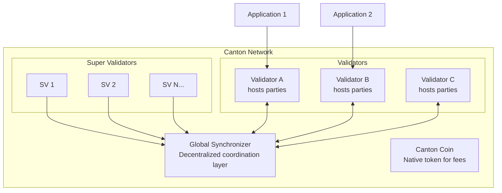

{/* Mintlify preview rebuild marker for stylesheet-only dark-mode highlight fix. */}

Canton Network is a public layer 1 blockchain designed for privacy-preserving transactions. Unlike traditional blockchains where all transactions are visible to all participants, Canton enables selective disclosure - parties see only the data they're entitled to see.

## The 60-Second Pitch

Canton Network solves a fundamental tension in blockchain: **transparency versus privacy**. Traditional blockchains like Ethereum provide integrity and decentralization but expose all transaction data to every network participant. This makes them unsuitable for regulated financial markets, confidential business processes, and any application where data privacy is non-negotiable.

Canton provides:
- **Sub-transaction privacy**: Different parties in the same transaction see only their relevant portions
- **Decentralized consensus**: No single entity controls the network
- **Regulatory compliance**: Data stays with the parties that own it
- **Horizontal scalability**: Add nodes to scale, without global state replication

## The Problem Canton Solves

Consider a simple example: Alice wants to trade an asset with Bob. On Ethereum, this trade is visible to everyone - Charlie, Dave, and thousands of anonymous observers can see the price, the parties, and the asset details.

In regulated finance, this is a non-starter. Position visibility enables front-running. Transaction patterns reveal trading strategies. Compliance requirements may prohibit sharing certain data with unauthorized parties.

Canton addresses this by fundamentally changing what data gets distributed where. In most blockchains, all state and transactions get replicated to all nodes. In Canton, state and transactions are distributed only to the nodes specified in the smart contracts. This isn't a bolt-on privacy layer - it's the core architectural principle.

## How Canton Is Different

Canton differs from other blockchain platforms in three fundamental ways:

### Sub-Transaction Privacy

Where other blockchains add privacy as an afterthought (ZK-rollups, private channels), Canton builds privacy into the protocol layer. Transactions are decomposed into "views" where each party sees only their portion.

### Synchronizers vs. Global Consensus

Canton doesn't use a single blockchain that all nodes replicate. Instead, **synchronizers** coordinate consensus without storing state, while **participant nodes** (validators) receive and store only the data relevant to their hosted parties.

### Daml Smart Contracts

Canton uses Daml, a purpose-built language for multi-party workflows. Unlike Solidity's imperative model, Daml provides:
- Explicit authorization declarations (who can do what)
- Built-in privacy controls (who can see what)
- Immutable contracts (state changes create new contracts)

## The Canton Network Ecosystem

**Key components:**
- **Global Synchronizer**: The public coordination layer operated by Super Validators
- **Canton Coin (CC)**: Native utility token for transaction fees and validator rewards
- **Validators**: Participant nodes that host parties and store their contract data
- **Applications**: What you build - connected to validators via the Ledger API

## Who Uses Canton

Canton Network launched in May 2023 backed by major financial institutions across banking, market infrastructure, and trading. For the current list of participants, see the [Canton Network website](https://www.canton.network/).

This institutional backing validates Canton's approach for enterprise use cases, but also means the platform evolved primarily for enterprise developers with direct support relationships. With the launch of the Global Synchronizer, Canton became accessible to anyone building financial infrastructure.

## When to Use Canton

### Ideal Use Cases

| Use Case | Why Canton Fits |
|----------|-----------------|
| **Multi-party workflows requiring confidentiality** | Participants shouldn't see each other's positions (e.g., syndicated loans, trade finance) |
| **Tokenization of regulated assets** | Compliance requires data sovereignty (e.g., securities, real estate) |
| **Cross-organizational processes** | Shared state without shared visibility (e.g., supply chain, consortium applications) |
| **Privacy-preserving DeFi** | Positions and portfolios stay private (e.g., trading, lending) |

### Less Ideal Use Cases

| Use Case | Why Canton May Not Fit |
|----------|------------------------|
| **Fully public applications** | Transparency is the feature, not a limitation (e.g., public governance, open auctions) |
| **Simple single-party applications** | No benefit from distributed ledger properties |
| **EVM interoperability required** | Canton does not natively interoperate with Ethereum smart contracts |
| **Anonymous public participation** | Canton parties have identity; truly anonymous systems need different approaches |

## Next Steps

- **[Canton for Blockchain Developers](/appdev/modules/m2-canton-for-ethereum-devs)** - Map your existing blockchain knowledge to Canton concepts
- **[Architecture Overview](/overview/learn/architecture)** - Understand how Canton's components work together
- **[Privacy Model Explained](/overview/learn/privacy-model)** - Deep dive into sub-transaction privacy
