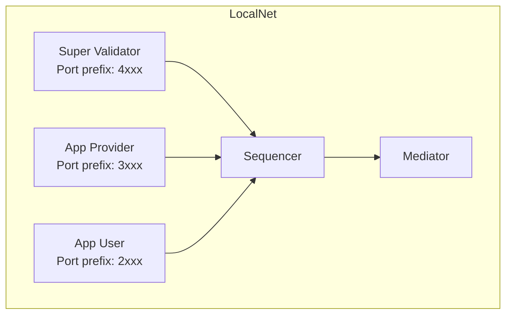

{/* COPIED_START source="splice:docs/src/app_dev/testing/localnet.rst" */}

<Warning title="Pre-reviewed Content - Do Not Modify">
**Source:** `splice:docs/src/app_dev/testing/localnet.rst`
</Warning>

LocalNet provides a topology comprising three participants, three validators, a PostgreSQL database, and several web applications (wallet, SV, scan) behind an NGINX gateway. Each validator plays a distinct role within the Splice ecosystem:

- **app-provider** — For the user operating their application
- **app-user** — For a user wanting to use the app from the App Provider
- **sv** — Super Validator, for providing the Global Synchronizer and handling AMT

LocalNet is designed for development and testing. It is not intended for production use.

{/* COPIED_END */}

LocalNet is provided as part of the [cn-quickstart](https://github.com/digital-asset/cn-quickstart) repository.

## What LocalNet Provides

- Three validators: Super Validator (SV), App Provider, and App User
- A local synchronizer with sequencer and mediator
- Canton Coin wallet services for each validator
- PQS (Participant Query Store) instances
- JSON API endpoints
- Keycloak for authentication (optional)
- Observability stack: Grafana, Prometheus, Loki (optional)

## Setup

From the cn-quickstart repository:

```bash
git clone https://github.com/digital-asset/cn-quickstart
cd cn-quickstart
direnv allow
cd quickstart
make install-daml-sdk
make setup
make build
make start
```

`make setup` prompts you to select a deployment profile and generates the appropriate `.env.local` configuration. `make build` compiles the Daml contracts, Java backend, and React frontend. `make start` launches the Docker Compose stack.

Check the status of running containers:

```bash
make status
```

Stop the environment:

```bash
make stop
```

## Network Topology



Each validator runs a participant, wallet services, and supporting infrastructure. The Super Validator also runs the synchronizer components (sequencer and mediator) and the Splice SV app.

## Port Conventions

{/* COPIED_START source="splice:docs/src/app_dev/testing/localnet.rst" */}

<Warning title="Pre-reviewed Content - Do Not Modify">
**Source:** `splice:docs/src/app_dev/testing/localnet.rst`
</Warning>

Ports are generated using specific patterns based on the validator:

- For the Super Validator (sv), the port is specified as `4${PORT_SUFFIX}`
- For the App Provider, the port is specified as `3${PORT_SUFFIX}`
- For the App User, the port is specified as `2${PORT_SUFFIX}`

These patterns apply to the following port suffixes:

- `901` -- Participant Ledger API
- `902` -- Participant Admin API
- `975` -- Participant JSON API
- `903` -- Validator Admin API
- `900` -- Canton HTTP health check
- `961` -- Canton gRPC health check

UI Ports:

- App User UI: port 2000
- App Provider UI: port 3000
- SV UI: port 4000

Application UIs:

- App User Wallet UI: `http://wallet.localhost:2000`
- App Provider Wallet UI: `http://wallet.localhost:3000`
- Super Validator Web UI: `http://sv.localhost:4000`
- Scan Web UI: `http://scan.localhost:4000`

Default wallet users: app-user, app-provider, sv.

{/* COPIED_END */}

For example, the App User's Ledger API is at `localhost:2901`, and the App Provider's JSON API is at `localhost:3975`.

<Warning>
The Admin API and PostgreSQL ports are exposed for development convenience. Do not expose these ports in non-local deployments.
</Warning>

## Configuration Options

### Deployment Profiles

`make setup` offers deployment profiles that control which optional services are included:

- **Minimal** -- Core validators and synchronizer only
- **Standard** -- Adds PQS, JSON API, and authentication
- **Full** -- Adds observability (Grafana, Prometheus, Loki)

### Environment Variables

The `.env` file in the `quickstart/` directory contains version numbers, feature flags, and service configuration. Create a `.env.local` file (not tracked by git) to override settings locally.

### Docker Compose Modules

LocalNet is built from modular Docker Compose layers in `docker/modules/`:

- `localnet/` -- Base infrastructure (validators, synchronizer)
- `auth/` -- Keycloak authentication
- `observability/` -- Grafana, Prometheus, Loki
- `pqs/` -- Participant Query Store instances
- `app/` -- Application services (backend, frontend)

## Health Checks

Verify that validators are healthy:

```bash
curl -f http://localhost:2903/api/validator/readyz  # App User
curl -f http://localhost:3903/api/validator/readyz  # App Provider
curl -f http://localhost:4903/api/validator/readyz  # Super Validator
```

An empty response indicates a healthy service.

## When to Use LocalNet vs Sandbox

**Use LocalNet** when you need to test:

- Multi-party workflows across separate validators
- Canton Coin transfers and traffic purchases
- Wallet integration
- Splice API interactions (Scan, Validator APIs)
- End-to-end flows with backend, frontend, and ledger

**Use the [Sandbox](/docs-main/sdks-tools/development-tools/sandbox)** when you need:

- Fast iteration on contract logic
- Single-participant testing without Docker
- A lightweight environment for `dpm test` and Ledger API integration

## Related Pages

- [cn-quickstart](/docs-main/sdks-tools/reference-projects/cn-quickstart) -- Repository overview and project structure
- [Sandbox](/docs-main/sdks-tools/development-tools/sandbox) -- Lightweight single-node alternative
- [QuickStart walkthrough](/docs-main/appdev/quickstart/running-the-demo) -- Step-by-step guide to running the demo application
