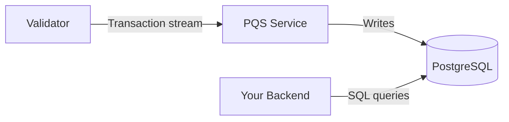

import DamlDocsSdksToolsDevelopmentToolsPqsL62 from "/snippets/daml-docs/sdks-tools_development-tools_pqs_L62.mdx";
import DamlDocsSdksToolsDevelopmentToolsPqsL73 from "/snippets/daml-docs/sdks-tools_development-tools_pqs_L73.mdx";
import DamlDocsSdksToolsDevelopmentToolsPqsL85 from "/snippets/daml-docs/sdks-tools_development-tools_pqs_L85.mdx";
import DamlDocsSdksToolsDevelopmentToolsPqsL96 from "/snippets/daml-docs/sdks-tools_development-tools_pqs_L96.mdx";
import DamlDocsSdksToolsDevelopmentToolsPqsL108 from "/snippets/daml-docs/sdks-tools_development-tools_pqs_L108.mdx";

PQS (Participant Query Store) subscribes to a validator's transaction stream and projects contract data into a PostgreSQL database. Your backend queries this database with standard SQL, enabling: filtered queries, aggregations, joins, and full-text search that would be impractical through the Ledger API alone.

## How PQS Works

PQS runs as a sidecar service alongside a validator. It connects to the validator's transaction stream and maintains a PostgreSQL database that reflect the current ledger state and historical data.

As the validator emits update events, PQS inserts corresponding entries in the database. This is for both contract create and archive events, along with exercise actions. Your SQL queries always reflect current ledger state, with a small propagation delay (typically milliseconds).

## When to Use PQS

PQS is the right choice when you need:

- **Filtered queries across one or more contracts** -- "All licenses expiring this month" or "all assets owned by this party"
- **Aggregations and reporting** -- Sums, counts, averages across contract data
- **Complex joins** -- Combining data from multiple template types
- **Full-text search** -- Searching contract fields by keyword
- **A read path that does not load the Ledger API** -- PQS queries hit PostgreSQL, not the participant

For simple queries that are specific ("get this specific contract by ID"), the Ledger API's active contract set query works fine without PQS.

## Setup

PQS requires a PostgreSQL database and a connection to a participant node's transaction stream.

### In LocalNet

The [cn-quickstart](https://github.com/digital-asset/cn-quickstart) LocalNet configuration includes PQS instances pre-configured for each validator. When you run `make start`, PQS starts automatically and begins projecting data.

### Standalone Setup

For a standalone deployment:

1. Provision a PostgreSQL database (version 14 or later recommended)
2. Configure PQS with the participant node's Ledger API address and authentication credentials
3. Start the PQS service, which downloads packages from the validator that it uses to create its schema. This is automatically done when PQS starts and when it detects a new template.

PQS configuration includes:

- **Participant connection** -- Host, port, and authentication token for the Ledger API
- **Database connection** -- PostgreSQL connection string
- **Party filter** -- Which parties' contract data to project (reduces storage and processing)
- **Template filter** -- Which templates to include (optional, projects all by default)

## SQL Query Examples

### Active Contracts

Query all active contracts for a specific template:

<DamlDocsSdksToolsDevelopmentToolsPqsL62 />

### Transaction History

View recent transactions for a party:

<DamlDocsSdksToolsDevelopmentToolsPqsL73 />

### Aggregations

Count active contracts by template:

<DamlDocsSdksToolsDevelopmentToolsPqsL85 />

### Party Filtering

Find all contracts visible to a specific party:

<DamlDocsSdksToolsDevelopmentToolsPqsL96 />

## Performance Optimization

### Indexes

Add indexes on columns you query frequently. PQS creates basic indexes on startup, but your application may benefit from additional ones:

<DamlDocsSdksToolsDevelopmentToolsPqsL108 />

### Connection Pooling

Use a connection pool (like HikariCP for Java or `pg-pool` for Node.js) between your backend and the PQS database. PQS itself maintains a separate connection to PostgreSQL for writes.

### Query Patterns

- Avoid `SELECT *` on large tables; specify the columns you need
- Use `template_id` filters to narrow the dataset before applying payload filters
- For time-range queries, add indexes on `effective_at` or `created_at` columns

## PQS in cn-quickstart

The cn-quickstart backend demonstrates PQS usage in the `repository/` and `pqs/` modules. The `Pqs` class generates SQL queries, and `DamlRepository` provides domain-specific methods that combine PQS reads with Ledger API writes.

See [Backend Development](/docs-main/appdev/modules/m4-backend-dev) for detailed code examples.

## Related Pages

- [Backend development](/docs-main/appdev/modules/m4-backend-dev) -- Using PQS in a Java backend
- [Ledger API](/docs-main/sdks-tools/api-reference/ledger-api) -- The underlying transaction stream that PQS consumes
- [LocalNet](/docs-main/sdks-tools/development-tools/localnet) -- Pre-configured PQS instances for local development
