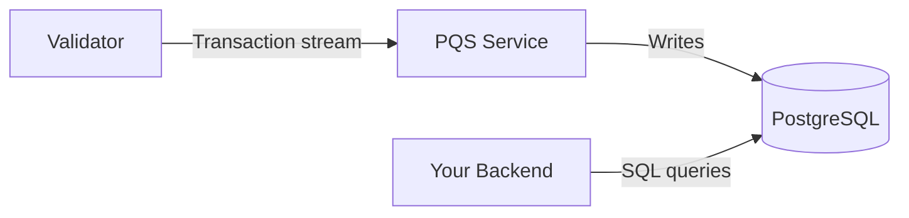

import DamlDocsSdksToolsDevelopmentToolsPqsL62 from "/snippets/daml-docs/sdks-tools_development-tools_pqs_L62.mdx";
import DamlDocsSdksToolsDevelopmentToolsPqsL73 from "/snippets/daml-docs/sdks-tools_development-tools_pqs_L73.mdx";
import DamlDocsSdksToolsDevelopmentToolsPqsL85 from "/snippets/daml-docs/sdks-tools_development-tools_pqs_L85.mdx";
import DamlDocsSdksToolsDevelopmentToolsPqsL96 from "/snippets/daml-docs/sdks-tools_development-tools_pqs_L96.mdx";
import DamlDocsSdksToolsDevelopmentToolsPqsL108 from "/snippets/daml-docs/sdks-tools_development-tools_pqs_L108.mdx";


PQS (Participant Query Store) subscribes to a validator's transaction stream and projects contract data into a PostgreSQL database. Your backend queries this database with standard SQL, enabling: filtered queries, aggregations, joins, and full-text search that would be impractical through the Ledger API alone.

## How PQS Works

PQS runs as a sidecar service alongside a validator. It connects to the validator's transaction stream and maintains a PostgreSQL database that reflect the current ledger state and historical data.



As the validator emits update events, PQS inserts corresponding entries in the database. This is for both contract create and archive events, along with exercise actions. Your SQL queries always reflect current ledger state, with a small propagation delay (typically milliseconds).

## When to Use PQS

PQS is the right choice when you need:

- **Filtered queries across one or more contracts** -- "All licenses expiring this month" or "all assets owned by this party"
- **Aggregations and reporting** -- Sums, counts, averages across contract data
- **Complex joins** -- Combining data from multiple template types
- **Full-text search** -- Searching contract fields by keyword
- **A read path that does not load the Ledger API** -- PQS queries hit PostgreSQL, not the participant

For simple queries that are specific ("get this specific contract by ID"), the Ledger API's active contract set query works fine without PQS.

## Setup

PQS requires a PostgreSQL database and a connection to a participant node's transaction stream.

### In LocalNet

The [cn-quickstart](https://github.com/digital-asset/cn-quickstart) LocalNet configuration includes PQS instances pre-configured for each validator. When you run `make start`, PQS starts automatically and begins projecting data.

### Standalone Setup

For a standalone deployment:

1. Provision a PostgreSQL database (version 14 or later recommended)
2. Configure PQS with the participant node's Ledger API address and authentication credentials
3. Start the PQS service, which downloads packages from the validator that it uses to create its schema. This is automatically done when PQS starts and when it detects a new template.

PQS configuration includes:

- **Participant connection** -- Host, port, and authentication token for the Ledger API
- **Database connection** -- PostgreSQL connection string
- **Party filter** -- Which parties' contract data to project (reduces storage and processing)
- **Template filter** -- Which templates to include (optional, projects all by default)


## Install and download

### Jar (as Part of Daml Sdk)

PQS `3.5.x` is built against the Daml SDK and Canton `3.5.x` releases (same major and minor versions), and is tested for compatibility with multiple Canton Participant Node versions (see Compatibility below).

The dpm CLI tool is used to download the `scribe.jar` file, as follows:

> 1.  `dpm install <version>` (e.g., `dpm install 3.5.1`) to get the latest SDK release which includes `scribe.jar`.
> 2.  To locate the directory where the scribe.jar file is, enter `dpm resolve | grep scribe` which will show the path to the jar file.


### Docker Image

| Source | Location |
| --- | --- |
| Browse UI | <a href="https://console.cloud.google.com/artifacts/docker/da-images/europe/public/docker%2Fparticipant-query-store?project=da-images">Browse available docker versions</a> |
| Docker Registry | `europe-docker.pkg.dev/da-images/public/docker/participant-query-store:<version-tag>` |

Alternatively, PQS can be started as a Docker container:

``` text
docker run -it europe-docker.pkg.dev/da-images/public/docker/participant-query-store:3.5.2 --version
Picked up JAVA_TOOL_OPTIONS: -javaagent:/open-telemetry.jar
scribe, version: v3.5.2
daml-sdk.version: 3.5.1
postgres-document.schema: 041
```

### Helm Chart
<Note>
    This helm chart is available beginning with version 3.5.x
</Note>

We provide a helm chart to install PQS:

``` text
helm upgrade --install -n pqs participant-query-store -f values.yaml \
oci://europe-docker.pkg.dev/da-images/public/charts/participant-query-store:3.5.2
```

| Source | Location |
| --- | --- |
| Browse UI | <a href="https://console.cloud.google.com/artifacts/docker/da-images/europe/public/charts%2Fparticipant-query-store?project=da-images">Browse available chart images</a> |
| Helm Registry | `europe-docker.pkg.dev/da-images/public/charts/participant-query-store:<version-tag>` |

#### Exhaustive example `values.yaml`


``` yaml
# Defines the container image registry, repository, and tag used for the PQS application
image:
  repo: europe-docker.pkg.dev/da-images/public/docker
  tag: "3.5.2"

# Defines the Kubernetes ServiceAccount name and its annotations
# (e.g., for workload identity mapping).
serviceAccount:
  name: pqs-sa
  annotations:
    iam.gke.io/gcp-service-account: pqs-service-account@my-project.iam.gserviceaccount.com

# Allows injection of custom initialization containers
# that run to completion before the main PQS app starts.
initContainers:
  - name: wait-for-postgres
    image: busybox:1.28
    command: ['sh', '-c', 'until nc -z postgres 5432; do echo waiting for db; sleep 2; done;']

# Allows injection of raw environment variables directly into the PQS container.
env:
  - name: JDK_JAVA_OPTIONS
    value: " -Dfile.encoding=UTF-8 -Djava.io.tmpdir=/tmp/myapp"

# Maps existing Kubernetes Secrets to environment variables,
# and then bridges those environment variables into the HOCON configuration file.
# Secret mappings
secrets:
- paths:
  - target.postgres.password
  secretKeyRef:
    name: postgres
    key: postgresPassword
- paths:
  - pipeline.oauth.clientSecret
  secretKeyRef:
    name: splice-app-validator-ledger-api-auth
    key: client-secret

# Configuration specifically targeted at the Pod level, such as custom annotations.
pod:
  # -- Annotations for pod
  annotations:
    prometheus.io/scrape: "true"
    prometheus.io/port: "8091"

# Defines container-level specifications of requests, limits, readinessProbe, and livenessProbe
# to ensure proper cluster scheduling and prevent resource starvation.
containers:
  resources:
    requests:
      memory: 256M
      cpu: 500m
    limits:
      memory: 3G
      cpu: 1000m
  readinessProbe:
    httpGet:
      path: /livez
      port: 8091
    initialDelaySeconds: 60
    periodSeconds: 15
  livenessProbe:
    httpGet:
      path: /livez
      port: 8091
    initialDelaySeconds: 60
    periodSeconds: 30

# Raw pqs config
pqs:
  # Configures the data ingestion pipeline, including the
  # data source type, contract filters, ledger read positions, and OAuth authentication specifics.
  pipeline:
    datasource: TransactionStream
    filter:
      betterWildcard: "true"
      contracts: "*"
      metadata: "*"
      parties: "*"
    ledger:
      start: Latest
      stop: Never
    oauth:
      clientId: splice-oauth-client-id
      issuer: "https://provider.oauth.com/fakeIssuer"
      endpoint: "https://provider.oauth.com/fakeIssuer/token"
      preemptExpiry: PT1M
      scope: daml_ledger_api
      parameters:
        audience: "http://fake.audience.com"

  # Defines the connection parameters to the participant node (Ledger API),
  # including host, port, authentication type, and connection keep-alive settings.
  source:
    ledger:
      auth: OAuth
      bufferSize: "128"
      cacheDir: "/tmp/scribe"
      host: participant
      keepAlive:
        time: PT40S
        timeout: PT20S
      port: "5001"

  # Specifies the retry policies and exponential backoff parameters for handling transient failures in the pipeline.
  retry:
    backoff:
      base: PT1S
      cap: PT1M
      factor: "2.0"
    counter:
      reset: PT10M

  # Configures the destination PostgreSQL database for the data queried from the participant.
  target:
    encoding:
      excludeNulls: "false"
      int64AsString: "true"
      numericAsString: "true"
    postgres:
      appName: scribe
      bufferSize: "128"
      database: public
      host: postgres
      keepAlive: "true"
      maxConnections: "16"
      username: "postgres"
      port: "5432"
      schema: pqs
      tls:
        mode: Disable
    schema:
      autoApply: "true"
      baseline: "false"

  # Configures the bind address and port for the application's health check endpoints,
  # which Kubernetes uses for liveness and readiness probes.
  health:
    address: "0.0.0.0"
    port: "8091"

  # Controls the logging behavior of the application, such as log levels (e.g., Info, Debug)
  # and output formats (e.g., Plain, JSON).
  logger:
    format: Plain
    level: Info
    mappings: {}
    pattern: Plain
```

### Compatibility

PQS is tested for compatibility with multiple versions of dependencies, as follows:

| Dependency              | Versions               |
|-------------------------|------------------------|
| Canton Participant Node | 3.4, 3.5               |
| Java Runtime (Temurin)  | 17, 21                 |
| PostgreSQL              | 13, 14, 15, 16, 17, 18 |


## SQL Query Examples

### Active Contracts

Query all active contracts for a specific template:

<DamlDocsSdksToolsDevelopmentToolsPqsL62 />

### Transaction History

View recent transactions for a party:

<DamlDocsSdksToolsDevelopmentToolsPqsL73 />

### Aggregations

Count active contracts by template:

<DamlDocsSdksToolsDevelopmentToolsPqsL85 />

### Party Filtering

Find all contracts visible to a specific party:

<DamlDocsSdksToolsDevelopmentToolsPqsL96 />

## Performance Optimization

### Indexes

Add indexes on columns you query frequently. PQS creates basic indexes on startup, but your application may benefit from additional ones:

<DamlDocsSdksToolsDevelopmentToolsPqsL108 />

### Connection Pooling

Use a connection pool (like HikariCP for Java or `pg-pool` for Node.js) between your backend and the PQS database. PQS itself maintains a separate connection to PostgreSQL for writes.

### Query Patterns

- Avoid `SELECT *` on large tables; specify the columns you need
- Use `template_id` filters to narrow the dataset before applying payload filters
- For time-range queries, add indexes on `effective_at` or `created_at` columns

## High Availability and Database Sharing

### PQS High Availability

Each hosting validator runs its own PQS instance backed by its own PostgreSQL database. If one validator's PQS becomes unavailable, your application can fail over to another hosting validator's PQS.

Design your backend to support PQS failover:

- Configure multiple PQS connection strings, one per hosting validator
- Implement connection health checks and automatic failover
- Accept that different PQS instances may be at slightly different offsets during normal operation — they converge once the synchronizer delivers all pending updates

### Sharing PQS Databases with Application Tables

An application making use of the PQS datastore may also manage its own database migrations via Flyway — either embedded, command-line, or other supported means. An example of such a scenario is the creation of application-specific indexes.

With default settings, the application's Flyway produces an error because its view of available/valid migrations is different from PQS. However, it is trivial to instruct the application's Flyway to use a different, non-default table name to store its versioning information, which allows both Flyways to coexist in the same database:

```bash
flyway -configFiles=conf/flyway.toml migrate \
  -table=myapp_version \
  -baselineOnMigrate=true \
  -baselineVersion=0
```

Now both PQS and the application can manage their own schema versions independently. The application should limit itself to adding indexes and other non-conflicting changes so the two Flyways can coexist without issues.

## PQS in cn-quickstart

The cn-quickstart backend demonstrates PQS usage in the `repository/` and `pqs/` modules. The `Pqs` class generates SQL queries, and `DamlRepository` provides domain-specific methods that combine PQS reads with Ledger API writes.

See [Backend Development](/appdev/modules/m4-backend-dev) for detailed code examples.

## Related Pages

- [Backend development](/appdev/modules/m4-backend-dev) -- Using PQS in a Java backend
- [Ledger API](/sdks-tools/api-reference/ledger-api) -- The underlying transaction stream that PQS consumes
- [LocalNet](/sdks-tools/development-tools/localnet) -- Pre-configured PQS instances for local development
