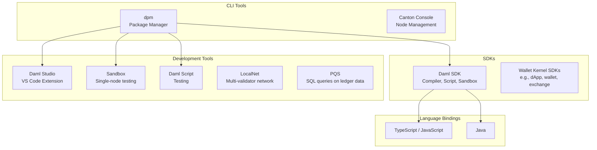

Canton provides a set of SDKs, CLI tools, and development environments for building, testing, and deploying applications. This page maps out what each component does and how they relate to each other.

## Tool Landscape

## SDKs

The **Daml SDK** is the primary development kit. It includes the Daml compiler, Daml Script runner, PQS, the Canton Sandbox, and many other components. You install and manage it through `dpm install`.

The **[Splice Wallet Kernel](https://github.com/canton-network/wallet-gateway) SDK** provides a set of TypeScript libraries for dApp, wallet, and exchange libraries for integrating with the Canton Network.
It is covered in the [Integrations](/integrations/overview) section.

## CLI Tools

**dpm** (Daml Package Manager) is the main command-line entry point for Canton development. It handles project initialization, dependency management, compilation, code generation, testing, and running the sandbox. Most developer workflows start with a `dpm` command.

**Canton Console** is a Scala-based REPL for managing Canton nodes directly. Operators and advanced developers use it for topology management, party administration, and debugging. See the [Global Synchronizer section](/global-synchronizer/understand/introduction) for operational details.

**Daml Script** is the testing language for Daml contracts. You write test scripts as `Script ()` values in Daml and run them with `dpm test`.

## Development Tools

**Daml Studio** is the VS Code extension for writing Daml code. It provides syntax highlighting, type checking, inline error diagnostics, and go-to-definition navigation. Launch it with `dpm studio`.

**Sandbox** starts a single-participant Canton node on your machine via `dpm sandbox`. Use it for unit tests written with Daml Script to test Daml logic, when you do not need a full network.

**LocalNet** is a Docker Compose environment from the [cn-quickstart](https://github.com/digital-asset/cn-quickstart) project. It runs multiple validators (super validator, app provider, app user) with a local synchronizer, Canton Coin, and wallet services. Use LocalNet when you need to test multi-party workflows, payments, or Splice API interactions.

**PQS** (Participant Query Store) projects ledger data into a PostgreSQL database so your backend can query contract state with standard SQL. It runs alongside a validator and stays synchronized with the ledger.

## Language Bindings

Code generation produces type-safe client libraries from your compiled Daml packages.

- **TypeScript/JavaScript** -- Generated with `dpm codegen-js`. Use these in Node.js backends or frontends that submit commands to the Ledger API.
- **Java** -- Generated with `dpm codegen-java`. Use these in JVM-based backends with the gRPC Ledger API client.

Community-maintained bindings exist for Python, Rust, and Go, though these are not officially supported by Digital Asset.

## Reference Projects

- [cn-quickstart](https://github.com/digital-asset/cn-quickstart) -- A complete full-stack example (Daml contracts, Java backend, React frontend, LocalNet) that you can clone and extend.
- [Splice](https://github.com/canton-network/splice) -- The reference applications for the Global Synchronizer infrastructure, including the SV app, Scan app, Validator app, and Wallet.

## Choosing the Right Tool

| Task | Tool |
|------|------|
| Develop a new Daml package | `dpm new` |
| Edit Daml in VS Code | Daml Studio via `dpm studio` |
| Compile Daml contracts | Daml SDK via `dpm build` |
| Test contract logic | Daml Script via `dpm test` |
| Quick, local testing | Sandbox via `dpm sandbox` |
| Multi-validator testing with payments | LocalNet via cn-quickstart |
| Query ledger data with SQL | PQS |
| Manage Canton nodes | Canton Console |
| Generate TypeScript bindings | `dpm codegen-js` |
| Generate Java bindings | `dpm codegen-java` |
