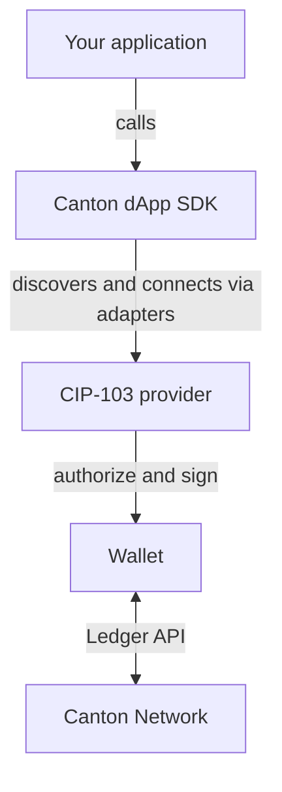

{/* COPIED_START source="splice-wallet-kernel:docs/dapp-sdk/overview.md@0431c87e" */}

The dApp SDK is a TypeScript library for connecting web applications to wallets on Canton Network. It lets your
frontend discover wallets, authenticate the user, read their parties, request
signatures, and submit transactions.

Use the SDK to:

- **Discover available wallets**: browser extensions, remote wallets, and WalletConnect.
- **Connect and restore sessions**: open a wallet picker and reconnect returning users silently.
- **Access the user's parties**: list accounts and read the primary party. A party is a
  user's identity on the Canton ledger.
- **Request signatures**: sign human-readable messages.
- **Prepare and execute transactions**: submit Daml commands for user approval.
- **Call the JSON Ledger API**: proxy authenticated requests through the user's wallet session.

<Note>
The SDK is framework agnostic and works with any browser-based application, including
React, Next.js, Vue, Svelte, or vanilla TypeScript.
</Note>

## How it fits together

Your application talks to the SDK. The SDK speaks the **CIP-103** provider protocol to
whichever wallet the user chose, and the wallet remains solely responsible for
authorization and signing.

| Layer                | Responsibility                                                                                               |
| -------------------- | ------------------------------------------------------------------------------------------------------------ |
| **dApp SDK**         | High-level, convenient API. The recommended entry point for dApps.                                           |
| **CIP-103 provider** | Low-level, EIP-1193–style interface. Use directly only for infrastructure or existing provider integrations. |
| **Adapters**         | Locate and connect to CIP-103 implementations (announced extensions, remote wallets, or WalletConnect).      |
| **Wallet**           | Holds the user's parties, authorizes requests, and signs transactions.                                       |

Wallets connect in one of two ways:

- **Browser wallets** run in the user's browser, such as a browser extension. They make
  themselves discoverable by announcing to the dApp.
- **Remote wallets** are server-side wallets reached over a CIP-103 RPC endpoint.

By default, the wallet picker lists the browser wallets that announce themselves, together
with the SDK's built-in list of remote wallets. You can add more wallets, such as
WalletConnect or a custom remote wallet, by registering adapters. See
[Wallet discovery](/sdks-tools/sdks/dapp-sdk/guides/wallet-discovery).

<Note>
The SDK is built over the CIP-103 provider API. Most dApps should use the SDK. Use the
[Provider API](/sdks-tools/sdks/dapp-sdk/reference/provider-api) directly only when building
lower-level infrastructure or adapting an existing provider-based integration.
</Note>

## Quickstart

Ready to build? The [Quickstart](/sdks-tools/sdks/dapp-sdk/quickstart) walks through
installing the SDK, connecting a wallet, reading the user's party, and submitting a
transaction, using only the high-level SDK.

{/* COPIED_END */}
