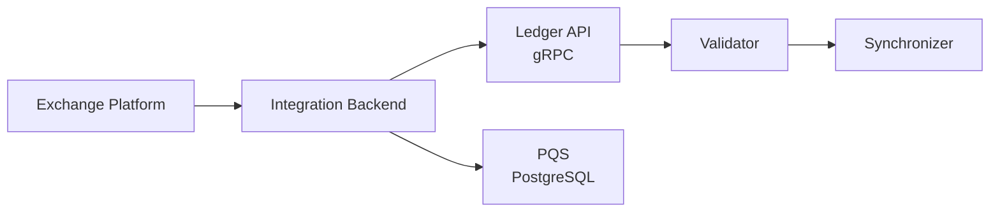

The Exchange SDK provides a Java-based reference implementation for connecting exchanges to Canton Network. It demonstrates the patterns needed to list, trade, and settle Canton-based assets on an exchange platform.

## Overview

Exchanges that want to support Canton Network assets need to interact with the Ledger API for deposits, withdrawals, and settlement. The Exchange SDK provides working code for these integration patterns rather than requiring you to build them from scratch.

The SDK covers:

- **Deposit handling** -- Monitoring the ledger for incoming asset transfers and crediting user accounts
- **Withdrawal processing** -- Submitting ledger commands to transfer assets from exchange-controlled parties to user parties
- **Balance tracking** -- Querying active contracts to maintain accurate balance records
- **Settlement workflows** -- Coordinating multi-step transactions between exchange participants

## Where to Find It

The Exchange SDK and its integration patterns are documented in the Integrations section:

<CardGroup cols={2}>
  <Card title="Exchange Integration" icon="arrows-rotate" href="/docs-main/integrations/overview">
    Full setup guide, download instructions, and API reference for exchange integration.
  </Card>
</CardGroup>

## Technical Details

The Exchange SDK is built in Java and uses the gRPC Ledger API for all ledger interactions. It relies on code-generated Java classes (produced by `dpm codegen-java`) for type-safe command submission and event processing.

Key technical characteristics:

- **Language**: Java 17+
- **Ledger access**: gRPC Ledger API via generated bindings
- **Authentication**: Token-based auth compatible with Canton's OAuth2 flow
- **Data layer**: Uses PQS (Participant Query Store) for efficient balance queries and transaction history

## Architecture

A typical exchange integration follows this pattern:

The integration backend sits between your exchange platform and the Canton ledger. It translates exchange operations (deposit, withdraw, trade) into Ledger API commands and monitors the transaction stream for confirmations.

## Getting Started

To work with the Exchange SDK:

1. Review the [Integrations overview](/docs-main/integrations/overview) for the full context on exchange and wallet integrations
2. Clone or download the SDK from the location specified in the integrations documentation
3. Configure your validator connection (host, port, authentication tokens)
4. Build the project with Gradle and run the provided examples

The SDK includes example workflows that demonstrate deposit and withdrawal flows against a local Sandbox or LocalNet environment. Start with these examples before adapting the code to your exchange platform.

## Prerequisites

- Java 17 or later
- A running Canton validator (Sandbox for development, or a DevNet/TestNet validator)
- The Daml SDK installed via `dpm install`
- Familiarity with the [Ledger API](/docs-main/sdks-tools/api-reference/ledger-api) and [Java bindings](/docs-main/sdks-tools/language-bindings/java)

## Related Pages

- [Integrations overview](/docs-main/integrations/overview) -- Wallet and exchange integration patterns
- [Java bindings](/docs-main/sdks-tools/language-bindings/java) -- Code generation for Java
- [PQS](/docs-main/sdks-tools/development-tools/pqs) -- SQL-based ledger queries used by the Exchange SDK
