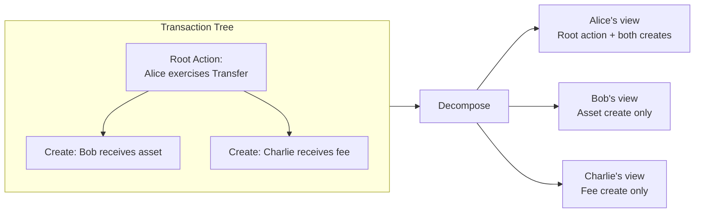

import DamlAppdevDeepDivesPrivacyModelL57 from "/snippets/daml-docs/appdev_deep-dives_privacy-model_L57.mdx";
import DamlAppdevDeepDivesPrivacyModelL74 from "/snippets/daml-docs/appdev_deep-dives_privacy-model_L74.mdx";
import DamlAppdevDeepDivesPrivacyModelL92 from "/snippets/daml-docs/appdev_deep-dives_privacy-model_L92.mdx";

Canton's defining architectural feature is sub-transaction privacy: the ability to execute a single atomic transaction where each party sees only the parts relevant to them. This page explains how it works and how to use privacy-aware patterns in your applications.

## Transaction Tree Decomposition

When you submit a transaction that involves multiple parties, Canton does not send the full transaction to every validator. Instead, the transaction tree is decomposed into **views**, one per stakeholder group.

Each view contains only the actions (creates, exercises, fetches) where that stakeholder group has a stake. The view is encrypted so that only the validators hosting those stakeholders can decrypt it.

Bob does not learn about Charlie's fee, and Charlie does not learn about Bob's asset. Alice, as the submitter and signatory, sees the full scope of her action and its consequences.

## Stakeholder Consensus and Privacy

Validators confirm only the views they can decrypt. A validator hosting Alice confirms Alice's view; a validator hosting Bob confirms Bob's. The synchronizer collects these confirmations and determines the transaction outcome.

What each role sees:

- **Validators** see only the views for parties they host. A validator hosting no parties involved in a transaction receives nothing about it.
- **The synchronizer** sees encrypted blobs, routing metadata (which validators to deliver to), and confirmation results. It cannot read transaction content, contract data, party relationships within views, or amounts and terms.
- **Non-stakeholders** receive no information about the transaction payload or metadata. They do not learn that the transaction happened.

## Privacy Guarantees

Canton provides these guarantees at the protocol level:

- Transaction content is visible only to stakeholders (signatories, observers, controllers for the relevant actions)
- Each validator stores data only for its hosted parties -- there is no global state replication
- The synchronizer cannot read any transaction payload
- Parties not entitled to a view learn nothing about it, including the identities of the parties involved

Your validator is the one entity that sees all your party's data. Choose your validator with the same care you would choose a custodian or cloud provider.

## Privacy Patterns

### Bilateral Agreements

When a contract has two signatories and no observers, only those two parties see it. No third party -- not even another party on the same validator -- has visibility.

<DamlAppdevDeepDivesPrivacyModelL57 />

Use this pattern for confidential two-party contracts where no third-party visibility is needed.

### Observer Disclosure

You can grant read access to additional parties by declaring them as observers. Observers see the contract but cannot exercise choices on it (unless separately declared as controllers).

<DamlAppdevDeepDivesPrivacyModelL74 />

The regulator sees the loan and its lifecycle events but cannot modify it. Use this pattern when compliance or audit requirements demand third-party visibility.

### Divulgence

When a contract is fetched or exercised within another party's transaction, that party automatically gains visibility of the fetched contract. This is called divulgence.

<DamlAppdevDeepDivesPrivacyModelL92 />

Divulgence happens automatically as a consequence of the transaction structure. Be deliberate about which contracts you fetch inside transactions, because every fetch can widen visibility.

### Explicit Contract Disclosure

Canton also supports explicit disclosure, where a party shares a contract reference with another party outside of the normal stakeholder model. The receiving party can then use that contract in their own transactions. Explicit disclosure gives you fine-grained control over information sharing without modifying the contract's observer list.

## Privacy and Auditability

Privacy does not mean you lose the ability to audit. Several mechanisms support auditability while preserving privacy boundaries.

**PQS (Participant Query Store)** maintains a PostgreSQL database synchronized with your validator's ledger state. You can run SQL queries against your own transaction history, contract state, and archived contracts. PQS sees only what your party sees -- it respects the same privacy boundaries.

**Scan** is a public service for the Global Synchronizer that exposes network-level data: round information, CC minting, and aggregate statistics. Scan does not expose private contract data.

**Auditor-as-observer** is a Daml pattern where you add an auditor party as an observer on contracts that require audit trails. The auditor sees the contract and its lifecycle but cannot act on it.

The key principle: each party can audit everything they are entitled to see, and nothing more.

## Next Steps

- [Privacy Model Explained](/testnet/overview/learn/privacy-model) -- Technical overview of sub-transaction privacy at the protocol level
- [Privacy Differences from Ethereum](/testnet/appdev/modules/m2-privacy-differences) -- How Canton's model compares to public blockchains
- [Design Patterns](/testnet/appdev/modules/m3-design-patterns) -- Patterns for authorization and multi-party workflows
