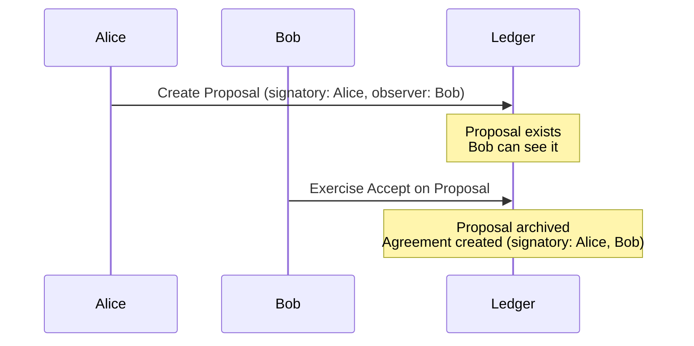
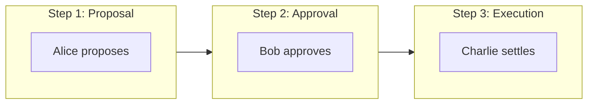
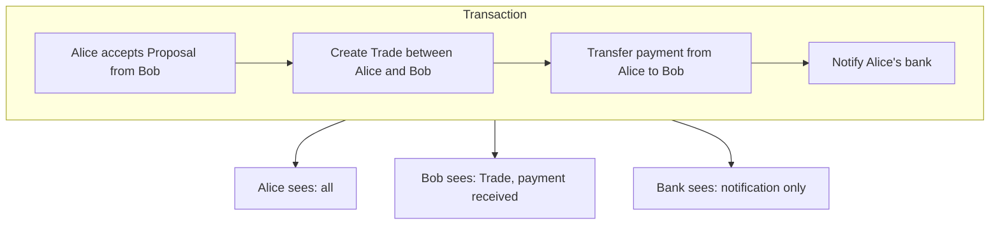

import DamlAppdevModulesM2MultiPartyWorkflowsL106 from "/snippets/daml-docs/appdev_modules_m2-multi-party-workflows_L106.mdx";
import DamlAppdevModulesM2MultiPartyWorkflowsL131 from "/snippets/daml-docs/appdev_modules_m2-multi-party-workflows_L131.mdx";
import DamlAppdevModulesM2MultiPartyWorkflowsL174 from "/snippets/daml-docs/appdev_modules_m2-multi-party-workflows_L174.mdx";
import DamlAppdevModulesM2MultiPartyWorkflowsL208 from "/snippets/daml-docs/appdev_modules_m2-multi-party-workflows_L208.mdx";
import DamlAppdevModulesM2MultiPartyWorkflowsL260 from "/snippets/daml-docs/appdev_modules_m2-multi-party-workflows_L260.mdx";
import DamlAppdevModulesM2MultiPartyWorkflowsL37 from "/snippets/daml-docs/appdev_modules_m2-multi-party-workflows_L37.mdx";


Multi-party workflows are where Canton's architecture shines compared to Ethereum. This page covers the key patterns and how to think about them differently.

## The Core Difference

On Ethereum, multi-party agreement is a **pattern you implement**. On Canton, it's a **protocol guarantee**.

| Aspect | Ethereum | Canton |
|--------|----------|--------|
| **Multi-sig creation** | Deploy contract, collect signatures over time | Collect signatures over time or submit all at once |
| **Authorization** | Runtime mapping checks | Protocol-level enforcement |
| **Atomicity** | Manual state machine | Built-in all-or-nothing |
| **Visibility** | All parties see everything | Each party sees only their view |

## The Propose-Accept Pattern

Since Canton requires all signatories to authorize contract creation, you can't create a multi-party contract unilaterally. The standard pattern is **propose-accept**:



### In Daml

<DamlAppdevModulesM2MultiPartyWorkflowsL37 />

### Compare to Ethereum

```solidity
// Ethereum: Manual approval tracking
contract TradeEscrow {
    address public buyer;
    address public seller;
    bool public buyerApproved;
    bool public sellerApproved;

    function approve() public {
        if (msg.sender == buyer) buyerApproved = true;
        if (msg.sender == seller) sellerApproved = true;
    }

    function execute() public {
        require(buyerApproved && sellerApproved, "Not approved");
        // Execute trade...
    }
}
```

The Canton version:
- Authorization is enforced by the protocol, not by application-level checks
- State transitions are atomic, so partial or inconsistent states don't arise
- Visibility is automatically scoped to the involved parties

## Delegation Patterns

Canton supports sophisticated delegation where one party grants another the ability to act on their behalf.

### Controller Delegation

<DamlAppdevModulesM2MultiPartyWorkflowsL106 />

### Delegation via Separate Contract

<DamlAppdevModulesM2MultiPartyWorkflowsL131 />

## Multi-Step Workflows

For workflows requiring multiple parties in sequence:



### Workflow State Machine

<DamlAppdevModulesM2MultiPartyWorkflowsL174 />

## Atomic Multi-Contract Operations

Canton can atomically update multiple contracts in a single transaction:

<DamlAppdevModulesM2MultiPartyWorkflowsL208 />

### Why This Matters

On Ethereum, atomic swaps require:
- Escrow contracts
- Time-locked phases
- Failure recovery logic
- Careful reentrancy protection

On Canton, atomicity is **guaranteed by the protocol**. If any part fails, nothing happens.

## Privacy in Multi-Party Workflows

Each party only sees their relevant portion:



## Common Workflow Patterns

| Pattern | Use Case | Key Feature |
|---------|----------|-------------|
| **Propose-Accept** | Two-party agreements | Simple, clear consent |
| **Propose-Accept-Settle** | Three-party workflows | Sequential authorization |
| **Delegation** | Acting on behalf | Controlled authority transfer |
| **Escrow** | Conditional execution | Atomic swap guarantee |
| **Voting** | Group decisions | Threshold-based approval |

### Voting Example

<DamlAppdevModulesM2MultiPartyWorkflowsL260 />

## Related Topics

<CardGroup cols={2}>

<Card title="Migration Checklist" icon="list-check" href="/testnet/appdev/modules/m2-migration-checklist">
  Practical checklist for migrating from Ethereum.
</Card>

<Card title="Module 3: Daml" icon="code" href="/testnet/appdev/modules/m3-dev-environment">
  Start writing Daml smart contracts.
</Card>

</CardGroup>
