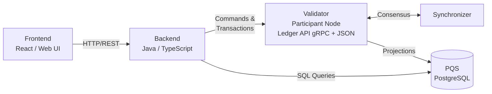

Canton applications follow a layered architecture where Daml smart contracts define the shared business logic, a backend mediates access to the ledger, and a frontend presents the user interface. This page describes the roles involved and how the layers connect.

## Roles

Three roles appear in most Canton applications.

**App Provider** -- The organization that builds, deploys, and operates the application. The App Provider typically runs its own validator, hosts the backend services, and serves the frontend. Because the App Provider's validator hosts the provider's party, it stores the provider-side contract data and exposes the Ledger API that the backend connects to.

**App User** -- A party that interacts with the application's contracts. An App User may connect through the App Provider's validator (if the provider hosts the user's party) or through the user's own validator. In either case, the user's party needs to be allocated on a validator that participates in the relevant synchronizer.

**End User** -- A person who interacts with the application through a browser, mobile app, or wallet UI. End Users typically do not manage validators or think about ledger mechanics. They authenticate through the frontend, and the backend handles ledger operations on their behalf.

## Architecture Layers

A Canton application has three main layers.

### Daml Model

The Daml model defines the contracts, choices, and authorization rules that make up the shared business logic. Once compiled into a DAR file with `dpm build`, this model is deployed to the validators that host the relevant parties. The Daml model is the single source of truth for what data exists on the ledger and what actions are possible.

### Backend

The backend is a service (Java or TypeScript) that connects to the validator's Ledger API. It submits commands (creating contracts, exercising choices) and reads the transaction stream or queries PQS for contract state. The backend also handles authentication, business logic that doesn't belong on-ledger, and any integration with external systems.

In the [cn-quickstart](https://github.com/digital-asset/cn-quickstart) reference application, the backend is a Spring Boot Java service.

### Frontend

The frontend is a web application (in this case it is React) that communicates with the backend over HTTP. It does not connect to the Ledger API directly. The backend exposes a REST API defined by an OpenAPI schema, and the frontend consumes it with generated TypeScript clients.

This separation keeps ledger concerns out of the browser and centralizes authentication and access control in the backend.

## Component Diagram

The following diagram shows how the layers connect at runtime.

- The **frontend** sends HTTP requests to the backend.
- The **backend** submits commands and reads transactions through the Ledger API (gRPC).
- The **validator** (participant node) processes commands submitted via the LAPI, stores contract data for its hosted parties, and synchronizes with other validators through the synchronizer.
- **PQS** maintains a PostgreSQL projection of ledger state that the backend can query with SQL.

## Where PQS Fits In

The Ledger API is optimized for command submission and streaming transaction updates. For read-heavy workloads -- dashboards, reports, filtered queries, aggregations -- PQS is a better fit. PQS subscribes to the validator's transaction stream and writes contract data into PostgreSQL tables. Your backend queries these tables with standard SQL.  PQS can be used to create new projections of data by combining data using standard SQL joins.  PQS also stores historical data which can be used for audits.

Using PQS means your read path does not compete with your write path for Ledger API resources, and you can use the full power of PostgreSQL (joins, indexes, full-text search) on your contract data.

## Choosing an Architecture Style

The cn-quickstart project uses a **fully mediated** architecture: the backend handles all ledger interactions, and the frontend only talks to the backend. This is the simplest model for most applications.

An alternative is a **CQRS** architecture where the frontend submits commands directly to the Ledger API (using TypeScript bindings from `dpm codegen-js`) while the backend handles queries. This gives the frontend tighter integration with the ledger but requires it to understand Canton concepts like party IDs and contract IDs.

Pick the fully mediated approach unless you have a specific reason to expose ledger concepts to the frontend.

## Next Steps

- [SDKs and APIs](/testnet/appdev/modules/m4-sdks-apis) -- The tools and interfaces available for each layer
- [Backend Development](/testnet/appdev/modules/m4-backend-dev) -- Patterns for connecting to the Ledger API and PQS
- [Frontend Development](/testnet/appdev/modules/m4-frontend-dev) -- Building a React UI against the backend API
