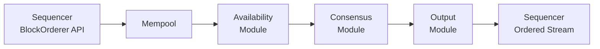

The ordering consensus layer is one half of Canton's [two-layer consensus architecture](/testnet/overview/reference/canton-protocol-specification). While the smart contract consensus layer validates transaction correctness among affected parties, the ordering layer establishes a single, global sequence of events on a given synchronizer. It does so without accessing transaction content — payloads remain encrypted end-to-end, and the ordering infrastructure sees only metadata.

## Synchronizer Components

A synchronizer consists of two node types: **sequencers** and **mediators**. Together they provide authenticated, ordered message delivery and transaction finalization. Neither type stores or has access to decrypted transaction payloads.

### Sequencer Nodes

Sequencers provide authenticated, timestamped multicast. They are the message routing backbone of a synchronizer.

- **Total ordering for a synchronizer.** Each batch of messages submitted to the sequencer receives a monotonically increasing value that acts as a timestamp. All recipients observe the same global ordering derived from these timestamps. This total ordering prevents double-spends by giving every state change on the synchronizer a deterministic position in the sequence.
- **Encrypted payload forwarding.** Sequencers forward opaque (encrypted) messages. They see metadata — recipient lists and message sizes — but not transaction content. Encryption keys are managed between participants; the sequencer never holds decryption keys.
- **Sender privacy.** Recipients do not learn the party ID of the sender. The sequencer strips sender information before delivering messages to other parties.
- **Traffic management.** Sequencers enforce traffic limits to protect the synchronizer from abuse and denial-of-service attacks. Each authorized member accumulates a traffic balance; submission requests that exceed the member's available balance are rejected. Traffic costs scale with payload size, number of recipients, and a per-event base cost.

Participants and mediators never communicate directly with each other. All protocol messages flow through sequencers.

### Mediator Nodes

Mediators synchronize the two-phase commit protocol that finalizes transactions. After the sequencer distributes encrypted transaction views to affected participants, participants validate their views and send confirmation responses (approve or reject) back through the sequencer to the mediator.

- **Confirmation collection.** The mediator collects confirmation responses from all confirming participants for a given transaction.
- **Verdict issuance.** Once the mediator has received enough responses to determine the outcome, it issues a transaction verdict (commit or reject). The sequencer then distributes this verdict to all affected participants.
- **Limited visibility.** Mediators see informee lists (which parties are involved in which transaction views) and the confirmation results (approve/reject per view). They do not see the encrypted transaction payloads themselves.

A synchronizer can run multiple mediator groups to distribute workload. The synchronizer owner configures mediator group membership through topology transactions.

## BFT Ordering Service

The ordering service backing the sequencer can operate in different configurations. The most significant distinction is between a centralized backend and a Byzantine-fault tolerant (BFT) backend.

When the BFT orderer is active, it runs within the Canton sequencer JVM process. It depends on the colocated sequencer for message signing, signature verification, key management, and governance (topology state). The BFT orderer implements the `BlockOrderer` API, which allows the sequencer to submit ordering requests (writes) and subscribe to the globally ordered transaction stream (reads).

The BFT orderer provides two guarantees:

- **Safety (consistency).** All correct nodes produce the same ordered output. No two correct sequencers deliver conflicting transaction orderings.
- **Liveness (progress).** The system continues to order transactions as long as the fault tolerance threshold is not exceeded.

## BFT Trust Model

The BFT orderer uses the standard Byzantine fault tolerance assumption:

- **Fault threshold.** Fewer than one-third of the total BFT orderer nodes may simultaneously exhibit Byzantine failures (arbitrary behavior, including crashes, message corruption, or active malice). For N total nodes, the system tolerates f Byzantine faults where 3f + 1 ≤ N.
- **Agreement quorum.** The trust threshold k = floor(2N/3). At least k + 1 nodes must agree to make progress on ordering.
- **Cryptographic assumption.** Adversaries may have large bandwidth and computational resources, but they cannot break standard cryptographic primitives (digital signatures, hash functions).
- **Shared fate.** A BFT orderer node and its colocated sequencer operate under a shared fate model. If one is compromised, the other should be assumed compromised as well.
- **Governance and onboarding.** Trusted administrators manage the BFT orderer configuration. New nodes being onboarded obtain correct startup state from peer sequencer snapshots, which bundle BFT metadata such as epoch numbers, block numbers, and timestamps.
- **Storage integrity.** The underlying database is assumed to be uncorrupted.

## BFT Architecture

The BFT orderer draws on two published algorithms:

**ISS (Insanely Scalable State-Machine Replication)** is a parallel leader-based BFT replication protocol. ISS inspires the core consensus subprotocol in the BFT orderer. It divides work into epochs of fixed block length, with multiple leaders proposing blocks in parallel across different segments of the epoch. This parallelism load balances the expensive costs associated with the leader role without incurring downtime when some leaders are unavailable.

**Narwhal** separates data dissemination from data ordering. The BFT orderer applies this idea to its pre-consensus availability subprotocol: data is disseminated first, and consensus then orders references to already-available data rather than the data itself. This decoupling reduces the communication load on the consensus protocol, which tends to be the bottleneck in ordering services.

### Module Architecture

The BFT orderer is organized into four modules that form a pipeline:

**Mempool** — Receives ordering requests from the local sequencer via the `BlockOrderer` API. Requests are held in an in-memory queue. When the queue is full, the mempool applies backpressure by rejecting incoming requests. When the downstream availability module requests data, the mempool batches queued requests and forwards them.

**Availability module** — Implements the Narwhal-inspired data dissemination phase. When the availability module receives a batch from the mempool, it stores the batch locally and forwards it to peer availability modules on other BFT orderer nodes. Each peer that successfully receives the batch returns a signed availability acknowledgment (ACK). The module collects at least f + 1 distinct ACKs (where f is the number of tolerable Byzantine faults) to produce a **proof of availability (PoA)**. It can wait for up to N - f ACKs for stronger guarantees. The PoA certifies that at least one correct node holds the data and can serve it to any node that needs it. This prevents Byzantine nodes from proposing references to data that does not actually exist.

**Consensus module** — Implements the ISS-inspired ordering protocol. Work is divided into discrete epochs of fixed block length. All nodes agree on the set of eligible leaders for each epoch via topology state. Leaders are deterministically assigned to blocks across the epoch, and each leader orders its assigned blocks independently using a three-phase protocol derived from PBFT:

1. **Pre-prepare.** The leader broadcasts an ordering block containing PoA references.
2. **Prepare.** Other nodes acknowledge the pre-prepare.
3. **Commit.** Nodes send a commit message after receiving a valid pre-prepare and more than 2/3 of prepare messages.

A block is considered ordered when a node receives a valid pre-prepare and more than 2/3 of commit messages.

**Output module** — Reconstructs the complete, globally ordered transaction stream from the consensus output. It fetches full request data from the availability module using the PoA references (locally if cached, or from remote peers if not). Because leaders order blocks in parallel, the output module re-sequences blocks into the correct global order. It assigns strictly increasing BFT timestamps to each block — the consensus module calculates candidate timestamps, and the output module deterministically adjusts them to ensure monotonicity. The final ordered stream is delivered to the colocated sequencer.

### Network Transport

BFT orderer nodes communicate peer-to-peer. Each node establishes a gRPC/HTTP2 stream to every other peer in the ordering service. These connections use TLS for point-to-point authentication and integrity. The peer-to-peer API is typically not exposed publicly; access is restricted to known BFT orderer peers.

## Centralized vs. Decentralized Options

Canton supports multiple sequencer backends. The choice of backend determines the trust model for the synchronizer.

**Centralized (single database backend).** A single database provides the ordering. This is the simplest configuration: lowest latency, easiest to operate, but a single point of trust and failure. If the database or its operator is compromised, ordering integrity is lost. Suitable for private synchronizers where the synchronizer operator is trusted by all participants. Note that the centralized orderer is in an Alpha state and not yet ready for production. This option will be removed in favor of running the Native BFT orderer even for single-sequencer deployments.

**CometBFT driver.** An external BFT ordering service using [CometBFT](https://cometbft.com/). Canton includes a driver that integrates CometBFT as the sequencer backend. This provides Byzantine fault tolerance through an established consensus engine, but runs as a separate process outside the sequencer JVM.

**Native BFT orderer.** The ISS-inspired orderer described above, running in-process with the sequencer. This is Canton's own BFT implementation, designed specifically for the sequencer's requirements and integrated tightly with Canton's topology and key management.

The **Global Synchronizer** uses the BFT configuration, operated by Super Validators. Each Super Validator runs sequencer and mediator nodes, and the BFT orderer nodes communicate peer-to-peer across Super Validator infrastructure. Private synchronizers may use any backend — a single-database backend for simplicity, or a BFT backend when trust must be distributed among multiple operators.

## Sequencer Guarantees

The sequencer, regardless of its backend, provides the following guarantees to the Canton protocol:

- **Total ordering.** All recipients observe the same sequence of messages. This is the foundation for preventing double-spends and ensuring consistency across participants connected to the same synchronizer.
- **Timestamping.** Each message batch receives a monotonically increasing timestamp. These timestamps drive all protocol timeouts and ordering decisions.
- **Authenticated delivery.** Messages delivered by the sequencer are signed, allowing recipients to verify that the message was actually sequenced (and not forged by a third party).
- **Payload privacy.** Transaction payloads are encrypted between participants. The sequencer transports ciphertext and cannot read the content of the messages it routes.
- **Sender privacy.** The sequencer does not reveal the identity of the sender to recipients. This prevents traffic analysis based on sender-recipient correlations.
- **Traffic management.** The sequencer enforces per-member traffic limits. Members accumulate traffic through base allocation (passive accumulation over synchronizer time) and purchased extra traffic. Submissions that exceed a member's available traffic balance are rejected, protecting the synchronizer against resource exhaustion.
