A validator on Canton Network is more than a Canton participant node. It bundles a Canton participant with the Splice application layer -- the software that implements Canton Coin, the wallet, the Canton Name Service, and network management automation. This page describes each component layer and how the layers relate.

## Component Architecture

```mermaid
flowchart TB
    subgraph UI["Application Layer (Web UIs)"]
        direction TB
        WUI[Wallet UI]
        CNSUI[Canton Name Service UI]
    end

    subgraph APIS["External APIs"]
        direction TB
        VALAPI[Validator App API]
        JAPI[JSON API &#40;HTTP&#41;]
        SCANP[Scan Proxy]
    end

    subgraph SPLICE["Splice Layer"]
        direction TB
        VAPP[Validator App]
        SDARS[Splice DARs<br>Amulet &#8226; Wallet &#8226; Name Service]
        TSDARS[Token Standard DARs]
    end

    subgraph PARTICIPANT["Canton Participant"]
        direction TB
        LAPI[Ledger API &#40;gRPC&#41;]
        AAPI[Admin API]
        ENGINE[Daml Engine]
        ACS[(Active Contract Store)]
        PROTO[Protocol Layer<br>preparation &#8226; validation &#8226; confirmation]
    end

    subgraph DATA["Data Layer"]
        direction TB
        PQS[PQS<br>Participant Query Store]
        PG[(PostgreSQL)]
    end

    subgraph SYNC["Synchronizer Connections"]
        direction TB
        GS[Global Synchronizer<br>via sequencer&#40;s&#41;]
        PS[Private Synchronizer&#40;s&#41;<br>optional]
    end

    WUI --> VALAPI
    CNSUI --> VALAPI
    VALAPI --> VAPP
    VAPP --> LAPI
    SDARS --> ENGINE
    TSDARS --> ENGINE
    LAPI --> ENGINE
    JAPI --> LAPI
    PQS --> LAPI
    ENGINE --> ACS
    ENGINE --> PROTO
    AAPI --> PARTICIPANT
    PARTICIPANT --> PG
    PQS --> PG
    PROTO <--> GS
    PROTO <--> PS
    SCANP --> GS
```

## Application Layer

{/* COPIED_START source="docs-website:replicated/canton/3.4/overview/explanations/canton/participant.rst" hash="3ccc7b7d" */}

<Warning title="Pre-reviewed Content - Do Not Modify">
This section was copied from existing reviewed documentation.
**Source:** `replicated/canton/3.5/overview/explanations/canton/participant.rst`
Reviewers: Skip this section. Remove markers after final approval.
</Warning>

Participant nodes

A closer look into the participant node

Diagram:

- PN connects to multiple synchronizers (details to be fleshed out in a separate section later)
- gRPC Ledger API access with isolation for multiple users, Admin API for operator access
- Private contract store (PCS) includes historic data, ACS doesn't.

##

{/* COPIED_END */}

The application layer comprises the web UIs that ship with every validator deployment.

**Wallet UI** -- a browser-based interface for the validator operator (and optionally hosted users) to manage Canton Coin holdings, view transaction history, accept or send transfer offers, and monitor reward collection. The Wallet UI communicates with the Validator App API.

**Canton Name Service (CNS) UI** -- a browser-based interface for purchasing and managing human-readable names mapped to party identifiers on the network. CNS names work like DNS records: a party can register a globally unique name (for example, `alice.unverified.cns`) and use it in place of the full party identifier.

Both UIs authenticate users through an external OIDC provider (such as Auth0 or Keycloak) and are served as single-page applications behind the validator's ingress.

## Splice Layer

The Splice layer is what distinguishes a validator from a plain Canton participant.

### Validator App

The Validator App is a backend process that sits between the web UIs and the Canton participant. It:

- Manages the participant's connection to the Global Synchronizer (and reconnects after outages or migrations)
- Automates onboarding: presents the onboarding secret to the sponsoring Super Validator and completes the handshake
- Uploads and vets Splice DAR packages on the participant
- Allocates parties and manages user-to-party mappings
- Runs wallet automation -- collecting validator rewards, executing recurring subscription payments, and purchasing traffic
- Exposes a REST API surface covering wallet operations, user management, CNS entry management, external signing, and a Scan Proxy endpoint (see [APIs](#apis) below)

### Splice DARs

The Splice DARs are Daml packages that implement Canton Network's built-in applications. They run as ordinary smart contracts on the Canton participant and include:

- **Amulet** -- the Daml logic for Canton Coin: minting rounds, reward coupons, holding fees, and coin transfers
- **Wallet** -- transfer offers, buy-traffic requests, subscription payments, and sweep automation
- **Amulet Name Service (ANS)** -- name registration, renewal, and resolution

### Token Standard DARs

The Token Standard DARs implement the [Canton Network Token Standard (CIP-0056)](https://github.com/global-synchronizer-foundation/cips/blob/main/cip-0056/cip-0056.md). They provide a standardized interface for transferring Canton Coin (and potentially other tokens) through Daml interfaces. Applications that integrate with Canton Coin should build against these interfaces rather than the lower-level Amulet contracts.

## Canton Participant

The Canton participant is the core runtime that executes Daml smart contracts and participates in the Canton transaction protocol. It has three main sub-components.

### Daml Engine

The Daml engine interprets and executes Daml smart contract code. When an application submits a command through the Ledger API, the Daml engine:

1. Parses and validates the command
2. Evaluates the Daml code to produce a transaction tree -- the root action plus all its consequences
3. Computes the view decomposition for privacy (each party sees only the sub-views they are entitled to)

### Active Contract Store (ACS)

The ACS is the participant's local projection of active contracts. It contains only contracts where a party hosted on that participant is a stakeholder (signatory or observer). The ACS is stored in the participant's PostgreSQL database.

When a transaction commits, the participant archives consumed contracts and inserts newly created ones. When a transaction is rejected, locked contracts are released. The ACS therefore reflects the current state of the ledger from this participant's perspective.

### Protocol Layer

The protocol layer handles the multi-step Canton transaction protocol:

- **Preparation**: the submitting participant constructs the confirmation request, embeds the transaction in a Merkle tree, and creates per-recipient encrypted envelopes
- **Submission**: encrypted envelopes are sent to the sequencer for ordering and distribution
- **Validation**: receiving participants validate their views against the Daml engine and local contract state
- **Confirmation**: participants send approval or rejection responses via the sequencer to the mediator
- **Result**: the mediator aggregates responses and declares commit or rollback via the sequencer; participants apply the outcome

For a full description of these steps, see [Transaction Lifecycle](/testnet/overview/reference/transaction-lifecycle).

## APIs

A validator exposes several API surfaces for different consumers.

### Ledger API (gRPC)

The Ledger API is the primary application interface to the Canton participant. It is a gRPC service with the following key service endpoints:

- **Command Submission Service** -- submit Daml commands (create, exercise) for execution
- **Command Completion Service** -- poll for the outcome of submitted commands
- **Transaction Service** -- stream committed transactions visible to a set of parties
- **Active Contract Service** -- get a snapshot of the current ACS for a set of parties
- **State Service** -- query active contracts and transaction trees

Applications authenticate to the Ledger API using JWT tokens verified against the configured OIDC provider.

### JSON API

The JSON API is an HTTP and WebSocket wrapper around the Ledger API. It translates JSON requests into gRPC calls and returns JSON responses. In Canton 3.x, the JSON API is integrated into the Canton participant process (not a separate sidecar as in 2.x). Many backend applications use the gRPC Ledger API directly -- gRPC is recommended for high-throughput backends. The JSON API endpoint is typically exposed at `/api/json-api` when configured through ingress.

### Admin API

The Admin API provides node administration capabilities. Through it, operators can:

- Manage synchronizer connections (connect, disconnect, reconnect)
- Upload DAR packages (also available via the Ledger API)
- Allocate and manage parties
- Query topology state and node identities
- Configure pruning schedules

The Admin API is not exposed through ingress by default and should be restricted to trusted operators.

### Validator App API

The Validator App exposes a REST API on port 5003 with endpoints grouped by function:

- **Wallet API** (`/v0/wallet/*`) -- create transfer offers, buy traffic, query balance and transaction history
- **User Management API** (`/v0/admin/users/*`, `/v0/register`) -- onboard and offboard users hosted on the validator
- **CNS API** (`/v0/entry/*`) -- create and list Canton Name Service entries
- **External Signing API** (`/v0/admin/external-party/*`) -- set up and operate externally-signed parties for Canton Coin
- **Validator Management API** (`/v0/admin/participant/*`) -- query participant identities and synchronizer connection configuration

### Scan Proxy

The Scan Proxy (`/v0/scan-proxy/*`) provides BFT read access to the public Scan API data hosted by Super Validators. Rather than trusting a single SV's Scan instance, the Scan Proxy broadcasts each query to multiple SV Scan services and returns the consensus result. Endpoints include querying amulet rules, open mining rounds, CNS entries, and transfer command status.

## Data Layer

### PostgreSQL

The participant stores its state in PostgreSQL databases. The primary stores include:

- **Ledger store** -- committed transactions and the ACS
- **Sequencer client store** -- messages received from synchronizers
- **Topology store** -- identity mappings, key registrations, and party-to-participant assignments (see [Topology](/testnet/overview/reference/topology))
- **Validator app store** -- the Validator App's own operational state

The Splice application layer (Validator App, wallet automation) uses additional database schemas within the same PostgreSQL instance.

Operators can configure participant pruning to remove historical transactions beyond a retention window, keeping only the ACS. This prevents unbounded database growth but requires careful sizing of the retention window relative to expected downtime.

### PQS (Participant Query Store)

PQS is an optional read-side component that subscribes to the participant's Ledger API transaction stream and writes a denormalized projection into its own PostgreSQL database. Applications query PQS via standard SQL (JDBC) rather than the gRPC Ledger API.

PQS is useful when applications need:

- SQL-based queries over contract payloads (the Ledger API does not index template fields)
- SQL joins across contract data to build projections (for example, joining multiple template types)
- Historical contract data retention for audit trails and compliance queries
- Analytics or reporting workloads that would otherwise overload the participant
- CQRS-style separation between command submission (Ledger API) and read queries (PQS database)

PQS does not write to the ledger -- it is a passive consumer of transaction data.

## Synchronizer Connections

A validator connects to one or more synchronizers. Each connection involves authenticated channels to the synchronizer's sequencer nodes, through which the validator communicates with the broader synchronizer infrastructure (including mediators).

### Global Synchronizer

Every validator on Canton Network connects to the Global Synchronizer. This connection carries:

- Encrypted confirmation requests and responses for transactions involving Canton Coin, CNS entries, and any other contracts on the Global Synchronizer
- ACS commitment exchanges between participants to verify state consistency
- Topology transactions (party allocations, package vetting, key rotations)

The sequencer endpoint URL and connection parameters are typically obtained from the Scan API during onboarding. By default, the validator connects to multiple sequencer endpoints for BFT fault tolerance, though operators can optionally configure a single trusted sequencer.

### Private Synchronizers

A validator can connect to additional synchronizers beyond the Global Synchronizer. Private synchronizers are operated by enterprises or consortia for their own application domains. Contracts on different synchronizers can interact through reassignment (transfer) operations, which move a contract from one synchronizer to another.

Multi-synchronizer connectivity enables a single validator to host parties that participate in workflows across different application domains while settling fees through the Global Synchronizer.

## Traffic Management

Submitting transactions to the Global Synchronizer consumes traffic. Every participant has a free base-rate traffic allowance that regenerates over a configurable time window. Beyond that baseline, the validator must purchase extra traffic by burning Canton Coin.

The Validator App includes built-in top-up automation: operators configure a target throughput, and the app automatically purchases traffic to maintain a sufficient balance. If the traffic balance drops below a reserved threshold, the Validator App pauses its own ledger submissions to preserve enough balance for a top-up transaction.

Traffic accounting is per-participant -- all parties hosted on the same validator share one traffic balance.

## Kubernetes Pod Topology

A typical Kubernetes deployment of a validator creates the following pods:

- `postgres` -- PostgreSQL instance
- `participant` -- Canton participant process
- `validator-app` -- Splice Validator App backend
- `wallet-web-ui` -- Wallet UI frontend
- `ans-web-ui` -- Canton Name Service UI frontend

Each pod runs as a separate Kubernetes deployment (or stateful set for PostgreSQL). The participant must be running before the Validator App can start, and PostgreSQL must be running before either.

## How the Layers Relate

A plain Canton participant can execute Daml contracts and connect to synchronizers, but it has no knowledge of Canton Coin, the wallet, or the Canton Name Service. The Splice layer adds that knowledge by deploying Daml packages (DARs) onto the participant and running the Validator App as an automation layer that reacts to on-ledger events.

From the participant's perspective, the Splice DARs are just Daml packages like any other. The Validator App is just another Ledger API client. The distinction matters because upgrading the Splice layer (new DAR versions, new Validator App release) is independent from upgrading the Canton participant runtime, though both must remain compatible with versions mandated by the network.

## Related Pages

<CardGroup cols={2}>

<Card title="Transaction Lifecycle" icon="arrows-spin" href="/testnet/overview/reference/transaction-lifecycle">
  How the Canton protocol processes a transaction from submission to commit.
</Card>

<Card title="Topology" icon="sitemap" href="/testnet/overview/reference/topology">
  Identity management, key registrations, and party-to-participant mappings.
</Card>

<Card title="Super Validator Components" icon="server" href="/testnet/overview/reference/super-validator-components">
  Additional components that Super Validators operate beyond a standard validator.
</Card>

<Card title="Canton Coin Tokenomics" icon="coins" href="/testnet/overview/reference/canton-coin-tokenomics">
  Minting, burning, rewards, and the burn-mint equilibrium mechanism.
</Card>

</CardGroup>
