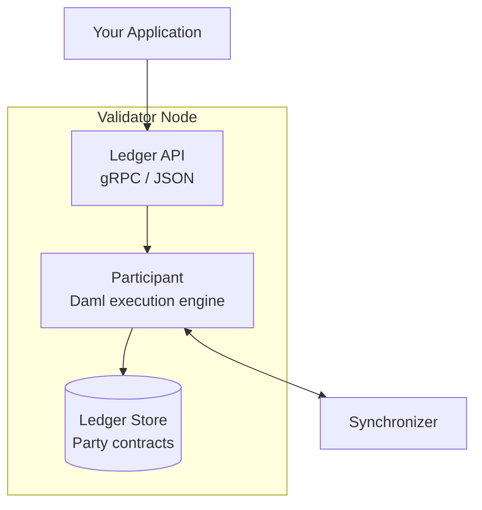
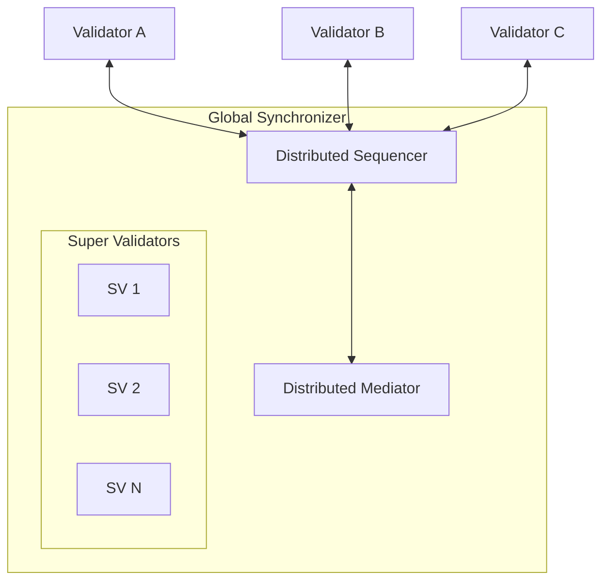
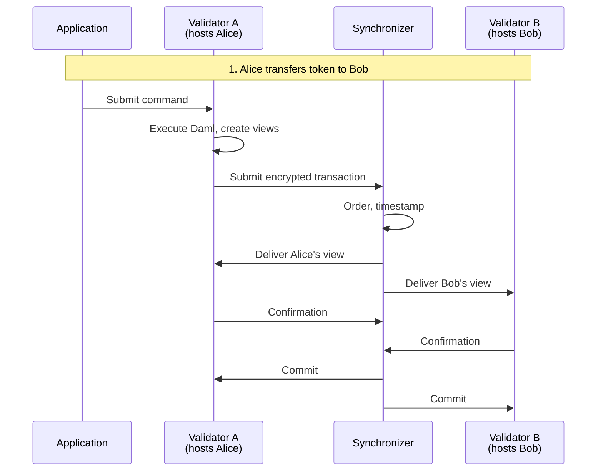

import DamlOverviewUnderstandCoreConceptsL183 from "/snippets/daml-docs/overview_understand_core-concepts_L183.mdx";
import DamlOverviewUnderstandCoreConceptsL223 from "/snippets/daml-docs/overview_understand_core-concepts_L223.mdx";
import DamlOverviewUnderstandCoreConceptsL44 from "/snippets/daml-docs/overview_understand_core-concepts_L44.mdx";


Understanding Canton requires grasping four fundamental concepts: **parties**, **validator** node, **synchronizers**, and **templates** (smart contracts). This page introduces each and explains how they work together.

## Parties

A **party** is an on-ledger identity in Canton—analogous to an address or account on other blockchains, but with explicit authorization semantics.

### Party Identifier Format

```
alice::1220f2fe29866fd6a0009ecc8a64ccdc09f1958bd0f801166baaee469d1251b2eb72
└┬┘  └─────────────────────────────────────────┘
name                                fingerprint (hash of public key)
```

### What Parties Do

| Capability | Description |
|------------|-------------|
| **Sign** | Authorize contract creation (as signatory) |
| **Act** | Execute choices on contracts (as controller) |
| **See** | Observe contracts and transactions (as stakeholder) |
| **Validate** | Confirm transactions affecting their contracts |

### Local vs. External Parties

| Type | Keys Held By | Use Case |
|------|--------------|----------|
| **Local Party** | Validator | Simpler; validator signs on party's behalf. Good for automation. |
| **External Party** | External system | User wallets; requires explicit signing workflow |

<Note>
Unlike Ethereum addresses, parties create state on validators and have costs associated with creation. Design your party structure deliberately—don't create parties unnecessarily.
</Note>

### Party Roles in Contracts

Parties interact with contracts in three roles:

<DamlOverviewUnderstandCoreConceptsL44 />

| Role | Can Create | Can See | Can Act |
|------|------------|---------|---------|
| **Signatory** | Must authorize | Always | If also controller |
| **Observer** | No | Yes | If also controller |
| **Controller** | No | When exercising | Yes (specific choice) |

<Note>
**Stakeholder** = signatories + observers. Stakeholders are all parties who can see a contract. Validators store contracts for their hosted parties when those parties are stakeholders.
</Note>

## Validators (Participant Nodes)

A **validator** hosts parties, stores their contract data, and participates in the Canton protocol. A validator contains a participant node (the Daml execution engine) plus a validator process.

### What Validators Do

| Function | Description |
|----------|-------------|
| **Host parties** | Store contracts for their hosted parties |
| **Execute Daml** | Run smart contract logic |
| **Validate transactions** | Verify authorization and correctness |
| **Expose APIs** | Provide Ledger API for applications |

### Validator Architecture



### Key Characteristics

- Each validator maintains a **localized, private view** of the ledger (called the _Active Contract Store_)
- Validators only store contracts where their hosted parties are stakeholders
- Multiple parties can be hosted on a single validator
- Validators can connect to multiple synchronizers
- A party can be hosted on multiple validators

<Warning>
Your hosting validator sees all your data. Choose your validator carefully—this is a trust relationship.
</Warning>

## Synchronizers

A **synchronizer** coordinates transaction ordering and consensus without seeing transaction content. It consists of two components:

### Sequencer

The sequencer orders and distributes messages:

| Function | Description |
|----------|-------------|
| **Order** | Assign timestamps and total ordering |
| **Distribute** | Route encrypted messages to recipients |
| **Consistency** | Ensure all participants see same order |

The sequencer **does not**:
- Decrypt messages
- See transaction content
- Permanently store transaction data (though it may cache it)
- Know which end users are involved (though it routes based on party information)

### Mediator

The mediator facilitates the consensus protocol that confirms the transaction:

| Function | Description |
|----------|-------------|
| **Collect** | Gather confirmations from participants |
| **Aggregate** | Determine if consensus threshold is met |
| **Declare** | Announce transaction outcome (commit/reject) |

The mediator **does not**:
- See transaction content
- Know what's being confirmed
- Store confirmation details

### The Global Synchronizer

The **Global Synchronizer** is the public synchronizer for Canton Network:



- Operated by **Super Validators** (major institutions)
- Decentralized—no single operator controls it
- Uses **Canton Coin (CC)** to purchase traffic to pay transaction fees
- Governed by the **Global Synchronizer Foundation**

## Smart Contracts (Templates)

Smart contracts in Canton are defined using **Daml**, a purpose-built language for multi-party workflows. A Daml **template** typically defines:

- **Data**: What information the contract holds
- **Parties**: Who can see and act on the contract
- **Choices**: What actions are possible

### Template Structure

<DamlOverviewUnderstandCoreConceptsL183 />

### Contracts Are Immutable

Unlike Solidity contracts with mutable state, Daml contracts (template instances) are immutable. They can only be `created` or `archived`.

| Solidity | Daml |
|----------|------|
| Modify state in place | Archive old contract, create new one |
| `balances[addr] = newValue` | `create Token with owner = newOwner` |
| State history implicit | State history explicit via contracts |

This immutability is key to Canton's privacy and integrity guarantees.

### Choices: Consuming vs. Non-Consuming

| Type | Effect | Use Case |
|------|--------|----------|
| **Consuming** | Archives the contract | State transitions, transfers |
| **Non-consuming** | Contract remains active | Queries, read operations, events for listening clients |

<DamlOverviewUnderstandCoreConceptsL223 />

## How Components Work Together

A complete transaction flow involves all four concepts:



| Step | Component | Action |
|------|-----------|--------|
| 1 | **Application** | Submits command via Ledger API |
| 2 | **Validator A** | Executes Daml, creates transaction views |
| 3 | **Synchronizer** | Orders, distributes encrypted views |
| 4 | **Validators** | Validate their respective views |
| 5 | **Synchronizer** | Collects confirmations, declares commit |
| 6 | **Validators** | Store committed contracts |

## Summary Table

| Concept | What It Is | Key Property |
|---------|------------|--------------|
| **Party** | On-ledger identity | Has explicit authorization roles |
| **Validator** | Node hosting parties | Stores only hosted parties' data |
| **Synchronizer** | Coordination layer | Orders without seeing content |
| **Template** | Smart contract definition | Defines data, parties, and choices |
| **Contract** | Template instance | Immutable; changes create new contracts |

## Next Steps

<CardGroup cols={2}>

<Card title="Architecture Deep Dive" icon="diagram-project" href="/testnet/overview/learn/architecture">
  See how components work together technically.
</Card>

<Card title="Global Synchronizer" icon="globe" href="/testnet/overview/understand/global-synchronizer">
  Learn about the public coordination layer.
</Card>

<Card title="Privacy Model" icon="lock" href="/testnet/overview/learn/privacy-model">
  Understand sub-transaction privacy in detail.
</Card>

<Card title="Start Building" icon="code" href="/testnet/appdev/get-started/choose-your-path">
  Begin developing on Canton.
</Card>

</CardGroup>
