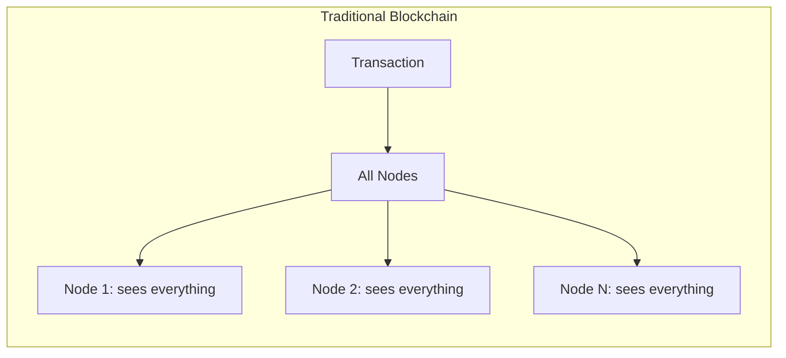
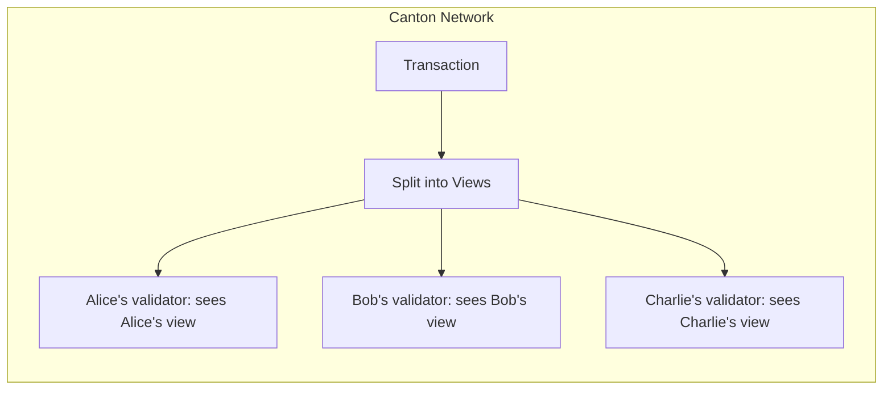
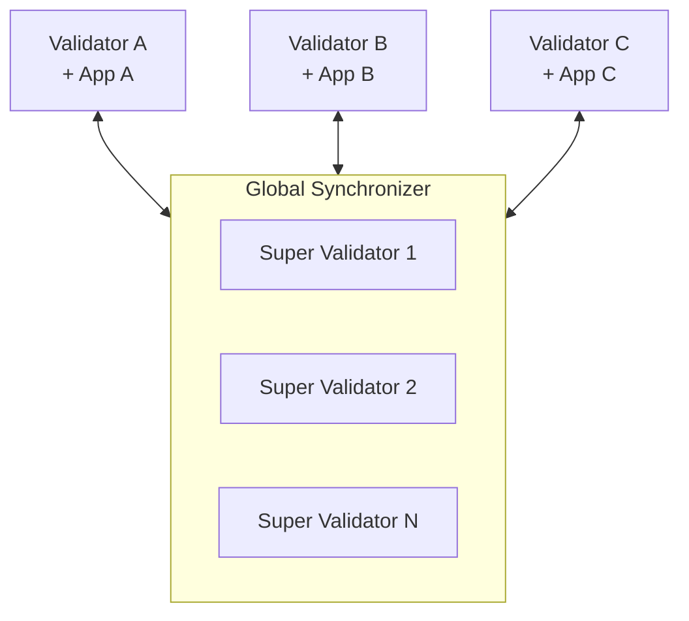

import DamlOverviewUnderstandFiveMinuteOverviewL64 from "/snippets/daml-docs/overview_understand_five-minute-overview_L64.mdx";

Canton Network is a public blockchain that solves a fundamental problem: how do you get the benefits of blockchain (shared truth, automation, auditability) without exposing sensitive data to everyone?

## The Core Insight

Traditional blockchains replicate all data to all nodes. This provides strong integrity guarantees but prevents privacy without additional layers.

Canton inverts this model: **data goes only where it needs to go**. Parties see only what they're entitled to see, yet the system maintains the same integrity guarantees as a fully replicated blockchain.

## How It Achieves This

Canton achieves this through three key innovations:

### 1. Sub-Transaction Privacy

Transactions are decomposed into **views**. Each party receives only the views they're entitled to see based on their role (signatory, observer, controller).

If Alice pays Bob, and Bob pays Charlie in a single atomic transaction:
- Alice sees her payment to Bob
- Bob sees both payments (he's involved in both)
- Charlie sees only his receipt from Bob
- Nobody else sees anything

### 2. Synchronizers Only Synchronize, Don't Store Transaction State

The **Global Synchronizer** orders transactions and facilitates consensus but never sees transaction content. It handles encrypted messages and confirmation results only.

This separation means:
- No central point that can read all data
- Synchronization without visibility
- Validators store data for their hosted parties

### 3. Smart Contracts Define Privacy

Privacy isn't a bolt-on feature. Daml smart contracts explicitly declare:
- **Signatories**: Who must authorize and always see the contract
- **Observers**: Who can see but not act
- **Controllers**: Who can execute specific actions

<DamlOverviewUnderstandFiveMinuteOverviewL64 />

## The Network

Canton Network consists of:

| Component | Role |
|-----------|------|
| **Global Synchronizer** | Public synchronization layer operated by Super Validators |
| **Validators** | Nodes that host parties and store their contract data |
| **Canton Coin (CC)** | Native token for transaction fees |
| **Applications** | What you build on top |

Each validator typically runs one or more applications. Applications can also compose with other applications—using their published Daml packages to build on top of existing functionality while preserving privacy.

## Why This Matters

Canton enables use cases that are not feasible on traditional blockchains:

| Use Case | Why Canton Works |
|----------|------------------|
| **Regulated finance** | Data stays with entitled parties; compliance becomes possible |
| **Multi-party workflows** | Shared truth without shared visibility |
| **Confidential agreements** | Terms visible only to signatories |
| **Position privacy** | Trading strategies protected |

## What's Different

If you're coming from other blockchains:

| Traditional Blockchain | Canton |
|------------------------|--------|
| Everyone sees everything | Parties see only their views |
| Global state replication | Distributed state per party |
| Privacy = additional layer | Privacy = core protocol |
| Gas fees | Traffic fees |
| EOA/Address | Party |
| Mutable contracts | Immutable; changes create new contracts |

## Next Steps

<CardGroup cols={2}>

<Card title="Why Canton?" icon="question" href="/testnet/overview/understand/the-problem">
  Understand the problem Canton solves in depth.
</Card>

<Card title="Core Concepts" icon="book" href="/testnet/overview/understand/core-concepts">
  Learn about parties, validators, synchronizers, and smart contracts.
</Card>

<Card title="For Ethereum Devs" icon="ethereum" href="/testnet/appdev/modules/m2-canton-for-ethereum-devs">
  Translate your blockchain knowledge to Canton.
</Card>

<Card title="Architecture" icon="diagram-project" href="/testnet/overview/learn/architecture">
  See how components work together.
</Card>

</CardGroup>
