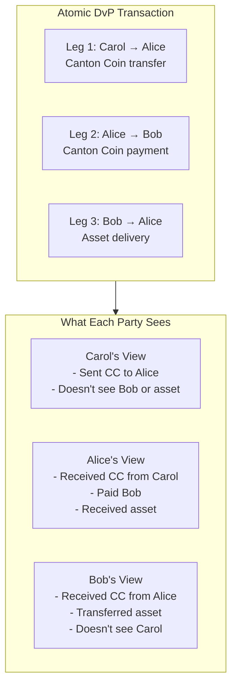
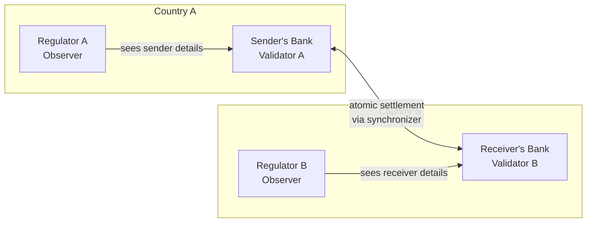
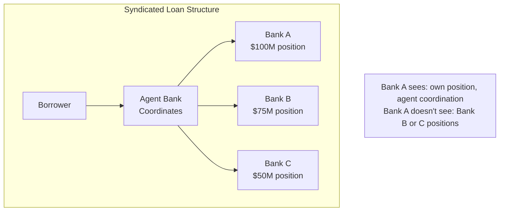

import DamlOverviewUnderstandUseCasesL202 from "/snippets/daml-docs/overview_understand_use-cases_L202.mdx";
import DamlOverviewUnderstandUseCasesL77 from "/snippets/daml-docs/overview_understand_use-cases_L77.mdx";

Canton's architecture enables use cases that are not feasible on public blockchains. This page explores key patterns and concrete examples.

## Delivery vs. Payment (DvP)

The canonical example of Canton's capabilities is atomic delivery vs. payment across different assets and parties.

### The Scenario

Alice wants to buy a tokenized asset from Bob. She'll pay with Canton Coin, which she obtained from Carol. The settlement should be:

- **Atomic**: Either both legs complete, or neither does
- **Private**: Carol shouldn't know about Alice's purchase; observers shouldn't see the price

### On Traditional Blockchains

This is problematic:

- If done in two transactions: risk of one completing without the other
- If done atomically: all parties (and observers) see all legs of the trade
- Carol learns Alice bought something from Bob
- Anyone watching can see the price and terms

### On Canton

The entire exchange happens in a single atomic transaction with sub-transaction privacy:

| Party | Sees | Doesn't See |
|-------|------|-------------|
| **Carol** | CC transfer to Alice | Bob's involvement, the asset, the price |
| **Alice** | All three legs | N/A (she's the central party) |
| **Bob** | CC receipt, asset transfer | Carol's involvement, source of funds |
| **Third party** | Nothing | Everything |

### Why This Matters

- **Regulatory compliance**: Each party sees only their entitled information
- **Atomic settlement**: No settlement risk—both legs or neither
- **Privacy**: Trading relationships and prices protected
- **Audit trail**: Entitled auditors can be added as observers

## Tokenized Securities

Issue and trade securities with regulatory compliance built in.

### Requirements

- Issuer controls who can hold the security
- Regulator has audit visibility
- Trades are private between buyer and seller
- Corporate actions affect all holders (but holdings remain private)

### Canton Design

<DamlOverviewUnderstandUseCasesL77 />

The regulator observes all holdings (for compliance) without that data being public. The issuer must approve all transfers, ensuring only eligible parties can hold the security. Trades remain private between counterparties while still being auditable.

## Cross-Border Payments

Move value across jurisdictions while respecting data sovereignty requirements.

### The Challenge

- Sender's bank is in Country A with data localization requirements
- Receiver's bank is in Country B with different requirements
- Correspondent banking requires coordination
- Neither country's regulator should see the other's customer data

### Canton Solution

Each jurisdiction's data stays with validators in that jurisdiction:

- Sender's details stay in Country A
- Receiver's details stay in Country B
- Settlement is atomic across the synchronizer
- Each regulator sees only their jurisdiction's data

## Syndicated Loan Management

Multiple banks participate in a loan without seeing each other's positions or terms.

### The Scenario

In syndicated loans:
- Multiple banks hold portions of the same loan
- Each bank's position is confidential
- The agent bank coordinates payments
- Borrower interacts with the group as a whole

On public systems, all participants would see all positions, defeating confidentiality.

### Canton Solution

Each bank sees:
- Their own position and terms
- Payments flowing to/from them
- Agent coordination for their portion

Each bank doesn't see:
- Other banks' positions
- Other banks' terms
- Total syndicate size (unless explicitly shared)

## Supply Chain Finance

Track goods and payments across multiple parties without exposing commercial relationships.

### The Scenario

A manufacturer ships to a distributor, who ships to a retailer. Financing is provided at each step.

### Privacy Requirements

- Manufacturer shouldn't see retailer's purchase price
- Retailer shouldn't see manufacturing cost
- Each financier sees only their debtor's portion
- Logistics providers see shipping info, not financial terms

### Canton Approach

Canton's privacy works at the contract level—observers see entire contracts, not individual fields. To give different parties access to different information, you design separate contracts for each audience:

<DamlOverviewUnderstandUseCasesL202 />

A single atomic transaction can create both contracts. The logistics provider and financier each see only their relevant contract, while the shipper and receiver (as signatories on both) see everything. Downstream participants in the supply chain never see upstream pricing, because those contracts have different stakeholders.

This pattern—separating data by audience into distinct contracts—is how Canton achieves fine-grained privacy while maintaining atomicity.

## When Canton Fits

Canton is ideal when you need:

| Requirement | Canton Provides |
|-------------|-----------------|
| **Multi-party coordination** | Native multi-party contracts with explicit authorization |
| **Confidential execution** | Sub-transaction privacy by design |
| **Regulatory compliance** | Selective disclosure to authorized parties |
| **Atomic settlement** | All-or-nothing execution across parties |
| **Audit trails** | Observer roles for entitled auditors |

## When Canton May Not Fit

Consider alternatives if you need:

| Requirement | Consideration |
|-------------|---------------|
| **Fully public applications** | Transparency is a feature, not a limitation (e.g., public governance, open auctions) |
| **EVM compatibility** | Canton does not natively interoperate with Ethereum smart contracts |
| **Anonymous participation** | Canton parties have identity; truly anonymous systems need different approaches |
| **Simple single-party apps** | Blockchain overhead may not be justified |

## Next Steps

<CardGroup cols={2}>

<Card title="Core Concepts" icon="book" href="/testnet/overview/understand/core-concepts">
  Understand parties, validators, and synchronizers.
</Card>

<Card title="Start Building" icon="code" href="/testnet/appdev/get-started/choose-your-path">
  Begin your development journey.
</Card>

</CardGroup>
