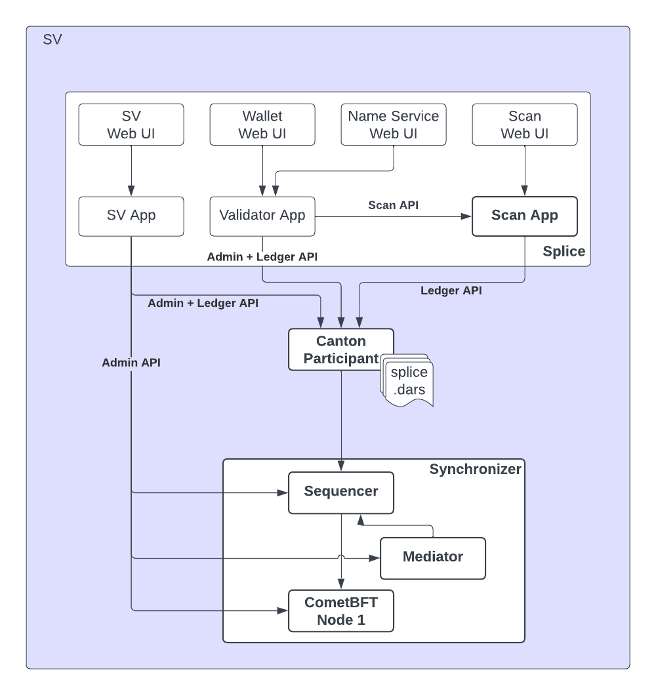

Splice nodes expose REST APIs that are separate from the [Ledger API](/testnet/sdks-tools/api-reference/ledger-api) and the [Admin API](/testnet/sdks-tools/api-reference/admin-api). These APIs are served by the Splice application layer running on top of Canton and provide access to Canton Network-specific functionality: querying network state, managing wallets, operating validators, and governing the network as a super validator (SV).

Three main APIs exist, each tied to a different Splice application component:

- **Scan API** — public, read-only access to Global Synchronizer state, transaction history, and reference data
- **Validator API** — wallet operations, user management, and validator node administration
- **SV API** — super validator governance, onboarding, and synchronizer management

## Scan API

{/* COPIED_START source="splice:docs/src/app_dev/scan_api/index.rst" hash="73c3f5b6" */}

<Warning title="Pre-reviewed Content - Do Not Modify">
This section was copied from existing reviewed documentation.
**Source:** `docs/src/app_dev/scan_api/index.rst`
Reviewers: Skip this section. Remove markers after final approval.
</Warning>

# Scan APIs

The Scan APIs consist of the following APIs:

- `scan_bulk_data_api`: A comprehensive API that provides access to the exact and full history of updates and ACS snapshots as recorded on the SV participant node.
- `scan_global_synchronizer_connectivity_api`
- `scan_global_synchronizer_operations_api`
- `scan_cc_reference_data_api`
- `scan_current_state_api`
- `scan_aggregates_api`

Please see the `scan_openapi` for the full API reference; and see `app_dev_openapi_conventions` to learn about the API stability annotations and the contract payload encoding used.

**Scan App Overview**

The Scan App serving the Scan APIs is part of a `CN Supervalidator` (SV) node. The Scan App is shown in the context of an SV node in the following diagram:



The Scan App stores the transaction history, and active contract set as seen by SVs, as well as reference data, for instance how to connect to the Global Synchronizer and which packages to use.

The Scan App ingests updates from the SV Participant node, reconstructs ACS snapshots from the updates and stores this data in a schema that is optimized for several querying scenarios. The Scan API provides access to this data.

The Scan API can be used to integrate third-party apps with the Scan App component of the SV nodes constituting the Global Synchronizer. Examples of such third-party apps are network analytic apps, block explorer apps, or financial accounting integrations.

The Scan App subscribes to the SV participant as the DSO (Decentralized Synchronizer Operations) Daml party, so it only observes sub transactions that involve that party. This includes CC (Canton Coin) transfers and governance operations but excludes most other things. In particular, any custom Daml app that does not interact with CC will be excluded.

You can directly connect to a Scan API hosted by a single SV, or you can read from multiple Scan APIs and compare the results.

The validator node contains a `validator-api-scan-proxy` that provides `BFT` reads to Scan APIs hosted by Super Validators.

<div class="toctree" hidden="">

scan_bulk_data_api scan_global_synchronizer_connectivity_api scan_global_synchronizer_operations_api scan_cc_reference_data_api scan_current_state_api scan_aggregates_api scan_openapi

</div>

{/* COPIED_END */}

You can connect directly to a Scan API hosted by a single SV, or query multiple Scan APIs and compare results for Byzantine fault tolerance. Use [sync.global/sv-network](https://sync.global/sv-network/) to discover Scan API URLs for DevNet, TestNet, and MainNet.

The base path for all Scan endpoints is `/api/scan`.

The Scan API covers six functional areas:

- **Bulk Data** — full update history and ACS snapshots (`POST /v2/updates`, `POST /v0/state/acs`)
- **Global Synchronizer Connectivity** — list all SV Scans (`GET /v0/scans`) and sequencers (`GET /v0/dso-sequencers`)
- **Global Synchronizer Operations** — validator liveness, DSO info, and governance state (`GET /v0/dso`)
- **Canton Coin Reference Data** — DSO party ID (`GET /v0/dso-party-id`) and network configuration
- **Current State** — open and issuing mining rounds, traffic status, and conversion rates
- **Aggregates** — Canton Coin balance summaries (`POST /v0/holdings/summary`) and ANS entry lookups

**Authentication:** The Scan API is publicly accessible and does not require authentication.

**Backwards compatibility:** External endpoints carry backwards compatibility guarantees. See the [OpenAPI specification](https://github.com/canton-network/splice/blob/main/apps/scan/src/main/openapi/scan.yaml) for stability annotations on each endpoint.

### Scan proxy

**Reference:** See the [scan-proxy.yaml](https://raw.githubusercontent.com/canton-network/splice/refs/heads/main/apps/validator/src/main/openapi/scan-proxy.yaml) OpenAPI spec.

## Validator API

{/* COPIED_START source="splice:docs/src/app_dev/validator_api/index.rst" hash="d35ed5ee" */}

<Warning title="Pre-reviewed Content - Do Not Modify">
This section was copied from existing reviewed documentation.
**Source:** `docs/src/app_dev/validator_api/index.rst`
Reviewers: Skip this section. Remove markers after final approval.
</Warning>

# Validator APIs

The Validator App exposing the validator APIs is part of a `CN Validator` or `CN Supervalidator` node. It connects to a Canton participant and provides the following functionality:

> - It manages the Canton participant. Examples are automatically setting up the participant's connection to `Canton Network` synchronizer, uploading DAR files, or managing daml parties.
> - It automates core `Canton Network` daml workflows (except those related to supervalidator operations). Examples are minting validator rewards or executing recurring `Canton Coin` payments.
> - It exposes a REST API for interacting with core `Canton Network` daml workflows (except those related to supervalidator operations). Examples are users programmatically managing their `CN Wallet`.

The different validator APIs and their purpose are listed below.

| API                                  | Purpose                                            |
|--------------------------------------|----------------------------------------------------|
| `validator-api-user-wallet`          | Users interacting with their wallets               |
| `validator-api-user-wallet-internal` | Internal components interacting with user wallets  |
| `validator-api-external-signing`     | External signing for `Canton Coin`                 |
| `validator-api-user-management`      | Managing users hosted by the (super)validator node |
| `validator-api-internal`             | Operators managing the (super)validator node       |
| `validator-api-ans`                  | Used for the Amulet Name Service                   |
| `validator-api-scan-proxy`           | BFT proxy to the public scan API                   |

Please see `app_dev_openapi_conventions` to learn about the API stability annotations and the contract payload encoding used in the OpenAPI specifications referenced below.

## User wallet API

These endpoints are intended for users to programmatically interact with their wallets.

**Authorization:** Authentication with a JWT token as described in `app-auth`, where the subject claim of the token is the user whose wallet the endpoint operates on.

**Backwards compatibility:** External API with backwards compatibility guarantees.

**Reference:** For details, see the [wallet-external.yaml](https://raw.githubusercontent.com/canton-network/splice/refs/heads/main/apps/wallet/src/main/openapi/wallet-external.yaml) OpenAPI spec.

### Splice Wallet Transfer Offers (deprecated)

<Note>
**Deprecated** (since `splice-0.4.11`): Use the [Canton Network Token Standard APIs](/testnet/overview/reference/cip-0056) instead.
</Note>

Splice Wallet transfer offers are a legacy two-step workflow to transfer Canton Coin between users. They work as follows:

> - The sender creates a `Splice.Wallet.TransferOffer` daml contract.
> - The receiver accepts the offer, which immediately transfers the agreed coin.

This specific transfer offer workflow is deprecated in favor of the two-step workflow supported by Canton Coin implementation of the [Canton Network Token Standard](/testnet/overview/reference/cip-0056).

Use the endpoints below to create and manage Splice Wallet transfer offers. Use the Ledger API directly to create and manage Canton Network Token Standard transfer offers.

| Endpoint                                                 | Description                          |
|----------------------------------------------------------|--------------------------------------|
| **POST** /v0/wallet/transfer-offers                      | Create a transfer offer              |
| **POST** /v0/wallet/transfer-offers/{tracking_id}/status | Check the status of a transfer offer |
| **GET** /v0/wallet/transfer-offers                       | List transfer offers                 |

### Buying Traffic

Traffic on the `CN Global Synchronizer` is limited. Every validator has a budget of traffic that they can use, and daml transactions submitted to the synchronizer consume this traffic. A certain amount of traffic is free, additional traffic has to be bought with Canton Coin.

Any user can buy traffic for any validator. Buying traffic is a multi-step process:

> - The user creates a `Splice.Wallet.BuyTrafficRequest` daml contract.
> - The users wallet automation picks up the request, burns the required coin from the users wallet, and increases the traffic budget of the target validator.

| Endpoint                                                      | Description                               |
|---------------------------------------------------------------|-------------------------------------------|
| **POST** /v0/wallet/buy-traffic-requests                      | Create a request to buy traffic           |
| **POST** /v0/wallet/buy-traffic-requests/{tracking_id}/status | Check the status of a buy traffic request |

## Internal user wallet API

These endpoints are used internally by the frontend of the Splice Wallet to interact with a user Canton Coin holdings.

<Note>
These endpoints are not intended to be used by other applications. If you want to build a wallet of your own, we recommend to build on the [Canton Network Token Standard APIs](/testnet/overview/reference/cip-0056) instead.
</Note>

**Authorization:** Authentication with a JWT token as described in `app-auth`, where the subject claim of the token is the user whose wallet the endpoint operates on.

**Backwards compatibility:** Internal API with no guarantees.

**Reference:** For details, see the [wallet-internal.yaml](https://raw.githubusercontent.com/canton-network/splice/refs/heads/main/apps/wallet/src/main/openapi/wallet-internal.yaml) OpenAPI spec.

| Endpoint                                                       |
|----------------------------------------------------------------|
| **POST** /v0/wallet/transfer-offers/{contract_id}/accept       |
| **POST** /v0/wallet/transfer-offers/{contract_id}/reject       |
| **POST** /v0/wallet/transfer-offers/{contract_id}/withdraw     |
| **GET** /v0/wallet/app-payment-requests                        |
| **POST** /v0/wallet/app-payment-requests/{contract_id}/reject  |
| **POST** /v0/wallet/app-payment-requests/{contract_id}/accept  |
| **GET** /v0/wallet/app-payment-requests/{contract_id}          |
| **GET** /v0/wallet/subscription-requests                       |
| **POST** /v0/wallet/subscription-requests/{contract_id}/reject |
| **POST** /v0/wallet/subscription-requests/{contract_id}/accept |
| **DELETE** /v0/wallet/subscription-requests/{contract_id}      |
| **GET** /v0/wallet/subscription-requests/{contract_id}         |
| **DELETE** /v0/wallet/cancel-featured-app-rights               |
| **POST** /v0/wallet/transfer-preapproval                       |
| **POST** /v0/wallet/transfer-preapproval/send                  |
| **GET** /v0/wallet/balance                                     |
| **GET** /v0/wallet/amulets                                     |
| **GET** /v0/wallet/accepted-app-payments                       |
| **GET** /v0/wallet/accepted-transfer-offers                    |
| **GET** /v0/wallet/app-reward-coupons                          |
| **GET** /v0/wallet/subscription-initial-payments               |
| **GET** /v0/wallet/subscriptions                               |
| **GET** /v0/wallet/sv-reward-coupons                           |
| **POST** /v0/wallet/transactions                               |
| **GET** /v0/wallet/validator-faucet-coupons                    |
| **GET** /v0/wallet/validator-liveness-activity-records         |
| **GET** /v0/wallet/validator-reward-coupons                    |
| **POST** /v0/wallet/self-grant-feature-app-right               |
| **POST** /v0/wallet/tap                                        |
| **GET** /v0/wallet/user-status                                 |

## External Signing API

These endpoints are used to implement external signing of `Canton Coin` transactions.

External signing is a Canton feature allows setting up a party such that transaction submissions must be signed by keys held outside of the participant. For more information on external signing in general, see the [example](https://github.com/digital-asset/canton/tree/release-line-3.2/community/app/src/pack/examples/08-interactive-submission/v1), [service protobuf definition](https://github.com/digital-asset/canton/blob/release-line-3.2/community/ledger-api/src/main/protobuf/com/daml/ledger/api/v2/interactive/interactive_submission_service.proto), and [readme](https://github.com/digital-asset/canton/blob/release-line-3.2/community/ledger-api/src/main/protobuf/com/daml/ledger/api/v2/interactive/README.md) in Canton.

For the common case of wanting to set up an external party in a topology where the executing, preparing and confirming participant are the same node and that party should hold and transfer Canton Coin, the validator provides high-level APIs.

> 1.  Use `/v0/admin/external-party/topology/*` to set up an external party
> 2.  Use `/v0/admin/external-party/setup-proposal` to start setting up a `Splice.Wallet.TransferPreapproval` daml contract for the external party, which allows the party to send and receive Canton Coin without having to approve individual [transfer offers](#splice-wallet-transfer-offers-deprecated).
> 3.  Use `/v0/admin/external-party/setup-proposal/*` to finish setting up the transfer preapproval.
> 4.  Use `/v0/admin/external-party/transfer-preapproval/*` to send Canton Coin to other parties.
> 5.  Use `/v0/admin/external-party/balance` to check the balance of the external party.

**Authorization:** Authentication with any valid JWT token as described in `app-auth`.

**Backwards compatibility:** Internal API with no guarantees.

**Reference:** For details, see the [validator-internal.yaml](https://raw.githubusercontent.com/canton-network/splice/refs/heads/main/apps/validator/src/main/openapi/validator-internal.yaml) OpenAPI spec.

| Endpoint                                                             |
|----------------------------------------------------------------------|
| **POST** /v0/admin/external-party/topology/generate                  |
| **POST** /v0/admin/external-party/topology/submit                    |
| **GET** /v0/admin/external-party/setup-proposal                      |
| **POST** /v0/admin/external-party/setup-proposal                     |
| **POST** /v0/admin/external-party/setup-proposal/prepare-accept      |
| **POST** /v0/admin/external-party/setup-proposal/submit-accept       |
| **GET** /v0/admin/transfer-preapprovals                              |
| **GET** /v0/admin/transfer-preapprovals/by-party/{receiver-party}    |
| **DELETE** /v0/admin/transfer-preapprovals/by-party/{receiver-party} |
| **POST** /v0/admin/external-party/transfer-preapproval/prepare-send  |
| **POST** /v0/admin/external-party/transfer-preapproval/submit-send   |
| **GET** /v0/admin/external-party/balance                             |

## User management API

These endpoints are used to manage users hosted on the validator node.

Users can either onboard themselves (`/v0/register`), or an admin may onboard arbitrary users (`/v0/admin/users`).

**Authorization:** Authentication with a JWT token as described in `app-auth`, where the subject claim of the token is the validator operator user (for `/v0/admin/users`), or the user onboarding itself (for `/v0/register`).

**Backwards compatibility:** Internal API with no guarantees.

**Reference:** For details, see the [validator-internal.yaml](https://raw.githubusercontent.com/canton-network/splice/refs/heads/main/apps/validator/src/main/openapi/validator-internal.yaml) OpenAPI spec.

| Endpoint                          |
|-----------------------------------|
| **GET** /v0/admin/users           |
| **POST** /v0/admin/users/offboard |
| **POST** /v0/admin/users          |
| **POST** /v0/register             |

## Validator management API

These endpoints are used by validator and supervalidator operators to manage their node. There is no need to call these endpoints unless instructed so by an operational manual, such as `validator_operator` or `sv_operator`.

**Authorization:** Authentication with a JWT token as described in `app-auth`, where the subject claim of the token is the validator operator user.

**Backwards compatibility:** Internal API with no guarantees.

**Reference:** For details, see the [validator-internal.yaml](https://raw.githubusercontent.com/canton-network/splice/refs/heads/main/apps/validator/src/main/openapi/validator-internal.yaml) OpenAPI spec.

| Endpoint                                                      |
|---------------------------------------------------------------|
| **GET** /v0/admin/participant/identities                      |
| **GET** /v0/admin/participant/global-domain-connection-config |
| **GET** /v0/admin/domain/data-snapshot                        |

## ANS API

These endpoints are used to interact with the `Amulet Name Service` (ANS). The (ANS) is a service that allows parties to buy a globally unique, human readable name for a time period mapped to their party. Users can request the creation of new ANS entries, upon which a subscription payment request is created. Once the payment is accepted in the wallet UI, the entry is created and the user can use it to refer to their party.

**Authorization:** Authentication with a JWT token as described in `app-auth`, where the subject claim of the token is the user who is requesting the new ANS entry.

**Backwards compatibility:** External API with backwards compatibility guarantees.

**Reference:** For details, see the [ans-external.yaml](https://raw.githubusercontent.com/canton-network/splice/refs/heads/main/apps/validator/src/main/openapi/ans-external.yaml) OpenAPI spec.

| Endpoint                  | Description                          |
|---------------------------|--------------------------------------|
| **POST** /v0/entry/create | Requests the creation of a new entry |
| **GET** /v0/entry/all     | Lists all entries                    |

## Scan Proxy API

These endpoints implement a BFT proxy to the public scan API. They have the same interfaces as the equally named endpoints in the public `app_dev_scan_api`.

If the validator app is part of a `CN Validator` node, then each call to one of these endpoints is broadcast to the scan services of multiple supervalidator nodes, and the consensus result is returned to the caller. Use these endpoints instead of calling a scan service directly to avoid the need to trust a single supervalidator node.

If the validator app is part of a `CN Supervalidator` node, then each call to one of these endpoints is simply forwarded to the scan service of the same node.

**Authorization:** Authentication with any valid JWT token as described in `app-auth`.

**Backwards compatibility:** See the corresponding endpoint in the `app_dev_scan_api`.

**Reference:** For details, see the [scan-proxy.yaml](https://raw.githubusercontent.com/canton-network/splice/refs/heads/main/apps/validator/src/main/openapi/scan-proxy.yaml) OpenAPI spec.

| Endpoint                                                     |
|--------------------------------------------------------------|
| **GET** /v0/scan-proxy/amulet-rules                          |
| **POST** /v0/scan-proxy/ans-rules                            |
| **GET** /v0/scan-proxy/dso-party-id                          |
| **GET** /v0/scan-proxy/open-and-issuing-mining-rounds        |
| **GET** /v0/scan-proxy/ans-entries                           |
| **GET** /v0/scan-proxy/ans-entries/by-name/{name}            |
| **GET** /v0/scan-proxy/ans-entries/by-party/{party}          |
| **GET** /v0/scan-proxy/featured-apps/{provider_party_id}     |
| **GET** /v0/scan-proxy/transfer-command-counter/{party}      |
| **GET** /v0/scan-proxy/transfer-command/status               |
| **GET** /v0/scan-proxy/transfer-preapprovals/by-party/\{party\} |

{/* COPIED_END */}

The base path is `/api/validator`. The Validator API is organized into the following sub-APIs:

- **User Wallet API** — programmatic interaction with user wallets, including transfer offers and buying synchronizer traffic. External API with backwards compatibility guarantees.
- **Internal User Wallet API** — used by the Splice Wallet frontend for balance queries, payment requests, and subscription management. Internal API, not intended for third-party use.
- **External Signing API** — endpoints for setting up external parties and signing Canton Coin transactions with keys held outside the participant.
- **User Management API** — onboarding and managing users hosted on the validator node (`POST /v0/register`, `GET /v0/admin/users`).
- **ANS API** — creating and listing Amulet Name Service entries (`POST /v0/entry/create`, `GET /v0/entry/all`). External API with backwards compatibility guarantees.
- **Validator Management API** — node administration endpoints for operators, such as retrieving participant identities and synchronizer connection configuration.

**Authentication:** All Validator API endpoints require a JWT token passed as an OAuth2 Bearer token in the `Authorization` header. The `sub` (subject) claim identifies the user whose context the request operates in. See the [Authentication](#authentication) section below.

**Reference:** OpenAPI specs:
- [wallet-external.yaml](https://raw.githubusercontent.com/canton-network/splice/refs/heads/main/apps/wallet/src/main/openapi/wallet-external.yaml) — User Wallet API
- [wallet-internal.yaml](https://raw.githubusercontent.com/canton-network/splice/refs/heads/main/apps/wallet/src/main/openapi/wallet-internal.yaml) — Internal User Wallet API
- [validator-internal.yaml](https://raw.githubusercontent.com/canton-network/splice/refs/heads/main/apps/validator/src/main/openapi/validator-internal.yaml) — External Signing, User Management, and Validator Management APIs
- [ans-external.yaml](https://raw.githubusercontent.com/canton-network/splice/refs/heads/main/apps/validator/src/main/openapi/ans-external.yaml) — ANS API

## SV API

The SV API is an internal API exposed by the SV App on super validator nodes. It is used by SV operators for governance, synchronizer management, and validator onboarding.

The base path is `/api/sv`. Key endpoint groups include:

- **Governance** — create and manage vote requests, cast votes, and query vote results (`POST /v0/admin/sv/voterequest/create`, `GET /v0/admin/sv/voterequests`, `POST /v0/admin/sv/votes`)
- **Amulet Price** — vote on Canton Coin price adjustments (`POST /v0/admin/sv/amulet-price/vote`, `GET /v0/admin/sv/amulet-price/votes`)
- **Synchronizer Management** — pause/unpause the synchronizer, retrieve migration dumps and identity dumps, check CometBFT and sequencer status
- **Validator Onboarding** — prepare onboarding secrets and onboard validators (`POST /v0/onboard/validator`, `GET /v0/admin/validator/onboarding/ongoing`)
- **SV Onboarding** — start SV onboarding, check onboarding status, authorize party migrations
- **DSO Info** — retrieve current DSO state, including rules, mining rounds, and SV node states (`GET /v0/dso`)

**Authentication:** Requires a JWT token where the subject claim is the SV operator user. The audience must match the SV backend API audience configured during deployment.

**Backwards compatibility:** The SV API is an internal API with no backwards compatibility guarantees.

**Reference:** See the [sv-internal.yaml](https://raw.githubusercontent.com/canton-network/splice/refs/heads/main/apps/sv/src/main/openapi/sv-internal.yaml) OpenAPI spec.

## Authentication

Pass the token as an [OAuth2 Bearer token](https://datatracker.ietf.org/doc/html/rfc6750#section-2.1):

```
Authorization: Bearer <your-token>
```

The Scan API is the exception -- it is publicly accessible and does not require authentication.

## OpenAPI Specifications

You can download the full set of OpenAPI specifications for all Splice applications from the [Splice repository](https://github.com/canton-network/splice). The individual spec files are:

- [scan.yaml](https://github.com/canton-network/splice/blob/main/apps/scan/src/main/openapi/scan.yaml) — Scan API
- [wallet-external.yaml](https://github.com/canton-network/splice/blob/main/apps/wallet/src/main/openapi/wallet-external.yaml) — Wallet API (external)
- [ans-external.yaml](https://github.com/canton-network/splice/blob/main/apps/validator/src/main/openapi/ans-external.yaml) — ANS API (external)
- [validator-internal.yaml](https://github.com/canton-network/splice/blob/main/apps/validator/src/main/openapi/validator-internal.yaml) — Validator API (internal)
- [sv-internal.yaml](https://github.com/canton-network/splice/blob/main/apps/sv/src/main/openapi/sv-internal.yaml) — SV API (internal)
- [scan-proxy.yaml](https://github.com/canton-network/splice/blob/main/apps/validator/src/main/openapi/scan-proxy.yaml) — Scan Proxy API

Endpoints in files named `*-external` carry backwards compatibility guarantees. Endpoints in `*-internal` files may change between releases without notice.

## Related Pages

- [Ledger API](/testnet/sdks-tools/api-reference/ledger-api) — gRPC API for submitting commands and reading the transaction stream
- [Admin API](/testnet/sdks-tools/api-reference/admin-api) — Canton node administration
- [JSON API](/testnet/sdks-tools/api-reference/json-api) — HTTP/REST wrapper for the Ledger API
