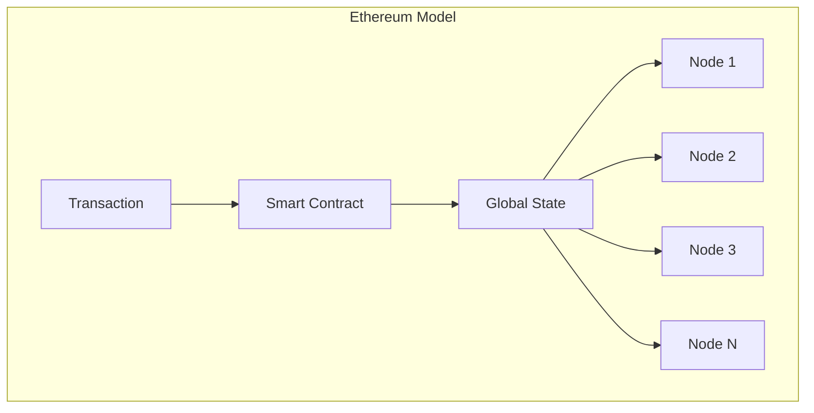
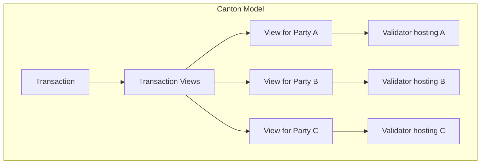
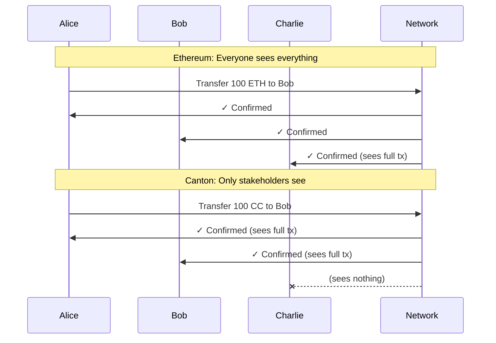

If you're coming from Ethereum, Solana, or another blockchain platform, Canton will feel both familiar and fundamentally different. This section maps concepts you know to their Canton equivalents - and highlights where mental models must shift.

## Core Concept Mapping

| Ethereum Concept | Canton Equivalent | Key Difference |
|-----------------|-------------------|----------------|
| Blockchain | Synchronizer | Coordinates consensus, doesn't store state |
| Smart Contract | Template | Defines data schema and choices (actions) |
| Contract Instance | Contract | Immutable; changes create new contracts |
| Function | Choice | Actions that archive/create contracts |
| EOA (Address) | Party | Cryptographic identity with permissions |
| Transaction | Transaction | Similar, but only parties see relevant views |
| Global State | Distributed State | No global state - each node sees its shard |
| Node | Validator (Participant) | Stores party data, validates transactions |
| Gas | Traffic | Network usage fee paid in Canton Coin |

## The Mental Model Shift

**On Ethereum**: You write code that mutates global state. Everyone sees everything. Your contract sits at an address anyone can call.

**On Canton**: You write templates that define what data exists and what actions are possible. Contracts are created and archived (never mutated). Only relevant parties see the data. Authorization is built into the model, not bolted on.





## Smart Contract Paradigm: Templates vs Solidity

In Solidity, you define contracts with mutable state and functions that modify that state:

```solidity
// Solidity: Mutable state
contract Token {
    mapping(address => uint256) public balances;
    
    function transfer(address to, uint256 amount) public {
        balances[msg.sender] -= amount;
        balances[to] += amount;
    }
}
```

In Daml (Canton's smart contract language), you define templates with immutable contracts and choices that archive existing contracts and create new ones:

```haskell
-- Daml: Immutable contracts with choices
template Token
  with
    owner : Party
    issuer : Party
    amount : Decimal
  where
    signatory issuer
    observer owner
    
    choice Transfer : ContractId Token
      with
        newOwner : Party
      controller owner
      do
        create this with owner = newOwner
```

### Key Differences

| Aspect | Solidity | Daml |
|--------|----------|------|
| **State** | Mutable storage variables | Immutable contracts; changes create new contracts |
| **Authorization** | Runtime `msg.sender` checks | Compile-time `signatory`/`controller` declarations |
| **Visibility** | Public by default | Private by default; explicit `observer` declarations |
| **Execution** | Anyone can call public functions | Only declared controllers can exercise choices |

The `Transfer` choice in Daml doesn't mutate the existing contract. It **archives** the current contract and **creates** a new one with the new owner. This immutability is fundamental to Canton's privacy and integrity guarantees.

## Privacy Model Differences

**Ethereum default**: Everything public. Privacy requires additional layers (ZK-rollups, private channels).

**Canton default**: Everything private. Visibility requires explicit declaration.



## Reading Data: No Global RPC

On Ethereum, any node can answer queries about any state. On Canton, **you must connect to the validator that hosts the party whose data you want**.

> "There is no single, all-encompassing blockchain RPC endpoint you can call to retrieve all data. Instead, you'll need to use your node's RPC for private data ('Ledger API') and potentially an app provider's API for their data."

This is a direct consequence of privacy. If Charlie can't see Alice's data on-ledger, Charlie's node doesn't have Alice's data to query.

## Authorization Model

| Ethereum | Canton |
|----------|--------|
| `msg.sender` determines authorization | `signatory` and `controller` declarations |
| Anyone can call any public function | Only specified parties can exercise choices |
| Authorization is runtime check | Authorization is compile-time guarantee |

Canton's authorization model uses three key roles:

| Role | Can See Contract | Can Exercise Choices | Required for Creation |
|------|-----------------|---------------------|----------------------|
| **Signatory** | Always | If also controller | Yes |
| **Observer** | Yes | No | No |
| **Controller** | If exercising | Specified choices only | No |

### Authorization Example

```haskell
template Asset
  with
    owner : Party
    issuer : Party
    auditor : Party
  where
    signatory issuer        -- Must authorize creation; always sees contract
    observer owner, auditor -- Can see but cannot act unless also controller
    
    choice Transfer : ContractId Asset
      with
        newOwner : Party
      controller owner      -- Only owner can exercise this choice
      do
        create this with owner = newOwner
```

In this template:
- `issuer` must sign to create the contract
- `owner` and `auditor` can see the contract
- Only `owner` can exercise the `Transfer` choice

## Developer Tooling Comparison

| Ethereum Tool | Canton Equivalent | Notes |
|--------------|-------------------|-------|
| Solidity | Daml | Functional vs imperative; different paradigm |
| Hardhat / Foundry | Daml SDK + dpm | Build, test, deploy toolchain |
| Remix | VS Code + Daml Extension | IDE with transaction visualization |
| MetaMask | Wallet SDK | User wallet integration |
| Infura / Alchemy | Node-as-a-Service providers | Hosted validator access |
| Web3.js / ethers.js | Ledger API (gRPC/JSON) | Application integration |

## Multi-Party Workflows

Canton treats multi-party coordination as a first-class concern. Where Ethereum requires manual coordination patterns, Canton builds them into the language.

### Ethereum Approach: Manual Multi-Sig

```solidity
// Solidity: Manual signature collection
contract MultiSig {
    mapping(address => bool) public approved;
    uint256 public approvalCount;
    
    function approve() public {
        require(!approved[msg.sender], "Already approved");
        approved[msg.sender] = true;
        approvalCount++;
    }
    
    function execute() public {
        require(approvalCount >= 2, "Need 2 approvals");
        // ... execute action
    }
}
```

### Canton Approach: Built-in Multi-Party

```haskell
-- Daml: Native multi-party agreement
template Agreement
  with
    partyA : Party
    partyB : Party
    terms : Text
  where
    signatory partyA, partyB  -- Both must agree to create
    
    choice Execute : ()
      controller partyA, partyB  -- Both must agree to execute
      do
        -- ... execute action
        return ()
```

The Daml version is enforced at the protocol level. There's no way to create the contract without both signatures, and no way to exercise `Execute` without both parties.

## What You'll Need to Unlearn

| Ethereum Habit | Canton Reality |
|----------------|----------------|
| **Query all state from any node** | You must query from validators hosting relevant parties |
| **Mutate contract storage** | State changes create new contracts; old ones are archived |
| **Implicit authorization via msg.sender** | Explicit declaration of signatories, observers, controllers |
| **Public by default** | Private by default; must explicitly add observers |
| **Interchangeable nodes** | Validators store their parties' state; they're not interchangeable |

### The Five Mental Shifts

1. **No global state queries**: You can't query "all tokens" across the network
2. **Immutable contracts**: State changes create new contracts; old ones are archived
3. **Explicit authorization**: Every action requires explicit authorization declarations
4. **Privacy by default**: You must opt-in to visibility, not opt-out
5. **Stateful nodes**: Canton validators store their parties' state; they're not interchangeable

## Common Gotchas

<Warning>
These are the most common mistakes blockchain developers make when first building on Canton.
</Warning>

| Gotcha | Why It Happens | How to Avoid |
|--------|---------------|--------------|
| **Building public state lookups** | Expecting Ethereum-style global queries | Design for party-scoped queries from the start |
| **Forgetting multi-party authorization** | Ethereum's permissionless model | Always consider: who must sign? who can act? |
| **Trying to mutate contracts** | Solidity's mutable storage model | Embrace create/archive pattern |
| **Expecting global state queries** | Ethereum's replicated state | Query via Ledger API or PQS for your parties only |
| **Ignoring party costs** | Addresses are free on Ethereum | Parties create state; design party structure deliberately |

## Next Steps

- **[Architecture Overview](/docs-main/understand/architecture)** - Deep dive into Canton's component model
- **[Privacy Model Explained](/docs-main/understand/privacy-model)** - Understand sub-transaction privacy
- **[Developer Track Module 3: Daml Development](/docs-main/developer/m3-daml)** - Start writing Daml code
