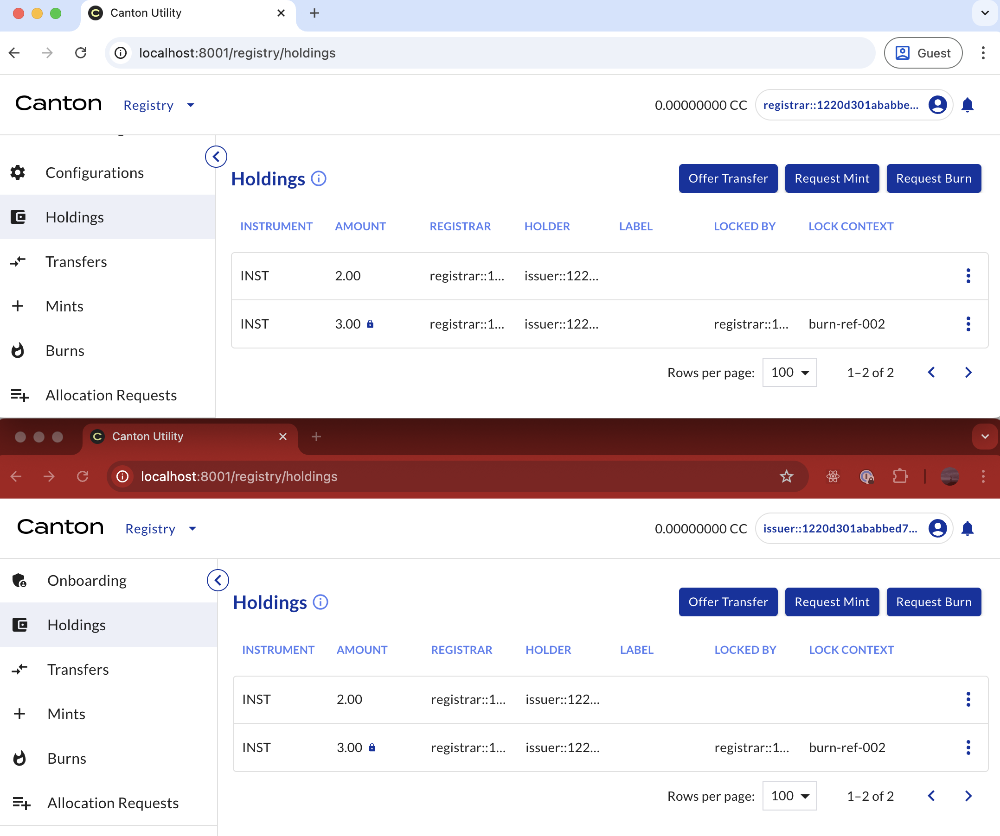
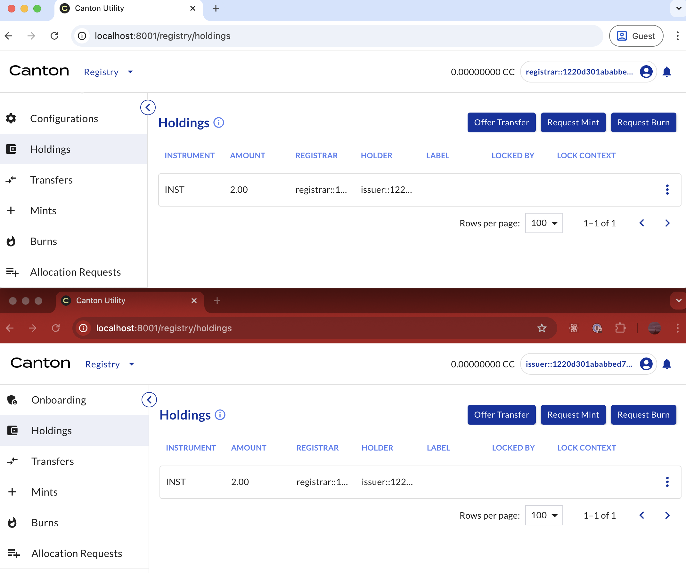

# Registry Utility - Burn Request API Example

This example shows how to perform a burn request on CNU `0.9.x` and later using the HTTP JSON API.

It is assumed that the burner has all the required credentials as issuer of the specific instrument.

## Preparation

Add all the required information to the `source.sh` file:

```{literalinclude} ./scripts/source.sh
:language: bash
:linenos:
```
The required information is:

```{list-table}
:header-rows: 1

* - Details of
  - Description
* - Burner
  - JWT, user ID, and party ID of the sender
* - Admin
  - JWT, user ID, and party ID of the receiver
* - Operator
  - Backend API and JSON Ledger API
* - Burn
  - Instrument ID, amount to be burned, and reference

```
If possible, open the CNU UIs for both the burner and the admin, to observe the request and change
in holdings. These are the initial holdings of the burner for INST.


### Step 1: Burner Requests a Burn

#### Step 1a - Obtain the Ledger End Offset

Run the following script to obtain the ledger end offset:

```{literalinclude} ./scripts/step-1a-burner-requests.sh
:language: bash
:linenos:
```
The result is the ledger end offset at this moment, stored in `response-step-1a.json`. For
example:

```{literalinclude} ./response/response-step-1a.json
:language: json
:linenos:
```
#### Step 1b - Retrieve Holding Cids

Run the following script to retrieve the Holding Cids:

```{literalinclude} ./scripts/step-1b-burner-requests.sh
:language: bash
:linenos:
```
The result is the Holding Cids, stored in `response-step-1b.json`. For example:

```{literalinclude} ./response/response-step-1b.json
:language: json
:linenos:
```
#### Step 1c - Access the Backend API

The request URL is `${BACKEND_API}/v0/registry/burn/v0/request`. To hit this endpoint, run the
following script:

```{literalinclude} ./scripts/step-1c-burner-requests.sh
:language: bash
:linenos:
```
The result contains the required choice context for executing the command, stored in
`response-step-1c.json`. For example:

```{literalinclude} ./response/response-step-1c.json
:language: json
:linenos:
```
#### Step 1d - Request the Burn

Finally, run the following script to request the burn:

```{literalinclude} ./scripts/step-1d-burner-requests.sh
:language: bash
:linenos:
```
After the exercise command is executed, the amount is locked by the admin.


### Step 2: Admin Accepts Burn Reequest

#### Step 2a - Obtain the Ledger End Offset

To obtain the ledger end offset, run the following script:

```{literalinclude} ./scripts/step-2a-admin-accepts.sh
:language: bash
:linenos:
```
The result is the ledger end offset at this moment, stored in `response-step-2a.json`. For
example:

```{literalinclude} ./response/response-step-2a.json
:language: json
:linenos:
```
#### Step 2b - Retrieve Burn Request

To retrieve the Burn Request created in Step 1d, run the following script:

```{literalinclude} ./scripts/step-2b-admin-accepts.sh
:language: bash
:linenos:
```
The result is the Burn Request, stored in `response-step-2b.json`. For example,

```{literalinclude} ./response/response-step-2b.json
:language: json
:linenos:
```
#### Step 2c - Access the Backend API

The request URL is
"${BACKEND_API}/v0/registry/burn/v0/request/${BURNREQUEST_CID}/choice-contexts/accept".
To hit this endpoint, run the following script:

```{literalinclude} ./scripts/step-2c-admin-accepts.sh
:language: bash
:linenos:
```
The result contains the required choice context for executing the command, stored in
`response-step-2c.json`. For example:

```{literalinclude} ./response/response-step-2c.json
:language: json
:linenos:
```
#### Step 2d - Accept the Burn Request

To finalize the burn and remove the asset for the burner, execute the following script:

```{literalinclude} ./scripts/step-2d-admin-accepts.sh
:language: bash
:linenos:
```
For example, this is the response of this command:

```{literalinclude} ./response/response-step-2d.json
:language: json
:linenos:
```
After the exercise command is executed, the burn is complete.


