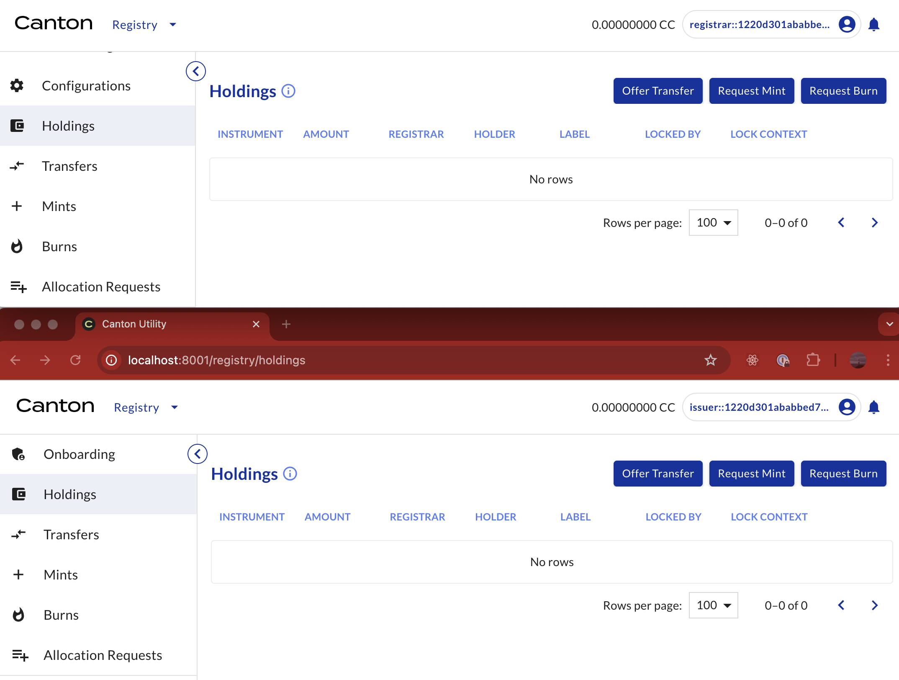
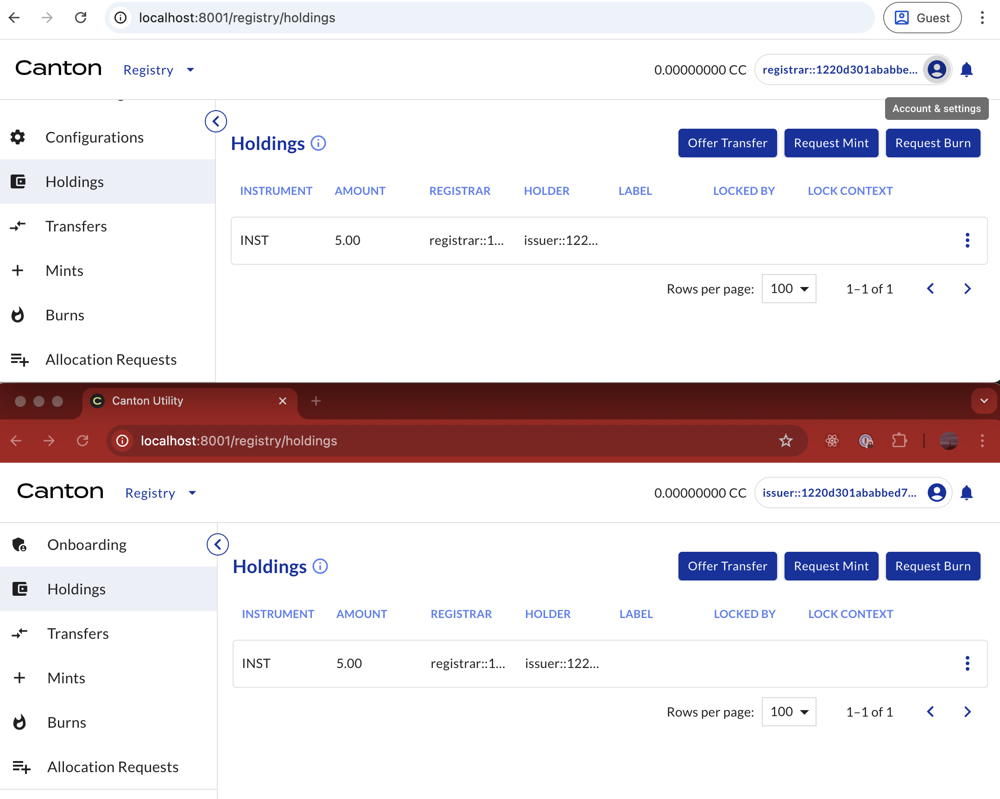

# Registry Utility - Mint Request API Example

This example shows how to perform a mint request on CNU `0.9.x` and later using the HTTP JSON API.

It is assumed that the minter has all the required credentials as issuer of the specific instrument.

## Preparation

Add all the required information to the `source.sh` file:

```{literalinclude} ./scripts/source.sh
:language: bash
:linenos:
```

The required information is:

```{list-table}
:header-rows: 1

* - Details of
  - Description
* - Minter
  - JWT, user ID, and party ID of the sender
* - Admin
  - JWT, user ID, and party ID of the receiver
* - Operator
  - Backend API and JSON Ledger API
* - Mint
  - Instrument ID, amount to be burned, and reference
```

If possible, open the CNU UIs for both the minter and the admin, to observe the request and change
in holdings. These are the initial holdings of the minter (issuer) for INST.



### Step 1: Minter Requests a Mint

#### Step 1a - Access the Backend API

The request URL is `${BACKEND_API}/v0/registry/mint/v0/request`. To hit this endpoint, run the
following script:

```{literalinclude} ./scripts/step-1a-minter-requests.sh
:language: bash
:linenos:
```

The result contains the required information when constructing the command, stored in
`response-step-1a.json`. For example:

```{literalinclude} ./response/response-step-1a.json
:language: json
:linenos:
```

#### Step 1b - Request the Mint

Finally, run the following script to request the mint:

```{literalinclude} ./scripts/step-1b-minter-requests.sh
:language: bash
:linenos:
```

For example, this is the response of this command:

```{literalinclude} ./response/response-step-1b.json
:language: json
:linenos:
```

### Step 2: Admin Accepts Mint Request

#### Step 2a - Obtain the Ledger End Offset

To obtain the ledger end offset, run the following script:

```{literalinclude} ./scripts/step-2a-admin-accepts.sh
:language: bash
:linenos:
```

The result is the ledger end offset at this moment, stored in `response-step-2a.json`. For
example:

```{literalinclude} ./response/response-step-2a.json
:language: json
:linenos:
```

#### Step 2b - Retrieve Mint Request

To retrieve the Mint Request created in Step 1d, run the following script:

```{literalinclude} ./scripts/step-2b-admin-accepts.sh
:language: bash
:linenos:
```

The result is the Mint Request, stored in `response-step-2b.json`. For example,

```{literalinclude} ./response/response-step-2b.json
:language: json
:linenos:
```

#### Step 2c - Access the Backend API

The request URL is
"${BACKEND_API}/v0/registry/mint/v0/request/${MINTREQUEST_CID}/choice-contexts/accept".
To hit this endpoint, run the following script:

```{literalinclude} ./scripts/step-2c-admin-accepts.sh
:language: bash
:linenos:
```

The result contains the required choice context for executing the command, stored in
`response-step-2c.json`. For example:

```{literalinclude} ./response/response-step-2c.json
:language: json
:linenos:
```

#### Step 2d - Accept the Mint Request

To finalize the mint and create the asset for the minter, execute the following script:

```{literalinclude} ./scripts/step-2d-admin-accepts.sh
:language: bash
:linenos:
```

After the exercise command is executed, the mint is complete.


