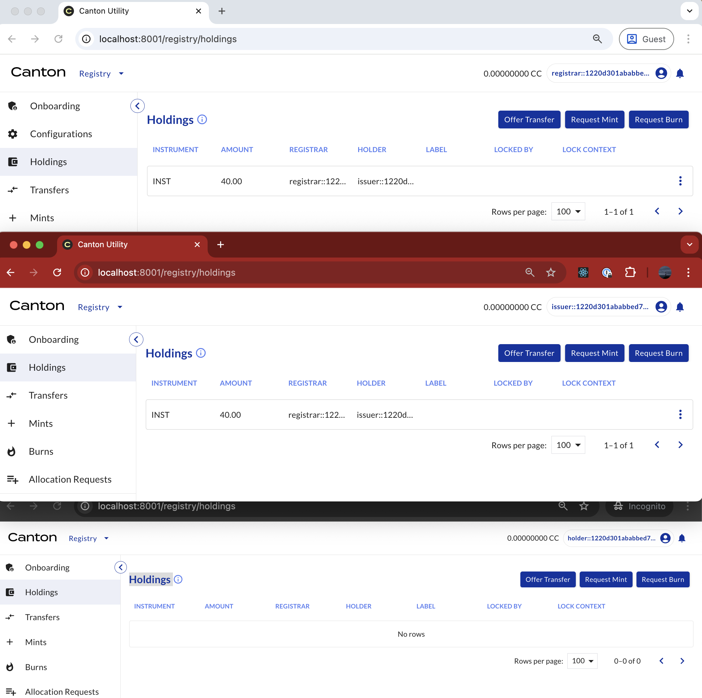
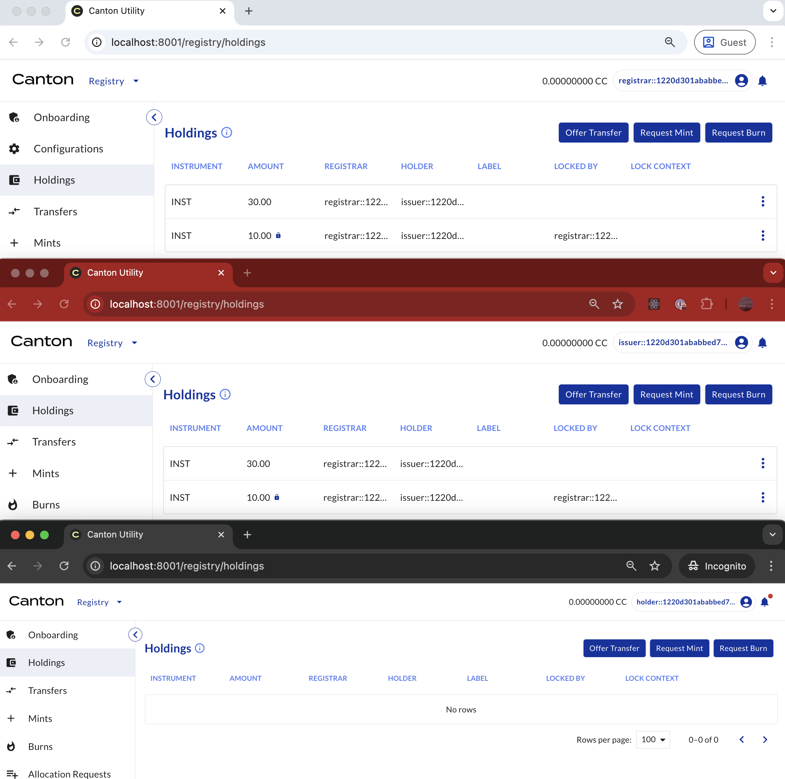
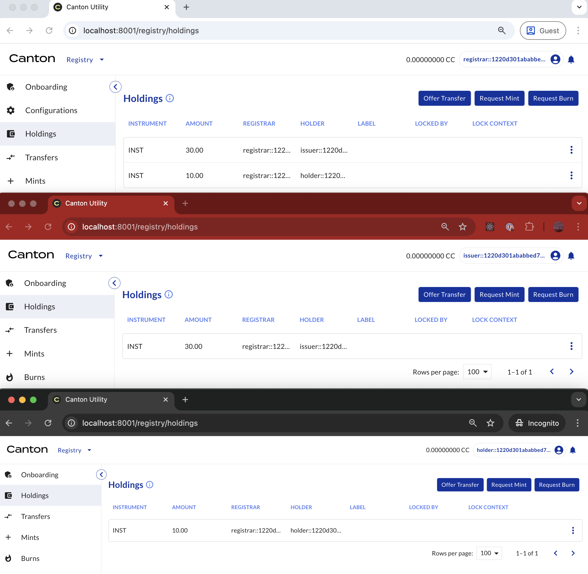

# Registry Utility - Transfer API Example

This example shows how to perform a transfer offer on CNU `0.9.x` and later using the HTTP JSON API.

It is assumed that both the sender and receiver have all the required credentials as holders of the
specific instrument.

## Preparation

Add all the required information to the `source.sh` file:

```{literalinclude} ./scripts/source.sh
:language: bash
:linenos:
```

The required information is:

```{list-table}
:header-rows: 1

* - Details of
  - Description
* - Sender
  - JWT, user ID, and party ID of the sender
* - Receiver
  - JWT, user ID, and party ID of the receiver
* - Operator
  - Backend API and JSON Ledger API
* - Transfer
  - Instrument ID and amount to be transferred
```

If possible, open three CNU UI windows, one each for the admin, sender, and receiver. This allows
you to observe changes in holdings for the parties throughout the transfer process. The image
below shows the initial holdings for both the sender (issuer) and the receiver (holder) for the
instrument INST.



### Step 1: Sender Offers a Transfer

#### Step 1a - Obtain the Ledger End Offset

Run the following script to obtain the ledger end offset:

```{literalinclude} ./scripts/step-1a-sender-offers.sh
:language: bash
:linenos:
```

The result is the ledger end offset at this moment, stored in `response-step-1a.json`. For
example:

```{literalinclude} ./response/response-step-1a.json
:language: json
:linenos:
```

#### Step 1b - Retrieve Holding Cids

Run the following script to retrieve the Holding Cids:

```{literalinclude} ./scripts/step-1b-sender-offers.sh
:language: bash
:linenos:
```

The result is the Holding Cids, stored in `response-step-1b.json`. For example:

```{literalinclude} ./response/response-step-1b.json
:language: json
:linenos:
```

#### Step 1c - Access the Backend API

The request URL is
`${BACKEND_API}/v0/registrars/${ADMIN_PARTY_ID}/registry/transfer-instruction/v1/transfer-factory`.
To hit this endpoint, run the following script:

```{literalinclude} ./scripts/step-1c-sender-offers.sh
:language: bash
:linenos:
```

The result contains the required choice context for executing the command, stored in
`response-step-1c.json`. For example:

```{literalinclude} ./response/response-step-1c.json
:language: json
:linenos:
```

#### Step 1d - Offer the Transfer

Finally, run the following script to offer the transfer:

```{literalinclude} ./scripts/step-1d-sender-offers.sh
:language: bash
:linenos:
```

For example, this is the response of this command:

```{literalinclude} ./response/response-step-1d.json
:language: json
:linenos:
```

After the exercise command is executed, the amount is locked by the admin.



### Step 2: Receiver Accepts the Transfer Offer

#### Step 2a - Obtain the Ledger End Offset

To obtain the ledger end offset, run the following script:

```{literalinclude} ./scripts/step-2a-receiver-accepts.sh
:language: bash
:linenos:
```

The result is the ledger end offset at this moment, stored in `response-step-2a.json`. For
example:

```{literalinclude} ./response/response-step-2a.json
:language: json
:linenos:
```

#### Step 2b - Retrieve Transfer Offer

To retrieve the Transfer Offer created in Step 1d, run the following script:

```{literalinclude} ./scripts/step-2b-receiver-accepts.sh
:language: bash
:linenos:
```

The result is the Transfer Offer, stored in `response-step-2b.json`. For example,

```{literalinclude} ./response/response-step-2b.json
:language: json
:linenos:
```

#### Step 2c - Access the Backend API

The request URL is
`${BACKEND_API}/v0/registrars/${ADMIN_PARTY_ID}/registry/transfer-instruction/v1/${TRANSFEROFFER_CID}/choice-contexts/accept`.
To hit this endpoint, run the following script:

```{literalinclude} ./scripts/step-2c-receiver-accepts.sh
:language: bash
:linenos:
```

The result contains the required choice context for executing the command, stored in
`response-step-2c.json`. For example:

```{literalinclude} ./response/response-step-2c.json
:language: json
:linenos:
```

#### Step 2d - Accept the Transfer Offer

To finalize the transfer and move the asset from the sender to the receiver, execute the following
script:

```{literalinclude} ./scripts/step-2d-receiver-accepts.sh
:language: bash
:linenos:
```

For example, this is the response of this command:

```{literalinclude} ./response/response-step-2d.json
:language: json
:linenos:
```

After the exercise command is executed, the transfer is complete.


