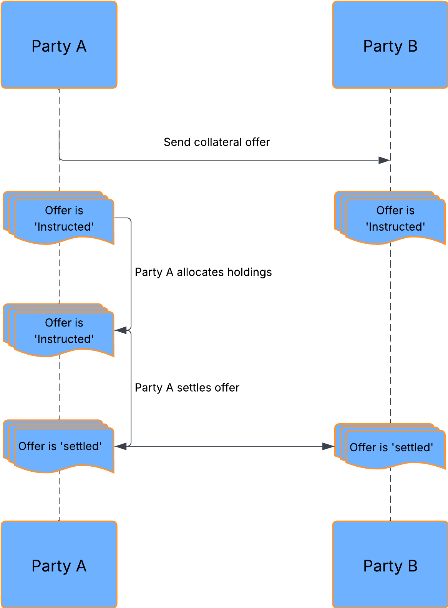

# Create a collateral agreement

## Create a new agreement

Before a user (party A) can instruct collateral over to another user on the platform, they need to have an active agreement in place with another party on the platform. This is to ensure the existence of a CSA (Credit Support Annex) that is currently in place between these two parties. To create this agreement within the Collateral Utility, the user needs to provide the following details that have been agreed as part of the CSA:

- **Agreement ID** - a unique identifier from the ISDA / CSA agreement between the two parties.
- **Counterparty (Party B)** - the application ID of the party that the user wants to establish the agreement with.
- **Eligible collateral** - select all the eligible collateral types as agreed in the CSA.

## Accept / reject agreement

Once party A has created an agreement request, they will have the option to cancel the request before party B responds to it. Party B will be able to see the new agreement request on their side and decide whether to either accept or reject it.

The state of each agreement can be seen from the ‘Agreements’ tab within the Collateral Utility.

