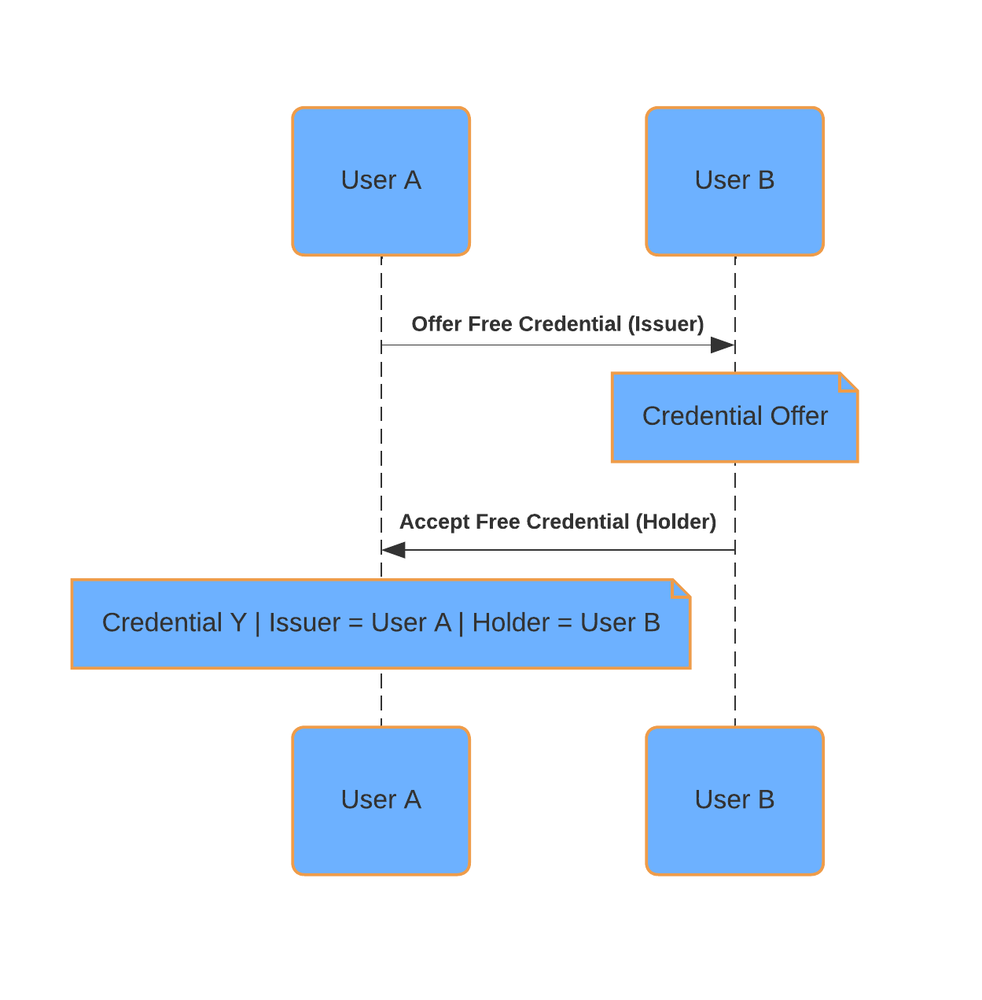
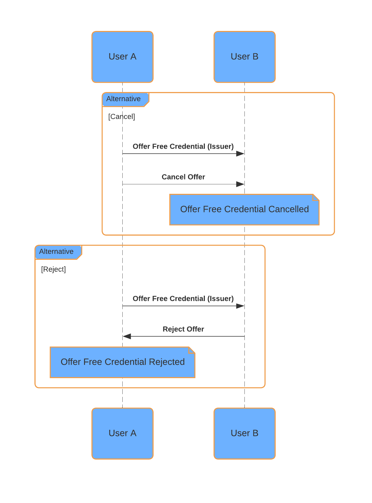

# Free Credentials

Any User (as well as the operator) can offer and accept free credentials. The content of the
credentials can be defined in the respective offer as described in the Credential Contract.

## Offer-Accept a Free Credential

The Credential issuance follows an offer and accept process. Any user can issue credentials to
another user of the application.

## Cancel/Reject Offer for a Free Credential

The credential offer can be canceled by the issuer or rejected by the holder.

