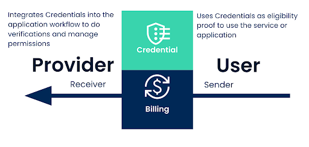
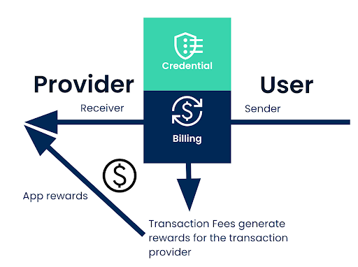

# Service Monetization via Paid Credentials

Using Paid Credential Billings, organizations can monetize their application by charging licensing
or service fees directly linked to credential usage. This ensures seamless monetization while
maintaining compliance and control over access permissions. By leveraging credential billings, an
application provider can create a sustainable revenue model through licensing or service fees paid
by application users.

## How it works

An application provider can integrate paid credentials into the application workflow by using
Credential contracts to control access and manage permissions to the application or some application
workflows or features. The application provider can then require application users to accept paid
credentials before they use the application or some of its features. The application user accepting
this offer triggers the automated billing process with regular payments in Canton Coin made from the
application user to the application provider. These payments are secured by a locked deposit
provided by the application user.

Application providers can define the terms of their offerings through the User Interface:

* **Price**: Daily usage fees denominated in USD.
* **Billing Period**: Automated payment intervals.
* **Required Deposit Amount**: The deposit amount required to ensure seamless execution of billing
  transaction.

## Minting, Incentives, and Participation in Canton Coin Tokenomics

Canton Coin is minted by participants who provide network utility, such as:

* Super Validators who operate nodes to maintain decentralized infrastructure.
* Application Providers who develop and deploy applications utilizing the Global Synchronizer.
* Validators who enable others to connect to the network.

The Canton Coin rewards mechanism fosters network growth, incentivizing stakeholders through
participation:

* Featured application providers can mint up to 100x the Canton Coin burned in fees within their
  applications, encouraging early adoption and high-value contributions.
* Unfeatured providers mint only 80% of their burned fees in Canton Coin, preventing unnecessary
  resource use without added network value.

Using credential billing as a featured app provider will generate application rewards for any
transfer from the application user (the credential holder) to the application provider (the
credential issuer).

