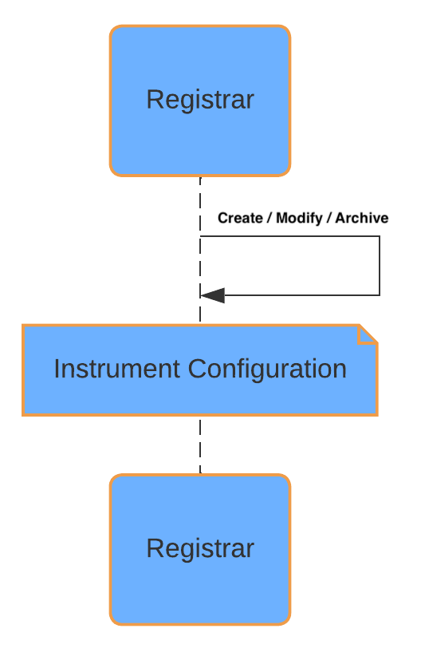
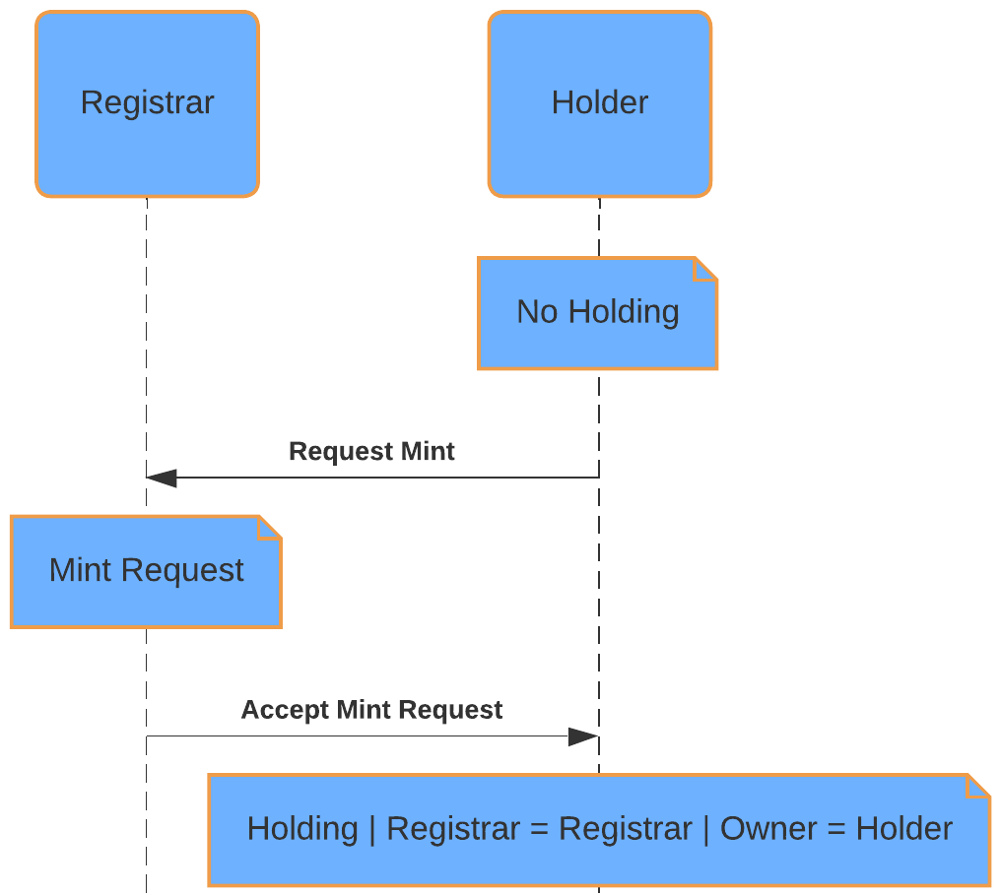
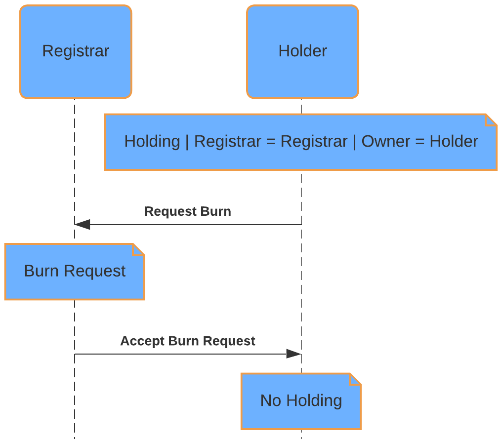
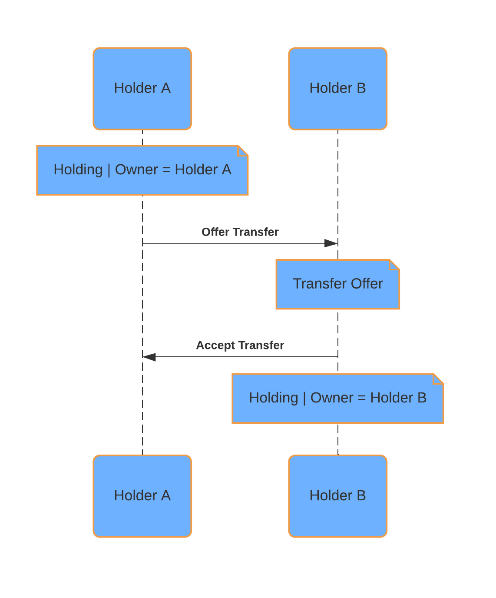

# Workflows

## Create Instrument Configuration

In the Registry Utility, a party with the Registrar role must create an
[InstrumentConfiguration](/docs-main/utilities/daml-api-reference/registry-model/Utility-Registry-V0-Configuration-Instrument#type-utility-registry-v0-configuration-instrument-instrumentconfiguration-39219)
contract for each instrument they support. This contract establishes an identifier for the
instrument and defines the credential requirements for holding, minting, and burning its tokens
([Holding](/docs-main/utilities/daml-api-reference/registry-holding-model/Utility-Registry-Holding-V0-Holding#type-utility-registry-holding-v0-holding-holding-15575)\s):

* **Holder Credential Requirements:** Credentials needed for transferring tokens of the instrument.
* **Issuer Credential Requirements:** Credentials needed for minting and burning tokens of the instrument.

For each credential requirement, the following values need to be specified based on the credential
model:

* **Issuer:** The ledger party of the issuer of the credential.
* **Property:** The claim's property (e.g., "isIssuerOf" or "isHolderOf").
* **Value:** The value of the claim property (e.g., the instrument's name or a unique identifier).

By correctly configuring these values, the registrar ensures that only authorized parties can hold,
mint, or burn tokens for a specific instrument, according to its defined rules.

Once an instrument configuration is created, it gets explicitly disclosed by the operator backend.
This makes it accessible to all parties interacting with the Registry Utility, ensuring that
everyone has the latest information on instrument configurations and their associated credential
requirements.

The
[InstrumentConfiguration](/docs-main/utilities/daml-api-reference/registry-model/Utility-Registry-V0-Configuration-Instrument#type-utility-registry-v0-configuration-instrument-instrumentconfiguration-39219)
also allows for specifying additional instrument identifiers, such as ISIN or CUSIP. These fields
are optional and can be used to facilitate integration with external systems that recognize these
identifiers. However, within the Registry Utility, only the main instrument identifier is used for
all workflows and operations.

## Mint

The registry's **Mint** request workflow allows authorized parties to create tokens
([Holding](/docs-main/utilities/daml-api-reference/registry-holding-model/Utility-Registry-Holding-V0-Holding#type-utility-registry-holding-v0-holding-holding-15575)\s) of a specific
instrument. This process uses a request/accept workflow to ensure that only eligible parties can
initiate and approve the minting of tokens.

* **Prerequisites/Credential Checks:**

  * Minting requires an
    [InstrumentConfiguration](/docs-main/utilities/daml-api-reference/registry-model/Utility-Registry-V0-Configuration-Instrument#type-utility-registry-v0-configuration-instrument-instrumentconfiguration-39219)
    for the instrument, see the section above for creating one.

  * Upon requesting and accepting a mint, it is verified that the requestor has valid
    Instrument Issuer credentials for the instrument as defined in the
    [InstrumentConfiguration](/docs-main/utilities/daml-api-reference/registry-model/Utility-Registry-V0-Configuration-Instrument#type-utility-registry-v0-configuration-instrument-instrumentconfiguration-39219),
    ensuring that only authorized parties can mint
    [Holding](/docs-main/utilities/daml-api-reference/registry-holding-model/Utility-Registry-Holding-V0-Holding#type-utility-registry-holding-v0-holding-holding-15575)\s. If no Instrument
    Issuer credentials are specified in the
    [InstrumentConfiguration](/docs-main/utilities/daml-api-reference/registry-model/Utility-Registry-V0-Configuration-Instrument#type-utility-registry-v0-configuration-instrument-instrumentconfiguration-39219),
    any party is eligible to request a mint.

* **Mint Request:**

  The party requesting the Mint specifies the following (in the corresponding UI dialog):

  * **Instrument:** The identifier of the instrument that will be minted.
  * **Amount:** The amount that will be minted.
  * **Registrar:** The ledger party of the registrar of the token that will receive the Mint request
    and needs to accept (or reject) it.
  * **Reference:** A reference field to provide context, such as the reason for the mint or the
    agreement under which the tokens are being minted.

<Note>
  Before the command is submitted by the UI, an
  [API](https://api.utilities.digitalasset.com/api/utilities/v0/openapi) call is being made (in
  the background) to an endpoint to retrieve required additional choice context (including
  disclosure), such as the
  [InstrumentConfiguration](/docs-main/utilities/daml-api-reference/registry-model/Utility-Registry-V0-Configuration-Instrument#type-utility-registry-v0-configuration-instrument-instrumentconfiguration-39219),
  the required
  [Credential](/docs-main/utilities/daml-api-reference/credential-model/Utility-Credential-V0-Credential#type-utility-credential-v0-credential-credential-66032)\s, and other required
  input.
  
</Note>
* **Mint Acceptance/Rejection:**

  Only the registrar is authorized to accept or reject Mint requests. Upon acceptance,
  the specified tokens are created for the requesting party. Upon rejection, the registrar may
  provide a reason for the rejection, and the mint offer is voided.

<Note>
  Before the accept command is submitted by the UI, an
  [API](https://api.utilities.digitalasset.com/api/utilities/v0/openapi) call is being made (in
  the background) to an endpoint to retrieve required additional choice context (including
  disclosure), such as the
  [InstrumentConfiguration](/docs-main/utilities/daml-api-reference/registry-model/Utility-Registry-V0-Configuration-Instrument#type-utility-registry-v0-configuration-instrument-instrumentconfiguration-39219),
  the required
  [Credential](/docs-main/utilities/daml-api-reference/credential-model/Utility-Credential-V0-Credential#type-utility-credential-v0-credential-credential-66032)\s, and other required
  input.
  
</Note>
* **Mint Cancellation:**

  The party that requested the mint has the ability to cancel it before acceptance by the registrar.

## Burn

The registry's **Burn** request workflow allows authorized parties to remove tokens
([Holding](/docs-main/utilities/daml-api-reference/registry-holding-model/Utility-Registry-Holding-V0-Holding#type-utility-registry-holding-v0-holding-holding-15575)\s) of a specific
instrument. This process uses a request/accept workflow to ensure that only eligible parties can
initiate and approve the burning of tokens.

* **Prerequisites/Credential Checks:**

  * Burning requires that the tokens to be burned have already been minted, see last section, and
    are held by the requesting party.

  * Upon requesting and accepting a burn, it is verified that the requestor has valid
    Instrument Issuer credentials for the instrument as defined in the
    [InstrumentConfiguration](/docs-main/utilities/daml-api-reference/registry-model/Utility-Registry-V0-Configuration-Instrument#type-utility-registry-v0-configuration-instrument-instrumentconfiguration-39219),
    ensuring that only authorized parties can burn
    [Holding](/docs-main/utilities/daml-api-reference/registry-holding-model/Utility-Registry-Holding-V0-Holding#type-utility-registry-holding-v0-holding-holding-15575)\s. If no Instrument
    Issuer credentials are specified in the
    [InstrumentConfiguration](/docs-main/utilities/daml-api-reference/registry-model/Utility-Registry-V0-Configuration-Instrument#type-utility-registry-v0-configuration-instrument-instrumentconfiguration-39219),
    any party is eligible to request a burn.

* **Burn Request:**

  The party requesting the Burn specifies the following (in the corresponding UI dialog):

  * **Instrument:** The identifier of the instrument that will be burned.
  * **Amount:** The amount that will be burned.
  * **Registrar:** The ledger party of the registrar of the token that will receive the Burn request
    and needs to accept (or reject) it.
  * **Reference:** A reference field to provide context, such as the reason for the burn or the
    agreement under which the tokens are being burned.

<Note>
  Before the command is submitted by the UI:
  
  1. [Holding](/docs-main/utilities/daml-api-reference/registry-holding-model/Utility-Registry-Holding-V0-Holding#type-utility-registry-holding-v0-holding-holding-15575)\s are selected to
     cover the burn amount.
  2. An [API](https://api.utilities.digitalasset.com/api/utilities/v0/openapi) call is being made
     (in the background) to an endpoint to retrieve required choice context (including
     disclosure), such as the
     [InstrumentConfiguration](/docs-main/utilities/daml-api-reference/registry-model/Utility-Registry-V0-Configuration-Instrument#type-utility-registry-v0-configuration-instrument-instrumentconfiguration-39219),
     the required
     [Credential](/docs-main/utilities/daml-api-reference/credential-model/Utility-Credential-V0-Credential#type-utility-credential-v0-credential-credential-66032)\s, and other
     required input.
  
  As a result of executing the command, the specified amount of a
  [Holding](/docs-main/utilities/daml-api-reference/registry-holding-model/Utility-Registry-Holding-V0-Holding#type-utility-registry-holding-v0-holding-holding-15575) gets locked for the
  burn, which is visually indicated by a lock symbol on the Holding page in the UI.
  
</Note>
* **Burn Acceptance/Rejection:**

  Only the registrar is authorized to accept or reject Burn requests. Upon accepting a request, the
  specified tokens are permanently removed from the registry. Upon rejection, the registrar may
  provide a reason for the rejection, the burn offer is voided, and locked
  [Holding](/docs-main/utilities/daml-api-reference/registry-holding-model/Utility-Registry-Holding-V0-Holding#type-utility-registry-holding-v0-holding-holding-15575)\s are released.

<Note>
  Before the accept command is submitted by the UI, an
  [API](https://api.utilities.digitalasset.com/api/utilities/v0/openapi) call is being made (in
  the background) to an endpoint to retrieve required choice context (including disclosure), such
  as the
  [InstrumentConfiguration](/docs-main/utilities/daml-api-reference/registry-model/Utility-Registry-V0-Configuration-Instrument#type-utility-registry-v0-configuration-instrument-instrumentconfiguration-39219),
  the required [Credential](/docs-main/utilities/daml-api-reference/credential-model/Utility-Credential-V0-Credential#type-utility-credential-v0-credential-credential-66032)\s, and
  other required input.
  
</Note>
* **Burn Cancellation:**

  The party that requested the burn has the ability to cancel it before acceptance by the registrar.
  Upon cancellation, any locked
  [Holding](/docs-main/utilities/daml-api-reference/registry-holding-model/Utility-Registry-Holding-V0-Holding#type-utility-registry-holding-v0-holding-holding-15575)\s are released and can be
  used for other purposes.

## Transfer

The registry's **Transfer** workflow implements the Transfer Instruction API defined by the
[Canton Network Token Standard](https://github.com/global-synchronizer-foundation/cips/blob/main/cip-0056/cip-0056.md).
It allows authorized parties to move tokens
([Holding](/docs-main/utilities/daml-api-reference/registry-holding-model/Utility-Registry-Holding-V0-Holding#type-utility-registry-holding-v0-holding-holding-15575)\s) of a specific instrument
from one party to another at a registrar.

By defining appropriate credential requirements for instrument holders in the
[InstrumentConfiguration](/docs-main/utilities/daml-api-reference/registry-model/Utility-Registry-V0-Configuration-Instrument#type-utility-registry-v0-configuration-instrument-instrumentconfiguration-39219),
the registrar can prevent unauthorized transfers. This approach helps maintain the integrity and
traceability of token ownership within the registry.

Transfers are executed either as a **two-step workflow** (offer -> accept) or a **direct
(preapproved) transfer**.

* **Prerequisites / Credential Checks:**
  Before a transfer can be initiated, the following conditions must be met:

  * The sending party must already own the tokens to be transferred. See the Mint workflow for
    token creation.

  * The registrar must have created a
    [TransferRule](/docs-main/utilities/daml-api-reference/registry-model/Utility-Registry-V0-Rule-Transfer#type-utility-registry-v0-rule-transfer-transferrule-77019) contract
    instance.

  * The sender must have valid Instrument Holder credentials for the instrument, as
    defined in the
    [InstrumentConfiguration](/docs-main/utilities/daml-api-reference/registry-model/Utility-Registry-V0-Configuration-Instrument#type-utility-registry-v0-configuration-instrument-instrumentconfiguration-39219).
    The receiver is subject to the same credential checks. This ensures that only authorized parties
    can send or receive
    [Holding](/docs-main/utilities/daml-api-reference/registry-holding-model/Utility-Registry-Holding-V0-Holding#type-utility-registry-holding-v0-holding-holding-15575)\s. If the Instrument
    Holder credential requirements are empty (in the
    [InstrumentConfiguration](/docs-main/utilities/daml-api-reference/registry-model/Utility-Registry-V0-Configuration-Instrument#type-utility-registry-v0-configuration-instrument-instrumentconfiguration-39219)),
    transfers are permitted between any parties.

  * For a **direct (preapproved) transfer**, the receiver must have created a
    [TransferPreapproval](/docs-main/utilities/daml-api-reference/registry-app-model/Utility-Registry-App-V0-Model-TransferPreapproval#type-utility-registry-app-v0-model-transferpreapproval-transferpreapproval-39728)
    in advance, targeting the relevant instrument. This is configured in the UI by specifying the
    following (in the corresponding UI dialog):

    * **Instrument Admin:** The registrar of the instruments being preapproved.
    * **Instrument IDs:** The instrument IDs eligible for a direct transfer without an explicit
      accept step. If left empty, all instruments administered by the specified instrument admin are
      eligible. Each
      [TransferPreapproval](/docs-main/utilities/daml-api-reference/registry-app-model/Utility-Registry-App-V0-Model-TransferPreapproval#type-utility-registry-app-v0-model-transferpreapproval-transferpreapproval-39728)
      instance may reference up to 10 instrument IDs.

* **Transfer Offer:**

  To initiate a transfer, the sender provides the following information in the UI:

  * **Receiver:** Ledger party of the receiver.
  * **Instrument:** Identifier of the instrument to be transferred.
  * **Amount:** Number of tokens
    ([Holding](/docs-main/utilities/daml-api-reference/registry-holding-model/Utility-Registry-Holding-V0-Holding#type-utility-registry-holding-v0-holding-holding-15575)\s) to transfer.
  * **Registrar:** Ledger party of the instrument admin overseeing the transfer.
  * **Reference:** Optional context or tracking information.

<Note>
  Before the command is submitted by the UI:
  
  1. [Holding](/docs-main/utilities/daml-api-reference/registry-holding-model/Utility-Registry-Holding-V0-Holding#type-utility-registry-holding-v0-holding-holding-15575)\s are automatically
     selected to cover the requested transfer amount.
  2. A background [API](https://api.utilities.digitalasset.com/api/utilities/v0/openapi) call is
     made to the corresponding Utilities token standard endpoint to
     retrieve the required choice context (including disclosure). This includes the
     [InstrumentConfiguration](/docs-main/utilities/daml-api-reference/registry-model/Utility-Registry-V0-Configuration-Instrument#type-utility-registry-v0-configuration-instrument-instrumentconfiguration-39219),
     applicable [Credential](/docs-main/utilities/daml-api-reference/credential-model/Utility-Credential-V0-Credential#type-utility-credential-v0-credential-credential-66032)\s, and
     other required inputs. The call also determines whether a transfer preapproval is in place or
     whether the transfer must follow the offer -> accept workflow.
  
  As a result of executing the command:
  
  - If a matching
    [TransferPreapproval](/docs-main/utilities/daml-api-reference/registry-app-model/Utility-Registry-App-V0-Model-TransferPreapproval#type-utility-registry-app-v0-model-transferpreapproval-transferpreapproval-39728)
    exists, the transfer is executed immediately and token ownership is updated.
  - Otherwise, the specified amount of a
    [Holding](/docs-main/utilities/daml-api-reference/registry-holding-model/Utility-Registry-Holding-V0-Holding#type-utility-registry-holding-v0-holding-holding-15575) is locked pending
    acceptance or rejection. Locked holdings are indicated by a lock symbol in the UI.
  
</Note>
{/* TODO: Uncomment this once the 2-step token standard transfer flow supports it */}
{/* * If the transfer is associated with a specific label (e.g., categorizing funds */}
{/* for a particular purpose), the transfer will only proceed if there are sufficient holding */}
{/* contracts (UTXOs) with the same label to cover the specified amount. The UI currently does not */}
{/* support specifying a label, but it can be done via the API. */}

* **Transfer Acceptance / Rejection:**

  The receiver may either accept or reject a transfer offer.

  - **Acceptance:** Ownership of the tokens is transferred from the sender to the receiver.
    The registrar remains unchanged.
  - **Rejection:** The transfer offer is voided, and any locked
    [Holding](/docs-main/utilities/daml-api-reference/registry-holding-model/Utility-Registry-Holding-V0-Holding#type-utility-registry-holding-v0-holding-holding-15575)\s are released back to
    the sender.

<Note>
  Before submitting an accept or reject command, a background
  [API](https://api.utilities.digitalasset.com/api/utilities/v0/openapi) call is made to the
  Utilities token standard endpoint to retrieve the required choice context (including
  disclosure):
  
  - For acceptance, this includes the
    [TransferRule](/docs-main/utilities/daml-api-reference/registry-model/Utility-Registry-V0-Rule-Transfer#type-utility-registry-v0-rule-transfer-transferrule-77019),
    [InstrumentConfiguration](/docs-main/utilities/daml-api-reference/registry-model/Utility-Registry-V0-Configuration-Instrument#type-utility-registry-v0-configuration-instrument-instrumentconfiguration-39219),
    required
    [Credential](/docs-main/utilities/daml-api-reference/credential-model/Utility-Credential-V0-Credential#type-utility-credential-v0-credential-credential-66032)\s, and other
    necessary inputs.
  - For rejection, the context is currently empty.
  
</Note>
* **Transfer Withdrawal:**

  Before a transfer is accepted, the sender may withdraw (cancel) the transfer offer.

  Upon withdrawal, any locked
  [Holding](/docs-main/utilities/daml-api-reference/registry-holding-model/Utility-Registry-Holding-V0-Holding#type-utility-registry-holding-v0-holding-holding-15575)\s are released back to the
  sender.

<Note>
  Before submitting the withdraw command, a background
  [API](https://api.utilities.digitalasset.com/api/utilities/v0/openapi) call is made to the
  corresponding Utilities token standard endpoint to retrieve required choice context (including
  disclosure). Currently, this context is empty.
  
</Note>

