```{sectnum}
:depth: 2
:start: 1
```

# Onboarding roles in Registry

## Onboarding credential services for all entities

All entities request credential service from DA the Operator.

| Actor | Utility Module |
| --- | --- |
| Provider | CREDENTIAL |
| Registrar | CREDENTIAL |
| Issuer | CREDENTIAL |
| Investor1 | CREDENTIAL |

Select ONBOARDING on the left navigation. Click REQUEST CREDENTIAL USER SERVICE on the right side. A request is shown in the REQUESTS table in the REQUESTS tab. The request is automatically accepted in the DevNet. Now the credential service is created in the SERVICES table.

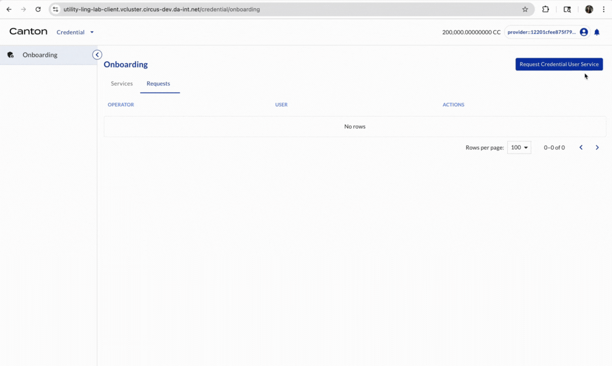

## Provider credential

DA as the Operator offers a credential to Provider. Provider accepts this credential offer.

| Actor | Utility Module |
| --- | --- |
| Provider | CREDENTIAL |

Select OFFERS on the left navigation. If there is a credential offer, click ACCEPT. Then select CREDENTIALS on the left navigation. The onboarding credential for onboarding provider will be there.

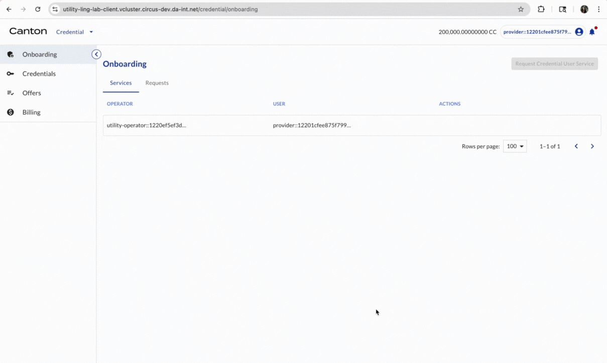

## Onboard Provider

| Actor | Utility Module |
| --- | --- |
| Provider | REGISTRY |

Select ONBOARDING on the left navigation. In the Services box, click REQUEST PROVIDER SERVICE. A request is shown in the Requests box. (Wait for acceptance by the Operator). Once accepted, a Provider Service is created. Now Provider is onboarded as a Provider.

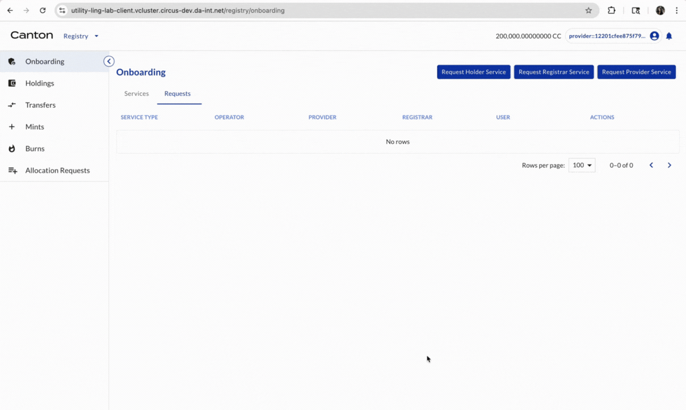

## Onboard requirements for registrars and holders

Here Provider specifies the credential requirement, i.e. what credentials are needed in order to be onboarded as a registrar or a holder.

| Actor | Utility Module |
| --- | --- |
| Provider | REGISTRY |

Select CONFIGURATIONS on the left navigation. In the Provider Configurations box, click CREATE PROVIDER CONFIGURATION.

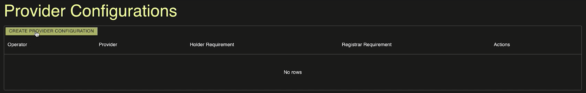

A window pops up for input.

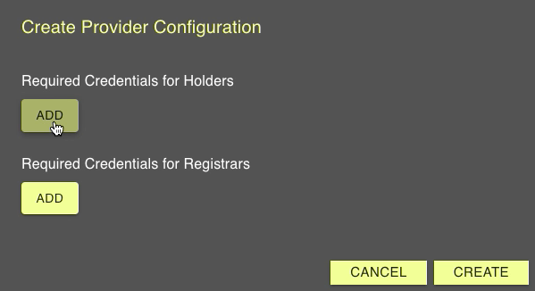

In this demo, the credential requirements are designed as follows:

| Role in Registry | Credential Requirements |
| --- | --- |
| Holder | [holder] [hasRegistryRole] [Holder] |
| Registrar | [holder] [hasRegistryRole] [Registrar] |

Under Required Credentials for Holders, click ADD.

- In the Credential Issuers, paste the copied Provider's Party ID.
- Then under Claim Requirements (where subject is the holder), click ADD.
- In Property, input hasRegistryRole.
- In Value, input Holder.

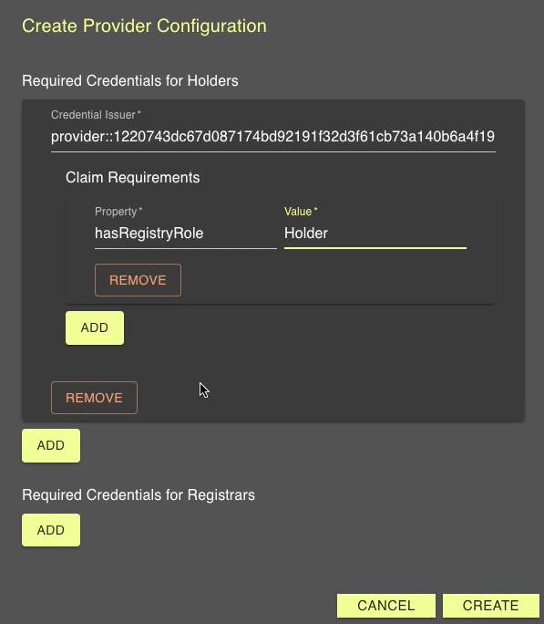

Scroll down if needed.

Under Required Credentials for Registrars, click ADD.

- In the Credential Issuers, paste the Provider's Party ID.
- Then under Claim Requirements (where subject is the holder), click ADD.
- In Property, input hasRegistryRole.
- In Value, input Registrar.

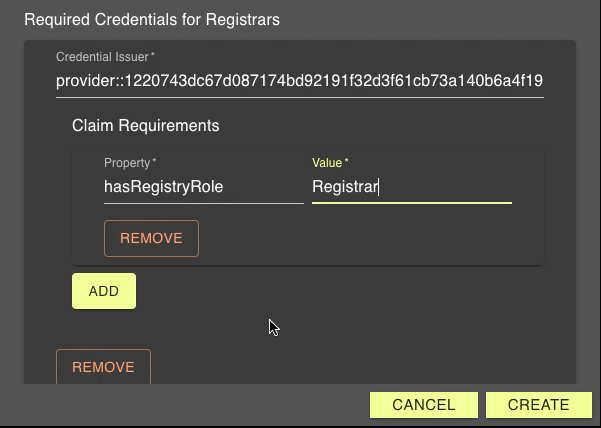

Then click CREATE. The provider configuration is created.

## Provider offers Registrar credential

Provider offers a free credential to Registrar.

| Actor | Utility Module |
| --- | --- |
| Provider | CREDENTIAL |

Select CREDENTIALS on the left navigation. Click OFFER FREE CREDENTIAL. A window pops up for input. Click OFFER. A credential offer is created (check OFFERS on the left navigation). The Registrar can then accept the credential offer.

```{youtube} plbHeSVTMhQ
```

## Registrar accepts credential offer

Registrar accepts the credential offer as a Registrar.

| Actor | Utility Module |
| --- | --- |
| Provider | CREDENTIAL |

Select OFFERS on the left navigation. There is a credential offer from Provider. Click ACCEPT. Now a credential is created (check CREDENTIALS on the left navigation).

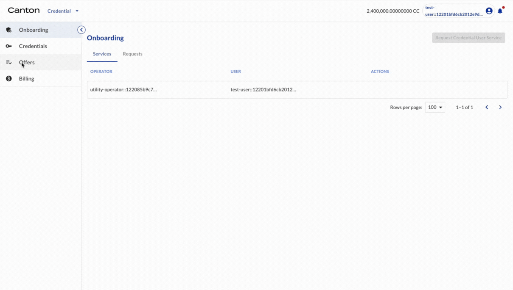

## Registrar requests onboarding as a Registrar in the Registry

Registrar requests onboarding the Registry as a Registrar.

| Actor | Utility Module |
| --- | --- |
| Registrar | REGISTRY |

Select ONBOARDING on the left navigation. In the Services tab, click REQUEST REGISTRAR SERVICE. A window pops up for input. Input Provider’s party ID. Click REQUEST. A request is shown in the REQUESTS tab.

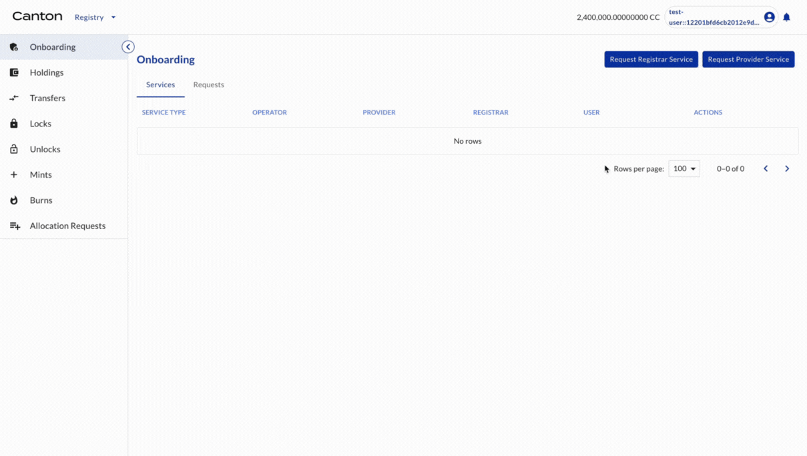

## Provider accepts onboarding request from Registrar

Provider accepts the request.

| Actor | Utility Module |
| --- | --- |
| Provider | REGISTRY |

Select ONBOARDING on the left navigation. In the Services tab, Provider sees the request. Click ACCEPT. Now the Registrar is onboarded as a Registrar by the Provider.

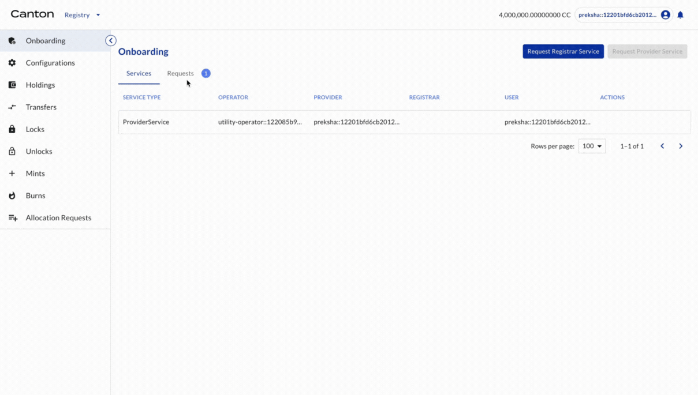

## All entities are onboarded

Provider is onboarded by the Operator (DA) and Registrar is onboarded by the Provider.

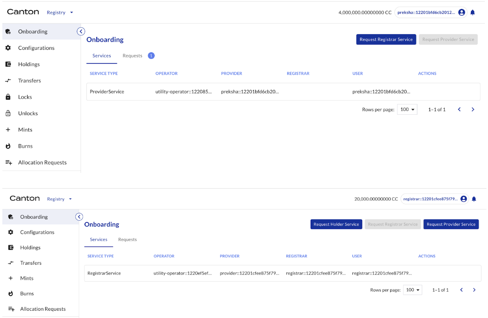

Congratulations! The overall onboarding process in the Registry is complete. Now it is time for token-specific activities.
