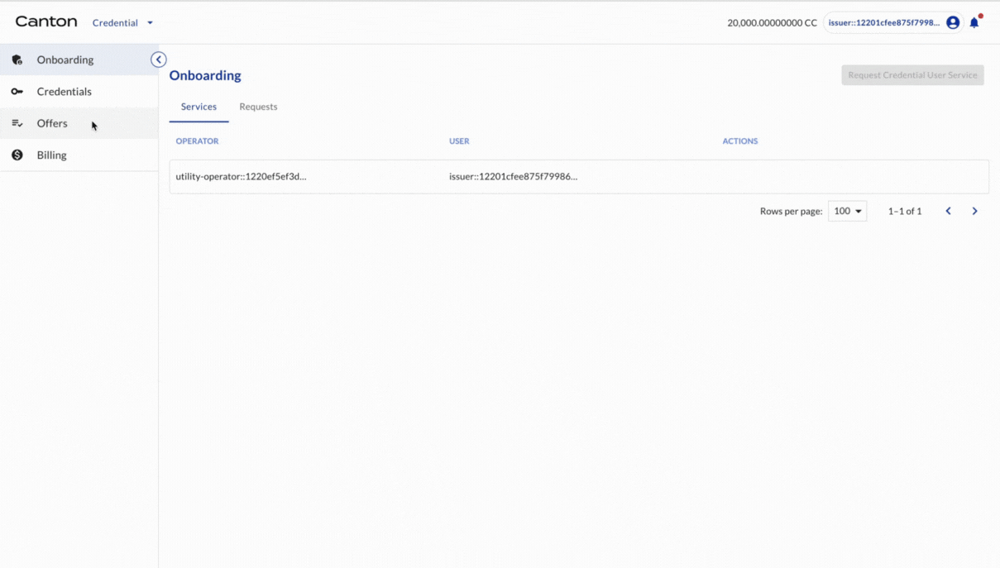
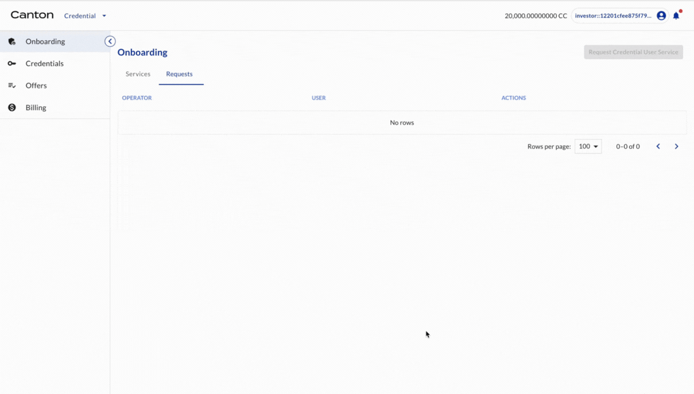

# Credential Preparation for Token Issuance and Transfer

## Registrar specifying the requirement of the BOND token

Here Registrar of BOND specifies the credential requirement, i.e. what credentials are needed in order to issue or hold the BOND tokens.

| Actor | Utility Module |
| --- | --- |
| Registrar | REGISTRY |

```{youtube} lc3KwlEoYtA
```

## Registrar offers credential of token issuer and holder to Issuer

Registrar (of BOND) offers a free credential to Issuer (as an issuer and a holder of BOND).

| Actor | Utility Module |
| --- | --- |
| Registrar | CREDENTIAL |

```{youtube} J7Xy0nAsUZ8
```

## Registrar offers credential of token holder to Investor1

Registrar (of BOND) offers a free credential to Investor1 (as a holder of BOND).

| Actor | Utility Module |
| --- | --- |
| Registrar | CREDENTIAL |

```{youtube} UBaafmm0--o
```

## Issuer accepts credential offers

| Actor | Utility Module |
| --- | --- |
| Issuer | CREDENTIAL |



## Investor1 accepts credential offer

Investor1 accepts the credential offer.

| Actor | Utility Module |
| --- | --- |
| Investor1 | CREDENTIAL |



Congratulations! All credentials are ready. It is time for the token issuance and transfer.
