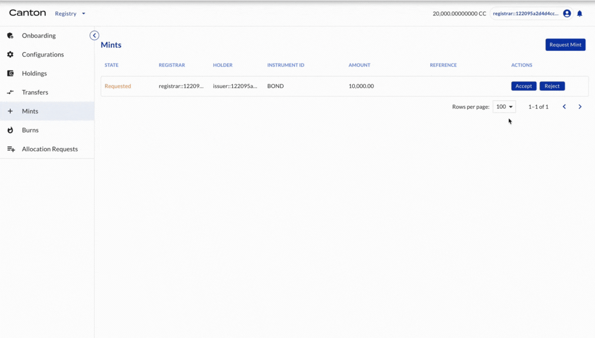
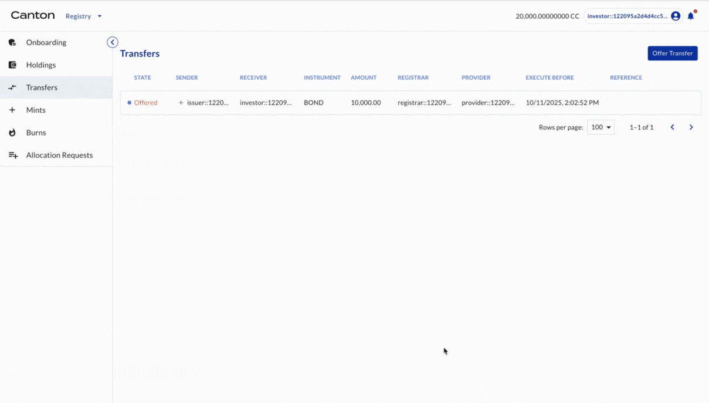

# Token Issuance

## Issuer requests token issuance (minting)

Issuer (as the issuer of BOND) requests issuance (minting) of 10,000 BOND.

| Actor | Utility Module |
| --- | --- |
| Issuer | REGISTRY |

```{youtube} 1-HiaDji_tk
```

## Registrar accepts and tokens are issued

Registrar (as the registrar of BOND) accepts the mint request.

| Actor | Utility Module |
| --- | --- |
| Registrar | REGISTRY |

Select MINTS on the left navigation. The mint request is shown. Click ACCEPT. The 10,000 BOND is minted. Note first the state is changed to Accepted. After execution is done automatically, the state is now changed to Executed. Select HOLDINGS on the left navigation. The minted 10,000 BOND is owned by Issuer.



## Issuer offers token transfer to Investor1

Issuer (as the holder of BOND) offers transfer of BOND to Investor1 (another holder of BOND).

| Actor | Utility Module |
| --- | --- |
| Issuer | REGISTRY |

```{youtube} B5DZuMyTxtY
```

## Investor1 accepts the transfer offer and tokens are transferred

Investor1 (as the holder of BOND) accepts the transfer offers.

| Actor | Utility Module |
| --- | --- |
| Investor1 | REGISTRY |

Select TRANSFERS on the left navigation. The transfer offer is shown. Click the offer and click ACCEPT. The transfer is executed. Select HOLDINGS on the left navigation. The minted 10,000 BOND is owned by the Investor.



Congratulations! The issuance is complete.
