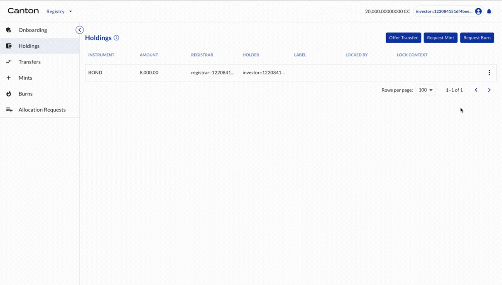
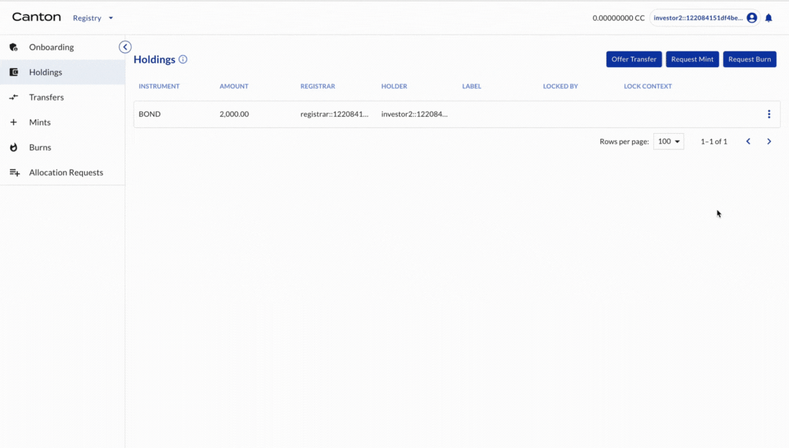
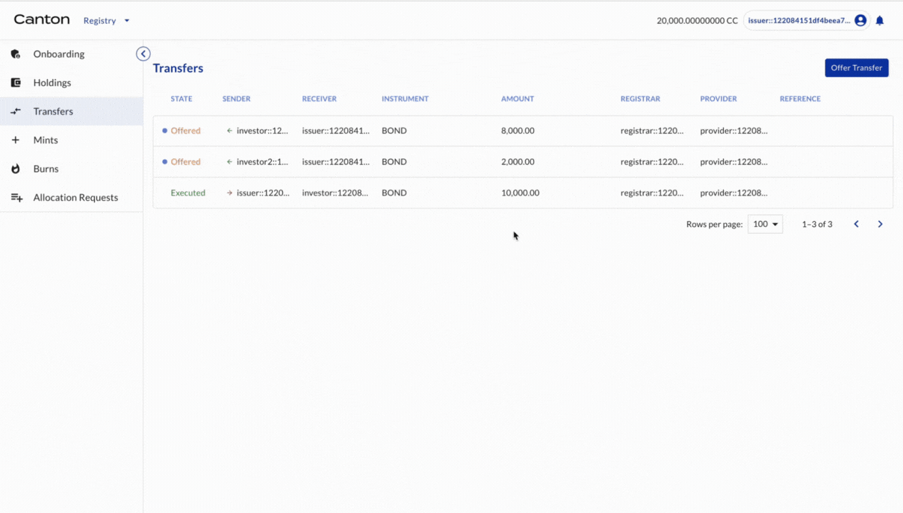
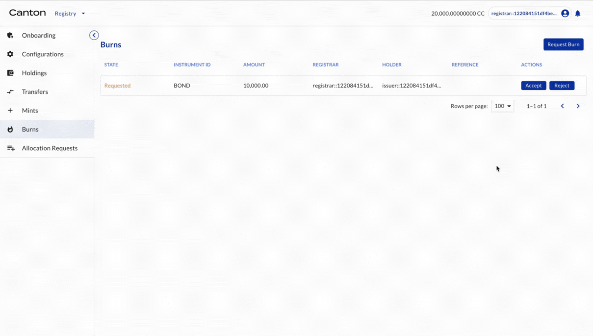

# Token Redemption

## Investor1 returns all holdings to Issuer

Investor1 (as the holder of BOND) offers transfer of BOND to Issuer (another holder of BOND)

| Actor     | Utility Module |
|-----------|----------------|
| Investor1 | REGISTRY       |

Select HOLDINGS on the left navigation. The 8,000 BOND is there. Click TRANSFER. Input issuer’s party ID as the receiver and 8,000 as the amount. Click OFFER.

## Investor2 returns all holdings to Issuer

Investor2 (as the holder of BOND) offers transfer of BOND to Issuer (another holder of BOND)

| Actor     | Utility Module |
|-----------|----------------|
| Investor2 | REGISTRY       |

Select HOLDINGS on the left navigation. The 2,000 BOND is there. Click TRANSFER. Input issuer’s party ID as the receiver and 2,000 as the amount. Click OFFER.

## Issuer accepts transfers

Issuer (as the holder of BOND) accepts the transfer offers.

| Actor  | Utility Module |
|--------|----------------|
| Issuer | REGISTRY       |

Select TRANSFERS on the left navigation. The transfer offers are shown. Click the offers and click ACCEPT. The transfer is executed. Select HOLDINGS on the left navigation. All holdings are now owned by Issuer.

## Issuer requests burning

Issuer (as the holder of BOND) request burning of tokens

| Actor  | Utility Module |
|--------|----------------|
| Issuer | REGISTRY       |

Select HOLDINGS on the left navigation. The 2,000 BOND is there. Click on the bond and click BURN. Input 10,000 as the amount. Click REQUEST.

## Registrar accepts burning and tokens are burned

Registrar (as the registrar of BOND) accepts the mint request

| Actor     | Utility Module |
|-----------|----------------|
| Registrar | REGISTRY       |

Select BURNS on the left navigation. The burn request is shown. Click ACCEPT. The 10,000 BOND is burned. Select HOLDINGS on the left navigation. There are no holdings in the Registrar.

Congratulations! The redemption is complete.
