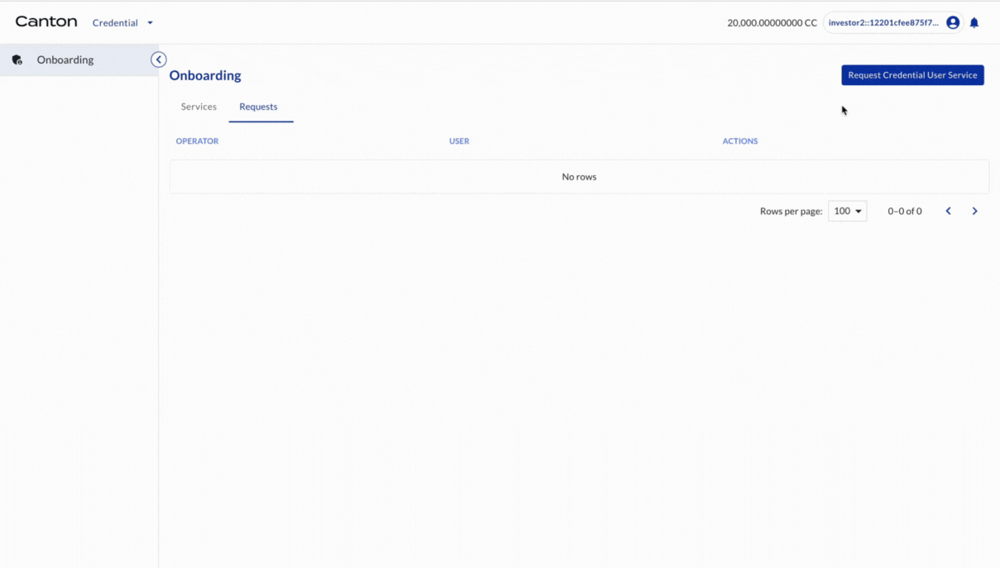

# Onboarding roles in Registry

## Onboarding credential services for all entities

Investor2 requests credential service from DA the Operator.

| Actor | Utility Module |
| --- | --- |
| Investor2 | CREDENTIAL |

Select ONBOARDING on the left navigation. Then click REQUEST CREDENTIAL USER SERVICE. A request is shown in the Requests tab. The request is automatically accepted in the DevNet. Now the credential service is created and can be seen in the Services tab.

