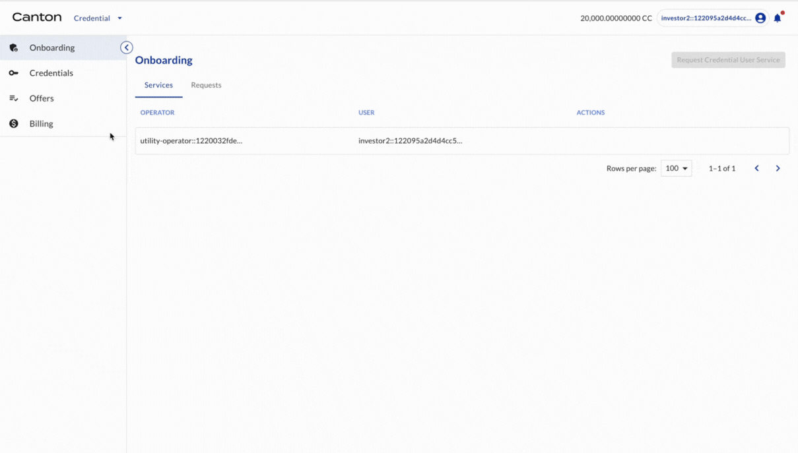

```{sectnum}
:depth: 2
:start: 2
```

# Credential Preparation for Token Transfer

## Registrar offers credential of token holder to Investor2

Registrar (of BOND) offers a free credential to Investor2 (as a holder of BOND).

| Actor | Utility Module |
| --- | --- |
| Registrar | CREDENTIAL |

```{youtube} h6BuWnYvT-c
```

## Investor2 accepts credential offer

Investor2 accepts the credential offer.

| Actor | Utility Module |
| --- | --- |
| Investor2 | CREDENTIAL |

Select OFFERS on the left navigation. There is one credential offer from Registrar. Click ACCEPT. Now a credential is created. Congratulations! All credentials are ready. It is time for the token issuance and transfer.



Congratulations! All credentials are ready. It is time for the token issuance and transfer.
