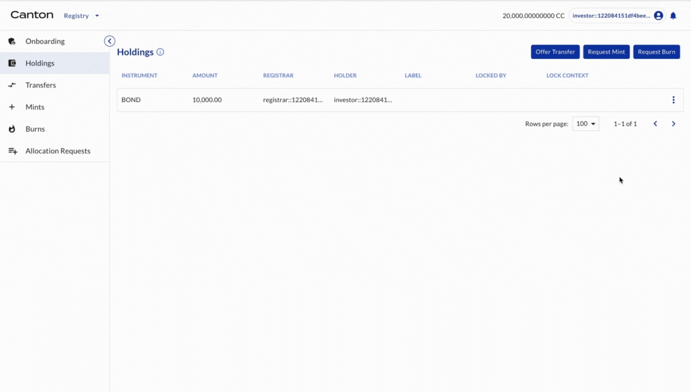
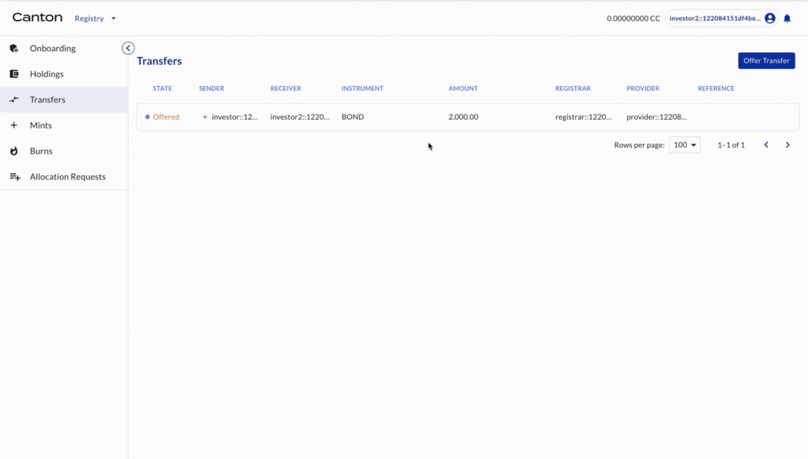
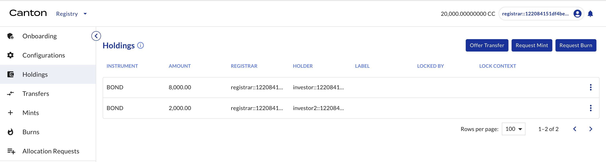
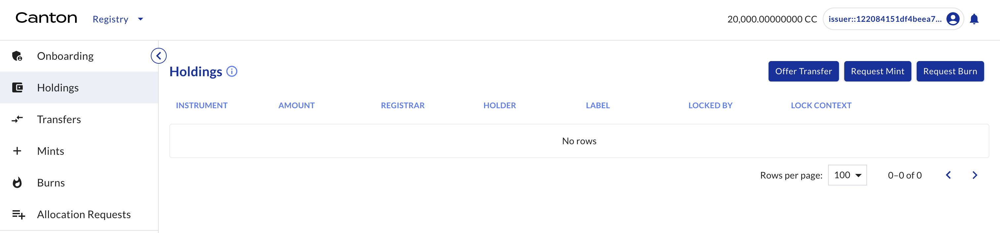
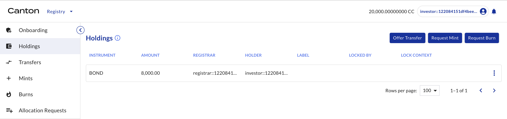
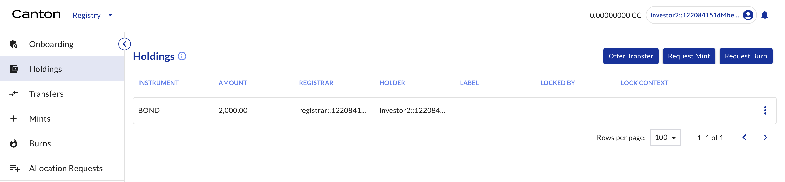

# Token Transfer

## Investor1 offers token transfer from Investor2

Investor1 (as the holder of BOND) offers transfer of BOND to Investor2 (another holder of BOND).

| Actor | Utility Module |
| --- | --- |
| Investor1 | REGISTRY |

Select HOLDINGS on the left navigation. The 10,000 BOND is there. Click TRANSFER. Input investor2’s party ID as the receiver and 2000 as the amount. Click OFFER.

## Investor2 accepts the transfer offer and tokens are transferred

Investor2 (as the holder of BOND) accepts the transfer offers.

| Actor | Utility Module |
| --- | --- |
| Investor2 | REGISTRY |

Select TRANSFERS on the left navigation. The transfer offer is shown. Click ACCEPT. The transfer is executed and that status is updated to “executed” in transfers.

## Holding views for various entities

Check BOND holdings for all entities.

| Actor | Utility Module |
| --- | --- |
| Registrar, Issuer, Investor1, Investor2 | REGISTRY |

Select HOLDINGS on the left navigation.

Registrar (see holdings for all entities)

Issuer (none)

Investor1 (only Investor1's holding, i.e. 8,000 BOND)

Investor2 (only Investor2's holding, i.e. 2,000 BOND)

Congratulations! The transfer (asset delivery) is complete.
